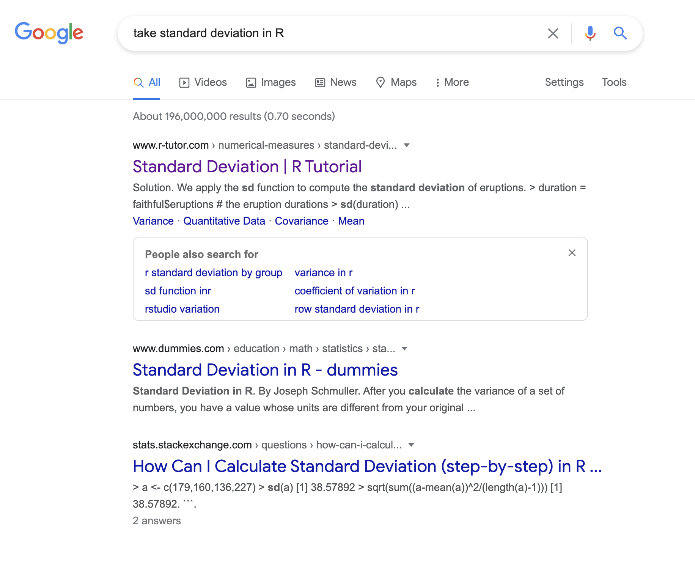
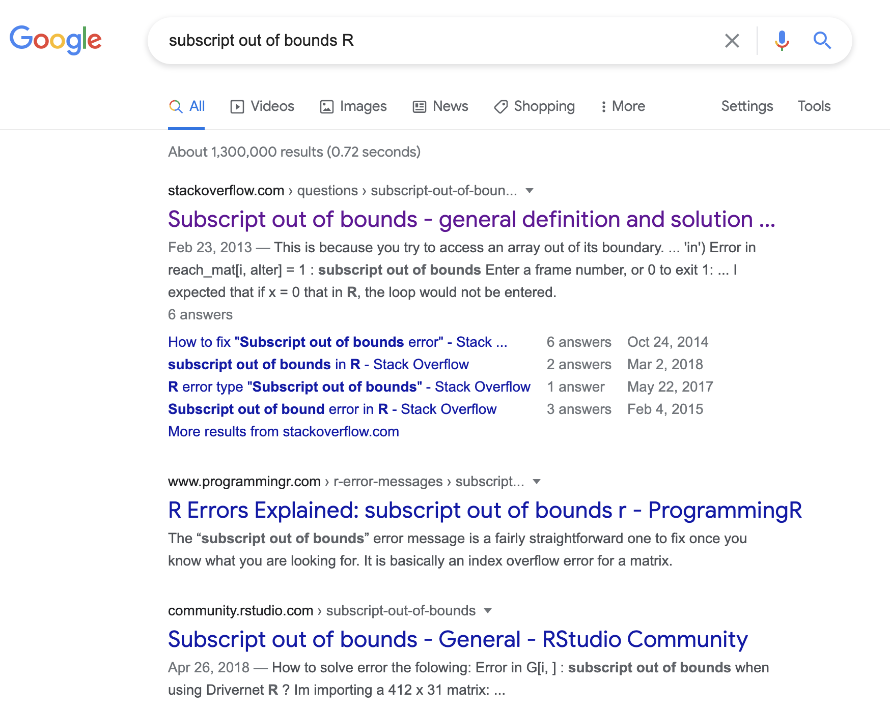

```{r setup, eval=TRUE, include=FALSE}

# add all packages that need loading
library(knitr)

# set warning to be off for all chunks
knitr::opts_chunk$set(warning = FALSE, message = FALSE)

```


# Instructions

This document will take you through some tips and tricks to be able to work
independently in R. It covers **Error messages**, **Warning messages**, and
**General help**.

<span style="color:blue"> Questions appear in blue. </span>
<span style="color:red"> Answers appear in red. </span>

</br>

By the end of these exercises, you should be able to:

* Read error and warning messages in R
* Solve errors or warnings either on your own or using the internet
* Find information and code for things you want to do in R

# Dealing with Errors

Error messages are quite common in R. If you stuck with the default colour 
scheme for RStudio, they will appear in <span style="color:red"> red </span> in 
the R console window. 

```{r figure-0, echo=FALSE, eval=TRUE, fig.cap="Example of an Error", fig.height=150}
include_graphics("./Error0.png")
```

This can be a bit intimidating or just frustrating after you have carefully
written your code. But they can also be **helpful**, yes, really. Most errors in
R, will actually tell you what is wrong with your code (some won't and we will
get to those), you just need to know what to look for.

## How to read an error in R

To illustrate this section we will focus on three very common errors and one
less common:

```{r figure-1, echo=FALSE, eval=TRUE, fig.cap="Error 1", fig.height=150}
include_graphics("./Error1.png")
```

</br>

```{r figure-2, echo=FALSE, eval=TRUE, fig.cap="Error 2", fig.height=150}
include_graphics("./Error2.png")
```

</br>

```{r figure-3, echo=FALSE, eval=TRUE, fig.cap="Error 3", fig.height=150}
include_graphics("./Error3.png")
```

</br>

```{r figure-4, echo=FALSE, eval=TRUE, fig.cap="Error 4", fig.height=150}
include_graphics("./Error4.png")
```


There are a couple of steps that can be taken to solve these errors, we will go 
through them below. 

### Step 1: read the error

**The first thing to do is to read the errors.** 

Sometimes the error itself will tell us what has gone wrong. 

<span style="color:blue"> Read all of the errors above, what do you think 
has gone wrong with the line of code? </span>

<details><summary>I had a go, now show me the answers.</summary>

Error 1: tells us that there is an error in the call of function `mean()` of
object `x`, R cannot find object `x`. <span style="color:red"> This means that
R cannot find the object `x`, it does not exist yet in the environment. </span>

Error 2: tells us that there is an error in the call of function `Sd()` of
vector `c(1, 2, 3, 4, 5)`, R cannot find function `Sd()`. 
<span style="color:red"> This means that
R cannot find the function `Sd()`, it does not exist in any packages loaded in
R, nor has a user written it. </span>

Error 3: tells us that there is an unexpected symbol in the line of code, 
something R is not expecting to be there. 
<span style="color:red"> This means that
something is wrong in the line of code, there is either an extra symbol or one
missing. </span>

Error 4: tells us there is an error in what looks like a random string of 
symbols and there is a subscript that is out of bounds.... 
<span style="color:red"> This is not very 
interpretable at the moment. </span>

</details>


### Step 2: try to fix the error

Now you hopefully have a rough idea what the errors mean, we need to fix them in
order to get our code working again. There are many ways this can be done but we
will go through a few examples. 

We will solve each of the example errors in turn to demonstrate how this can be 
done.

You can have a go first and then look at the answers. 

<details><summary>I had a go, now show me the answers.</summary>

### Error 1

When reading this error we can see that R cannot find the object `x`. This means
that `x` does not exist in your R session. If you look at the Environment panel
to the top right, it will not be shown. 

There are two main ways this can happen:

* First, you did not yet create the object `x`. If you create it e.g. 
`x <- c(1,2,3)` trying to take the mean, the line should work.

* Second, there could be a typo. Maybe you think you did already make object `x`
but actually you made an object with a capital x (`X`). This time correcting the
typo e.g. `mean(X)` would fix the line. 

### Error 2

When reading this error we can see that R this time cannot find the function 
`Sd`. This means
that `Sd` does not exist as a function in your R session. 

There are three main ways this can happen:

* First, there could be a typo. In this case you want to take the standard 
deviation of the set of numbers. To check what the correct function name is
you can Google `take standard deviation in R`. If I do this I get the following
results:

</br>

```{r figure-5, echo=FALSE, eval=TRUE, fig.cap="", fig.height=150}

```

</br>

If you click on the first [entry]( http://www.r-tutor.com/elementary-statistics/numerical-measures/standard-deviation)

You can see that the function used is `sd` not `Sd`, there was in fact a typo.

* Alternatively, you can get this error when you are missing a package that
contains the function. Therefore, you need to load the package using `library()`
before you can use the function. If the package is not found, you will also need to install it with `install.packages()`.

* Finally, if it was a user defined function (one you wrote yourself), it could
be that you have not loaded it yet. Check the Environment panel to see if it
exists (you can also check for typos in your own functions this way). If not,
then run the code for the function from your script and try again. 

### Error 3

When reading this error we can see that R has found an unexpected symbol in the 
code. 

This usually indicates a particular kind of problem:

* **Typos**

Luckily, R is also quite helpful with pointing out where the typo is. If you
look closely at the error `Error: unexpected symbol in "seq(from = 1 to"` you 
can see that R has not printed the whole line of code you ran. 

The whole line was `seq(from = 1 to = 4, by = 1)`. Where the printing stops,
i.e. after to, shows you where the error is. 

The line is missing a comma between 1 and to. The correct line would be:

`seq(from = 1, to = 4, by = 1)`

It can take a little while to get good at spotting these typos but it gets
easier with practice. 

### Error 4

This error was not clear from reading. Therefore, we need to take a different
strategy.

**We use Google!** This is how everyone uses R, even those that could be 
considered experts. 

There are a few good tips for using Google for R errors:

* Copy and paste the generic part of the error. Some parts of the error will be
specific to your work e.g the names if your objects. This part won't help. 
* Always include the letter R in the Google phrase, either at the beginning or 
end is easiest. 

In the example of error 4, the generic part is `subscript out of bounds` so to
search for this I use the phrase `subscript out of bounds R`. This gives over
1 million results:


```{r figure-6, echo=FALSE, eval=TRUE, fig.cap="", fig.height=150}

```


If we again look at the first result [click here](https://stackoverflow.com/questions/15031338/subscript-out-of-bounds-general-definition-and-solution) you will see that it is a post on a page called Stackoverflow. This
is one of the biggest places to get R help. You can post yourself, but many 
people just look at existing answers. Most R problems have been encountered 
before. 

On the thread you will first see the question, then several answers. You might
need to read a few answers before you find one that makes sense to you. You
can also try other Google results if the first one isn't helpful.

In this case, the answer is that the code `z[10,1] <- 5` is trying to give the
10th row of the 1st column (that's what `[10,1]` means - 
`[rownumber, columnnumber]`) of object `z` a value of 5. But, `z` is not big
enough, the cell we are trying to edit is outside of the size of `z`. If we look
at the dimensions of z below, you can see it is 3 by 2 (three rows and two 
columns).

```{r error4}

z <- matrix(c(1,2,3,4,5,6), ncol=2)
dim(z)

```
To fix the line of code, we need to edit a row/column combination that actually
exists in `z` e.g. `z[3,2] <- 5`.

</details>

# A little bit on warnings

Warnings appear very much like errors. They are also
red and they tell you about why the warning was generated. 

One big difference is **with the warning, the R code still runs.** But,
there is something that isn't quite correct. Some warnings can be fixed in the same way as errors. Others can be ignored - sometimes they are
really just warning you about a particular choice. 

</br>

# Practice solving errors and warnings

Now, you have seen how to fix errors, have a go at fixing
these lines of code on your own. 

```{r practice errors, eval = FALSE}

log(p) # take log of p
x <- c(1,2,3,4,5,6,7,8,9,10,) # create vector x with numbers 1 to 11
y <- esq(1, 20, length = 11) # create a sequence of 11 numbers from 1 to 20

plot(y, x, col ="red", type = "l") # plot x and y with a red line

```

If you run all lines at once, you will find that many
errors appear. Go back and run the code one line at a time
to isolate the errors and fix them in order. 

# General help

Google is the first place to look for many R questions. Most problems
you encounter will have been faced by someone else before. This really is the best tool to learn more about R and fix any problems you encounter. You can also always check with a member of the teaching team. 

There are a few good tips for using Google for R help generally:

* Always include the letter R in the Google phrase, either at the beginning or 
end is easiest. 
* Be as specific as possible but also short e.g. 'How to find mean in R',
'How to make cat drawing in R', 'pch options in R'
* Try several results if the first link does not answer the question. 

## Practice

<span style="color:blue">Try and find a list of all of the colour options in R.</span> 

<details><summary>I had a go, now show me the answers.</summary>

Just one option is to Google 'colours in r'

https://www.google.com/search?q=colours+in+r&oq=colours+in+R&aqs=chrome.0.0i457j0l2j0i395l7.1711j1j4&sourceid=chrome&ie=UTF-8

</details>

<br />
