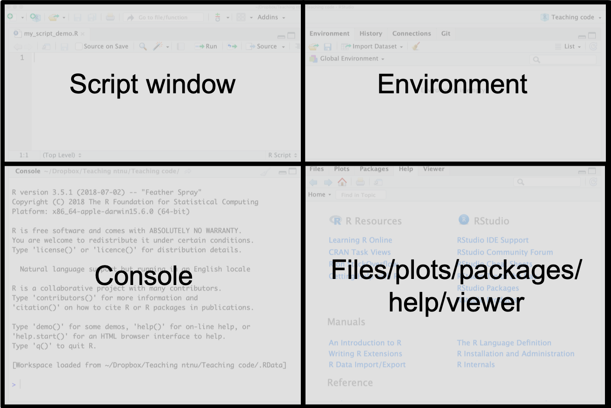

## Instructions:

Read through each part of the document and complete the tasks. 

*Hints and reminders are italic*

<span style="color:blue"> Tasks appear in blue. </span>

```{r setup, include=FALSE}
knitr::opts_chunk$set(echo = TRUE,tidy=TRUE,message=FALSE,warning=FALSE,results="hold")
showsol<-FALSE
```

(Latest changes: 04.01.2021: first version for 2019)

# Part A: Downloading R and RStudio and getting started

<span style="color:blue"> Download and install R and RStudio. </span>


R is a free software environment for statistical computing and graphics. It runs on a wide variety of UNIX platforms, Windows and MacOS. R can be downloaded from http://www.r-project.org/.


We recommend that you run R using RStudio. RStudio can be downloaded from https://rstudio.com/products/rstudio/. You will need the desktop version.

**You need to download both R and RStudio.**

If you need help installing R and RStudio on you laptop computer, contact orakel@ntnu.no.

### Using RStudio - what are the different windows? 

Start RStudio. Then you (probably) have the following four windows. 



* **Source** (aka script window) - upper left window: where you write your code and keep track of your work. 
* **Console** - lower left window: where the R commands are executed (so here is where you R installation lives). Sometimes also referred to as command window.   
* **Environment/History/Connections/Presentation** - upper right window: the objects that you have in your workspace, and the commands you have executed, and more.   
* **Files/Plots/Packages/Help/Viewer**- lower right: overview of your files, the plots you produce, the packages you have installed and loaded, and more.  

### Using RStudio more information

**Script window**: (Make the source window active.) To start writing a script press File- New File- R Script. To open an existing file, press File- Open File- and select the file you want to open. The file will open in the source window. To save this file, press File- Save as- and save the file as "name".R (example: `myRintro.R`). Files with R code usually have extension `.R`. 

<span style="color:blue"> Open a new script and save it. </span>

**Console window**: (Make the console window active.) To see your working directory (the folder where files will input and save out to), you can write `getwd()`, and you will get your location as output. You can also set your working directory to a certain folder of choise by writing `setwd("location")` (Example: `setwd("M:/Documents/ST2304/")`). Now you are certain that all your files will be put in this folder. 

<span style="color:blue"> Type the following into the console window one line at a time. </span>

<span style="color:blue"> Press enter after each line. </span>

<span style="color:blue"> What happened? </span>

```{r, eval=FALSE}
getwd()
2+2
x<-2+2
2+
  2
```

<details><summary>**Once you had a go, click to read about what should have happened.**</summary> 

You might have noticed that the line with `2+` caused R to begin the next line with a `+` instead of `>` **This is important.** When R is ready for a new line of code, it begins with a >. If R is still working on a line, for example if the line is incomplete like `2+`, then it begins with a `+`. It will not complete until the line is finished e.g. by typing `2` to complete the sum. 

</details>

</br>

<span style="color:blue"> Now type the same lines of code into the script window. </span>

<span style="color:blue"> Try running from there. </span>

<span style="color:blue"> You can run the current line by using cmd+enter (Mac) or ctrl+enter (Windows) or the Run button on the top right. </span>

<span style="color:blue"> To run several lines, highlight them, then use the same keys. </span>

<span style="color:blue"> Save the script. </span>

**Quitting**: It is always important to be able to quit a program: when you are finished you may choose RStudio-Quit Rstudio (top menu outside of the windows). You will be asked if you want to save your script and workspave. If you want to reuse your script later (and of cause you want to do that!), you should save it! If you answer yes to "Save workspace image" all the objects you have created are found in a `.RData` file (more about objects soon). This could be useful if you don't want to run all the commands in the script again, because if you start R in the same working directory all the objects you have created will be automatically availble to you. But it is not always helpful. We recommend to **not** "Save workspace image". 

<span style="color:blue"> Quit RStudio and re-open. </span>

<span style="color:blue"> What do you notice about the code
you ran before? </span>

</br>

<details><summary>Click for more information</summary> 

The code in the console will have disappeared when you reopened RStudio. However,
the code in the script is still there. This is why we use scripts to work in,
so that we can keep a record of our code. This will be very useful for the 
rest of this course as we use the same code in multiple weeks of the course. 

</details>

</br>

You can download the **RStudio IDE cheat sheet** for more information: <https://github.com/rstudio/cheatsheets/blob/main/rstudio-ide.pdf>

More on objects and commands next.

<span style="color:blue"> **PAUSE HERE**. If you want, you can [follow this link to a video](https://ntnu.cloud.panopto.eu/Panopto/Pages/Viewer.aspx?id=67948ccb-ab50-4d95-b7e2-ae1b00a22fc3):</span>
<!---
<iframe src="https://ntnu.cloud.panopto.eu/Panopto/Pages/Embed.aspx?id=67948ccb-ab50-4d95-b7e2-ae1b00a22fc3&autoplay=false&offerviewer=true&showtitle=true&showbrand=false&captions=false&interactivity=all" height="405" width="720" style="border: 1px solid #464646;" allowfullscreen allow="autoplay"></iframe>
--->
(apologies if the imbedding doesn't work: follow the link above)

# Part B: Trying out R-commands

To execute your commands, you can either type directly in the console or run the commands from the source window. But here we want you to use a script.

<span style="color:blue"> Type and execute (run) the following commands. Add a comment after each one to remind yourself what it does. </span>

```{r, eval=FALSE}
2+3
2*6
5^2
10^2-1
10^(2-1)
sqrt(9)
?log
log(3)
exp(34)
1:4
c(1,2,3,4)
seq(from = 1, to = 4, by = 1)
mean(1:5)
heights = c(192,185,174,195,173)
shoes = c(46,43,40,45,40)
ratio <- heights/shoes
ratio
```

Here we have created three **objects**: `heights`, `shoes` and `ratio`. **Note**: we can both use `=` and `<-` for **assigning** content to an **object**.

Notice now that the **objects** you **assigned** values to (`heights, shows, ratio`) appear in the Environment window to the right (sorted as Data, Values or Functions, but you should only have Values so far).

You have also used some **functions**. For example the **function** `c` combines values into a vector (concatenate).

<span style="color:blue"> Save your script and **PAUSE HERE**. </span>

# Part C: Using objects and functions in R  

### Objects

<span style="color:blue"> Have a go at creating an object called `x`, which has the value of 10. </span>

<span style="color:blue"> Create an object `y`, which has a value of 5. </span>

<span style="color:blue"> Create an object `z`, which is the sum of `x` and `y`. </span>

<span style="color:blue"> Now change `x` to have a value of 20. </span>

<span style="color:blue"> What is the value of `z`? </span> **You can find this by simply typing z into the console and pressing enter.**

<details><summary>**ANSWER**</summary> 

You should see that `z` is still 15. This is because the object `z` was created before you changed the object `x`. To update `z`, you would need to sum `x` and `y` again, after `x` has been changed. 

</details>

</br>

### Functions

Functions are something we use a lot in R. They make calculations easier and faster to reuse. There are many functions that already exist in R, which were written by other users. We can also write our own, but we will get to this a bit later.

We will begin with using functions that already exist in R.

<span style="color:blue"> Run the lines of code below. Add some more comments to tell yourself what each does. </span> 

<span style="color:blue"> **Bonus** Read the error for line 3 and work out why it appears. </span> 


```{r, eval=FALSE}
sd 
?sd 
sd() #gives error
sd(c(1,2,3,4,5,6,7,8,9,10)) #calculates....
# This last line actually uses two functions, sd() and c()
```

<details><summary>**ANSWER**</summary> 

`sd()` gives an error because no argument is given. This function needs an
argument `x` which is a vector of numbers. 

</details>

</br>

When using functions, there are two ways we can input the arguments. The first is to write them **in order** separated by commas. The second is to **name them**. There are examples of each below. If writing in order, you will need to look at the Help file to remember the correct order for each function.

The example uses the `round()` function, this rounds a specified number to a certain number of digits. 

<span style="color:blue"> We want to round 33333.33333 (object `a`) to 2 decimal places. Which lines below give the correct answer? </span> 

<span style="color:blue"> Why do some of them give the wrong answer? </span>

```{r, eval=FALSE}
?round #help pages for the function
a <- 33333.33333 # create object a
b <- 2 # create object b
round(a, b)
round(x = a, digits = b)

round(b, a)
round(digits = b, x = a)
```

<details><summary>**ANSWER**</summary> 

Because the a and b are the wrong way round. `round(b, a)` rounds 2 to 
33333.33333 decimal places. 

</details>

</br>


https://ntnu.cloud.panopto.eu/Panopto/Pages/Viewer.aspx?id=d09deb92-fa3c-4c77-9ea2-ae1b00ab6c0b

[Now you can follow this link to watch a video about this](https://ntnu.cloud.panopto.eu/Panopto/Pages/Viewer.aspx?id=67948ccb-ab50-4d95-b7e2-ae1b00a22fc3). Or, if it works, watch this embedded video:
<!---
<iframe src="https://ntnu.cloud.panopto.eu/Panopto/Pages/Embed.aspx?id=d09deb92-fa3c-4c77-9ea2-ae1b00ab6c0b&autoplay=false&offerviewer=true&showtitle=true&showbrand=false&captions=false&interactivity=all" height="405" width="720" style="border: 1px solid #464646;" allowfullscreen allow="autoplay"></iframe>
--->
# Part D: Plotting

Creating plots is very important for presenting results, it can also be fun to make a pretty visual output. We can plot our data in R.

<span style="color:blue"> Create a basic plot using the code below. </span> 

```{r, eval=FALSE}
x <- seq(-4,4,length=500) # create an object called x
y <- x^2 - 1 # create an object called y
?plot # look at the plot function in Help
plot(x, y, type="p", main="My plot", xlab = "x", ylab = "y") # Plot the data
```

<span style="color:blue"> What do the arguments `type`, `main`, `xlab`, and `ylab` do?. </span> 

<details><summary>If you get stuck</summary> 

`type` = style of graph to be made

`main` = title text

`xlab` = label for the x axis  

`ylab` = label for the y axis

</details>

</br>

To draw the plot in the way you want, check the help pages of the plot function to see which input values you can change to make your plot look the way you want to.

<span style="color:blue"> Try and change the colour and shape of the points. </span> 

<details><summary>If you get stuck</summary> 

You do this using the arguments `col = "CHOSENCOLOUR"` and 
`pch = CHOSENNUMBER`

</details>

</br>

<span style="color:blue"> Try and plot a line instead of points. </span> 

<details><summary>If you get stuck</summary> 

change `type` to `l`

</details>

</br>

The package (a collection of functions - more on this in Part F) `ggplot2` is a powerful tool for making nice plots. In this package, the function `ggplot()` 
can be used to make pretty and complex graphs. For an intro this you can look
here (webpage still under development) https://bioceed.uib.no/dropfolder/WebJS/Visualizing_1.html

But in this course we use `plot()` as standard. But if you want to try `ggplot()`
go for it. 
  
# Part E: Writing a simple function  

When starting a function, you should start with the name of the function and state if the function takes input values, give these arguments names e.g. `x` 
and `y`. 

Then you write the code you want the function to perform inside the branches ${}$. **You must indicate what you want your function to output using the `return()` function**.

<span style="color:blue"> Have a look at the example function below. Can you work out what it does? </span> 

```{r, eval=FALSE}
myfunction <- function(x,y) 
  # myfunction is the name, x and y are the names of the inputs (arugments)
{ # function begins here
  p <- x*y
  return(p) # we want to output p
} # function ends here
```

To start using the function, you must first run it through the console so that it is in your environment (mark and run). Then you call the function name and give your inputs like this. 

```{r, eval=FALSE}
a <- 7
b <- 333
p <- myfunction(x = a, y = b) # assign output to a variable p
p
```

**Congratulations! You have written your first R function.**

<span style="color:blue"> Now see if you can write another, this time to add 5 
to any value. </span> 

<details><summary>If you get stuck</summary> 

```{r, eval=FALSE}
myfunction2 <- function(z) # make sure it has a new name
{ # function begins here
  z2 <- z+5 # add 5 to z
  return(z2) # return z2
} # function ends here
```

</details>

</br>

# Part F: Packages

As mentioned in Part D, packages are a collection of functions someone has written and published so that they can be used by others. Packages are one of the very useful things in R. There are many different packages for almost any use you can imagine. Some are already included in the default R session, like the package `stats` that includes many basic functions for doing statistics. A large number can be found on the most widely used service for R packages: CRAN. See the official page for the package here: <https://cran.r-project.org/web/packages/ISLR/index.html>. 

To use packages you must complete two steps. First you **install** the package. Then you can **load** it into your own R session to use. 

**To install** an R package from CRAN you go to the Packages tab in the bottom right RStudio window and see if the packages is already available on your computer (there will be a list). If you do not see the package in this list you will need to download and install it. Do this by either pressing Install on the top left corner of the Packages window, CRAN is already filled as "Install from" and then write your package name to install, and usefully you can check a box to "install dependencies" **This is important to do**. Then press "Install".

Alternatively, in the script window you may write and run:
```{r, eval=FALSE}
install.packages("PACKAGE_NAME", dependencies = TRUE)
library(PACKAGE_NAME) # to make the package available in the current session
```

<span style="color:blue"> Using one of the methods above, install the package called "praise". </span> 

**Remember:** PACKAGE_NAME must always be changed to the actual package you want!

**To load**: Now the package is installed, you need to load it into our current session. Remember that whenever starting a new session, you need to reload the packages you want to use. This can be done in two ways. Either, find the package in your list of packages, in the Packages window, and check the box next to it. OR using the `library()` function. **Note:** the library function does not have "" around the package name.

```{r, eval=FALSE}
library(PACKAGE_NAME) # to make the package available in the current session
```

<span style="color:blue"> Using one of the methods above, load the package called "praise" into your session. Then run the below. </span> 

```{r, eval=FALSE}
praise("${EXCLAMATION}! You have done this ${adverb}!")
```

# Part G: Importing 

Most of the time in biological statistics, you have far too much data to type it all in by hand. Therefore, you often store it in as a file on our computer or on the internet and then import it into R. 

## Importing data from your computer

The most common file type we will use in this course are `.csv` files. We will provide you with them and you will import and analyse them. The first is called `test_data.csv`. You import using the function `read.csv()`.

<span style="color:blue"> Download `test_data.csv' from https://www.math.ntnu.no/emner/ST2304/2020v/RIntro/. </span>

<span style="color:blue"> **Make sure you download and save as a `.csv` file.** </span> 

<span style="color:blue"> **DO NOT open in excel or save as `.xls` or `.txt`** </span> 

<span style="color:blue"> Now look at the R script below, what does each line of the script do? </span>

```{r,eval=FALSE}
?read.csv
datafile <- read.csv(file="test_data.csv", header=TRUE)
dim(datafile)
head(datafile)
tail(datafile)
datafile
```

## Importing data from the internet

It is also possible to import a file directly from the internet, you can do this for `test_data.csv` because it is stored on the internet. To do this you use the whole url for the file instead of just the file name.

```{r, eval=FALSE}
datafile <- read.csv("https://www.math.ntnu.no/emner/ST2304/2020v/RIntro/test_data.csv", header = TRUE)
```

<span style="color:blue"> Try and run the R code above. What does the argument `header=TRUE` do? </span>

<details><summary>If you get stuck</summary> 

It tells R that there are column names in the file it is importing. 

</details>

</br>

Reading and writing data into R may be a bit tricky if the format of the data is not defined
exactly, we will try and stick to `.csv` in the beginning.

## Executing the commands in an R-file with `source`

As well as data, you can also import other R scripts into our R session. This can be a useful way to load functions quickly. You use the function `source` to import the R script. `source` imports the script and runs all of the code within it. This will be a useful way for us to give you functions we write to use in R.

<span style="color:blue"> Download the file `Test_script.R` from https://www.math.ntnu.no/emner/ST2304/2020v/RIntro/ and save in the same folder as your working directory. </span>

**Remember** you can check where that is using `getwd()`.

The script contains a function called `test_function()` it takes the argument `x`, which should be a single number. 

<span style="color:blue"> Run the code below to source the script and run `test_function()` see if you can work out what the function does. </span>

```{r, eval=FALSE}
source("Test_script.R")
test_function(x=5)
```

<details><summary>If you get stuck</summary> 

The function squares x. 

</details>

</br>

# Part H: Plotting from a data frame

**Make sure to complete Part G directly before this Part.**

Now you have imported some data from a file, you can now plot it using the same ideas from Part D. But this time, you will be using data store as something called a **data frame**. You can see that the data you imported is different to the **objects** you created before because it is stored under 'Data' in our Environment not 'Values'. 

<span style="color:blue"> Just as you did in Part D. You want to create a plot of `x` versus `y`. </span> The first thing you need to do is find out the structure of your data, which part is `x` and which is `y`.

<span style="color:blue"> Try out the following lines of code. What does each do? </span>

```{r, eval=FALSE}
head(datafile)
str(datafile)
colnames(datafile)
```
You should be able to see that the columns in our data frame are called `x` and `y`. **Note:** both are lower case. You can refer to these individual columns using the `$` symbol.

<span style="color:blue"> Try out the following lines of code. Why does the second line fail? </span>

```{r, eval=FALSE}
datafile$x
datafile$Y
plot(datafile$x, datafile$y, type="p", main="My plot", xlab = "x", ylab = "y") # Plot the data
```

<details><summary>**ANSWER**</summary> 

The second line fails because the column name is `y` not `Y` and R is case
sensitive. 

</details>

</br>

# Part I: Further work

If you are happy with the introduction above, maybe try out these tutorials/
courses to learn more about R:

https://digit.ntnu.no/courses/course-v1:NTNU+IMF001+2020/course/

https://ourcodingclub.github.io/tutorials.html

And check out the R Resources folder in BlackBoard:

https://ntnu.blackboard.com/ultra/courses/_25772_1/cl/outline


And [you can also watch a video summarising this week](https://ntnu.cloud.panopto.eu/Panopto/Pages/Viewer.aspx?id=50be3e96-d056-47b4-aa6b-ae1b00b241a8), and suggesting ways to get help. It might (or might not) be embedded here:
<!---
<iframe src="https://ntnu.cloud.panopto.eu/Panopto/Pages/Embed.aspx?id=50be3e96-d056-47b4-aa6b-ae1b00b241a8&autoplay=false&offerviewer=true&showtitle=true&showbrand=false&captions=false&interactivity=all" height="405" width="720" style="border: 1px solid #464646;" allowfullscreen allow="autoplay"></iframe>
--->
