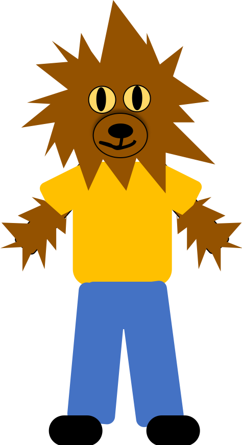

```{r setup, include=FALSE}
knitr::opts_chunk$set(echo = TRUE)
```

# Instructions:

This document contains information, questions, R code, and plots.

**Hints and reminders are bold**

<span style="color:blue"> Questions appear in blue. </span>


**Needs to be completed and handed in by 11th March, 2022, 23:59**

# Rationale

This week you will be looking at how to use linear models when we
have categorical explanatory variables. We will look
at the techniques to use, practicing how to use them, and focus on interpreting results
and how this is different to continuous explanatory variables.

# R hints and general help

## Definitions:

**Vector**: a sequence of data elements of the same basic type e.g. 1, 10, 3, 
7, 4 or TRUE, FALSE, TRUE

# Resources:
<!---
* [Help on data types](https://qmbio.math.ntnu.no/theory/all-about-data/) 
--->
* Background on Rothamsted and Fisher - why they are important in statistics (p8 The New Statistics with R)
* Week 4 - t-test. [Module](https://www.math.ntnu.no/emner/ST2304/2023v/Module04/Module04Normal.html) 
* Week 5 - regression. [Module](https://www.math.ntnu.no/emner/ST2304/2023v/Module05/Module05Regression.html)
* Week 7 - design matrix. [Module](https://www.math.ntnu.no/emner/ST2304/2021v/Module07/Module07MultipleRegression.html)
* Your brain - we will spend more time on this part of the exercise thinking through **why**
we are doing things and what it shows rather than just running the analyses.

## Extras (try to complete without these, but if you get stuck use them)

* [How to read lm() output](https://www.math.ntnu.no/emner/ST2304/2023v/Module08/Reading_lm_output.pdf)
* [Reminder of confidence interval definition](https://en.wikipedia.org/wiki/Confidence_interval)

## R this week:

Things to remember:

* `lm()` takes the arguments x, y, and data e.g. `lm(y ~ x, data = YOURDATA)` x and y here correspond to an 
explanatory variable (x) and a response (y)
* `plot()` and `abline()` 
* `predict()`
* `confint()` and `coef()`
* `qqnorm()` and `qqline()`
* `summary(YourModel)$r.squared`


# The challenge: Did we have a solution to insect pests back in 1942?

This week your group are a team of scientists looking into
how we can control insect pests on crops. You will look at the influence of insecticides on 
insects of crop plots in Ontario, Canada in 1942.

The data comes from a scientific paper from 
1942 http://www.bio.umass.edu/biology/kunkel/pub/Biometry/Beale_InSpra-Biom1942.pdf, 
pretty old. You have
columns of the:

* **biomass** (this was originally a count but 
we have altered it to be an indicator of biomass
because we should do a different kind of model for counts - which we will cover in a few weeks) 
of the dead insects randomly sampled in the plot after the treatment.
* **spray**, which insecticide spray the plot was treated with (no one seems to know what these
actually were - good lesson to always keep good notes!).

Here is a picture of an insect pest - the tomato hornworm *Manduca quinquemaculata* - 
in its most elegant form. (credit- wikipedia)


The experiment was run by taking several independent crop plots of 
nightshade *solanaceae* (tomatoes, peppers etc)
and spraying them
with one of six different insecticide sprays (again, we only know them as A,B,C,D,E,F). 
Insects were randomly sampled (dead ones) after the treatment. 

The data cover 72 plots, each spray was applied on 12 plots.

<span style="color:blue"> Your job is to find out whether these sprays influence
the amount of insects killed on a crop. </span>


# Part A: Choosing a model

The data can be found at https://www.math.ntnu.no/emner/ST2304/2023v/Module08/InsectData.csv

The first step is to import the data and assign it to an object. You can use the whole
web link above to import the data. It is a csv file with column names (header) included.

**One extra thing this week.** You will need to check the format of your data
using the `str()` function. You want to column `biomass` to be numeric and
`spray` to be a factor. It could be that spray originally comes in as `chr` which
means character. If this happens, you will need to change the way it is 
stored in R using: `InsectData$spray <- as.factor(InsectData$spray)`. **This
is good practice for when you use your own data**. Then you should ALWAYS
check how it is stored in R before doing an analysis. 

```{r ReadData, warning = FALSE, error = FALSE, include = FALSE, echo = FALSE, eval=TRUE}
InsectData <- read.csv("https://www.math.ntnu.no/emner/ST2304/2019v/Week8/InsectData.csv", 
                       header=TRUE)

InsectData$spray <- as.factor(InsectData$spray)
```
The next step, as always, is to **plot** our data. As we just have two columns we can use the 
`pairs()` function. (This won't work if you miss the extra step to check the
format of the data above.)  

```{r Pairs, warning = FALSE, error = FALSE, include = FALSE, echo = FALSE, eval=FALSE}
pairs(InsectData)
```

Take a look at the plot and think about the experimental design.

<span style="color:blue"> A1. **What** is the response variable and **what** is the
explanatory variable here? **What** kind of data are each of these? </span>

If you are unsure of what *kind* of data means. Take a look at the data types
help at the top of this document.

You want to try and model this data. Given your answer to question A1:

<span style="color:blue"> A2. **What** would do you think we
want to capture mathematically here? (Think about what kind of question you can
ask or model you can use.) </span>

<details><summary>I'm not sure I understand this question.</summary>

This question is asking you to start thinking about the whole modelling process, 
beginning
with choosing the appropriate model for your data. 

One way to do this, is to think about what you can find out or would
want to ask based on your data. For example, if you collected data
on temperature and plant height you might want to see if there is a
relationship between temperature and height or ask how temperature influences
plant height. 

In that example you would be choosing to mathematically capture
how much height changes with temperature i.e. a slope of a line, which
would be a regression model. You can choose this because both
variables are continuous. This would not be quite the same if one of
them was categorical.

So, to choose a model you need to think about your **question of interest** and
the **type of variables/data you have**.

**General hint: think about the kind of values we can get out of models e.g.
we can characterise a relationship, estimate a difference between means,
estimate a probability (these are all examples of models we have used), which
is most appropriate here?**

</details>


<span style="color:blue"> A3. **write** question A2 as a question
about biology. </span>

# Part B: Estimate parameters

Hopefully you have suggested something for question A3 that can be achieved
with a linear model i.e. `lm()`. If this is the case, we can run an `lm()` for our data.
You should know how to do this by now. We want our treatment column (just the column name) 
as our X value
and the response as our Y.

<span style="color:blue"> B1. **Run** an `lm()` for your question in A2/A3. </span>

<details><summary>We did not come up with a question.</summary>

To come up with a model that will work for your data, you need to decide
which of the variables in the data 
will be your **response (Y) variable** and what will be your
**explanatory (X) variable**. 

Think about which variable is most likely to influence the other. This
is not always easy and it will depend a bit on what you want to find out.
But there should be a direction that makes more sense. E.g.
butterfly wing beats are unlikely to affect the amount of wind
on a given day, but the amount of wind might affect how many 
beats a butterfly needs to stay flying. 

<details><summary>No, we still are not sure.</summary>

With the insect data you have two variables (1) the biomass of dead insects
and (2) the type of spray used on the crop. The amount of dead insects
is unlikely to impact the spray, but we would expect the spray to
have an influence on the amount of dead insects. 

biomass = Y, spray = X

</details>

</details>

```{r Model, warning = FALSE, error = FALSE, include = FALSE, echo = FALSE, eval=TRUE}
# run the model
InsectModel <- lm(biomass ~ spray, data = InsectData)

# get the coefficient estimates
coef(InsectModel)

# and the confidence intervals
confint(InsectModel)
```

<span style="color:blue"> B2. **What** are the coefficient estimates you get 
from the `lm()` and **what** do they represent? </span> 

**Hint: think about the equation for a linear model in weeks 4 and 5.**

You already know that the biomass variable has been squareroot transformed to improve
the fit of the linear model. But, we shouldn't just take someone else's word for this.
We should also check ourselves. Even with categorical data, we still have pretty much the same
assumptions for a linear model as we did for regression (but we no longer need a straight line!).

* Equal variance between each group
* Residuals are normally distributed at each X
* Residuals have zero mean
* Independence of data

<span style="color:blue"> B3. **Create** a residuals vs fitted and a
Normal QQ plot for your model from B1. **What** do you think of the model fit?
Remember to mention which assumptions are checked in each plot. </span>


```{r Resids, warning = FALSE, error = FALSE, include = FALSE, echo = FALSE, eval=FALSE}
# Get the rounded residuals and fitted values from the model
InsectResiduals <- round(residuals(InsectModel),2)
InsectFitted <- round(fitted(InsectModel),2)


# Plot the fitted versus residuals 
plot(InsectFitted, InsectResiduals)
# add a horizontal line at 0
# line is grey and dashed (lty=2)
abline(h=0, lty=2, col="grey")

# Plot a normal Q-Q plot
qqnorm(InsectResiduals)
qqline(InsectResiduals)
```

# Part C: The design matrix

**This section gives some more details on how to read a design matrix and what the different
parts mean.**

The `lm()` function in R uses a design matrix to determine how to model 
the data you put in. It is a way of telling R how the different parts of
the model fit together. You have seen these in the Lecture from Week 7. 
Luckily, R does this by default so usually you do not need to 
worry about the exact format of these matrices. But sometimes it can 
be a helpful way to think about model structure. 

Here we will try and explain a bit more about these matrices, so that
you can recognise the different elements that go in and how these relate
to the linear model equation: 

$$
y_i = \alpha + \beta x_i + \epsilon_i
$$

Also written as:

$$
y_i = \beta_0 + \beta_1 x_i + \epsilon_i
$$

We will explain this using a single example.

## The example:

I want to you to image a particular scenario for this rest of Part C. 
In the scenario, you have just designed and conducted an experiment. 
In this experiment, you wanted to look at how moon cycles affect werewolves.
You designed an experiment where you measured the level of werewolf hormone
in known werewolves. You did this at two different times "New moon" and 
"Full moon". 



In this example the response we have is hormone concentration and the
explanatory variable is moon stage. Moon stage has two groups/levels, which are
"New" and "Full", so it is categorical. These can also be written as 
0 = New and 1 = Full, this is called creating a **dummy variable**. A dummy
variable is a numerical representation of our categorical variable.

## Back to the design matrix

Now you have an example to picture, we can look at the different parts of the design matrix.

The first part of the design matrix, $X$, to consider is the first
column. This is indicated in black below. You can see that it is 
all 1s. This column represents the intercept of the model, $\alpha$ or $\beta_0$ in the linear
model equation. We will explain more about why this is a 1 below. 

The next part to think about is where you
put the values of your explanatory variables. In this case, this is
where we will write out the 0s and 1s to represent Full and New moon stage.
This is the second column of the matrix below, shown in red. 

In other words, this second column, and any others that come after, just
contain the observed values of our explanatory/predictor variables.
This is the $x$ part of the linear model equation above.

$$
X = \left(\begin{matrix}
        1 & \color{red}{0} \\\
        1 & \color{red}{0} \\\
        1 & \color{red}{1} \\\
        1 & \color{red}{1} \\\
        \end{matrix}  \right)
$$

So, with those two columns, you now have a design matrix for 
the example model! It contains your x values, we will call them covariate values here and a representation of the intercept.

In order to use this design matrix as part of the full model, 
you now need to specify some parameters that will
be used to relate the $X$ matrix to your observed response values, the $y$ from 
the linear model equation. 

To do this, we create a vector called $\beta$. It will contain all the parameter values we need ($\beta_0$ and
$\beta_1$), so its length is two.

$$
\beta = \left(\begin{matrix}
\beta_0 & \beta_1 \\\
\end{matrix}  \right)
$$

$Y$, your response data, is also a vector. It contains of all the values of $y$ that we observed. 

## Linking it all together

Now that you have all of the elements of the model: the design matrix $X$, 
the observed responses $Y$, and an indication of parameter values $\beta$, you
can combine them all to make your model and then use maximum likelihood 
estimation to find estimates of the parameter values within $\beta$.

To do this we use the following equation and some matrix multiplication.

Don't worry, you don't need to remember matrix multiplication, I will walk you through
it here. 

$$
Y = X \beta  + \epsilon
$$

When you multiply a matrix by a vector (as we do with $X$ and $\beta$) 
the first column of the matrix gets multiplied by the first element of the
vector. In this case, the first column of the matrix = the 1s that
indicate the intercept and luckily, the first element of $\beta$ is the 
estimate of the value of the intercept. **Now we can see why we wanted 1s in our $X$ matrix!** 
This is because the intercept is a constant.  

So, the next column of the design matrix, which is the values we measured for
our covariates, then gets multiplied by the $\beta_1$ element of $\beta$. 
For our group 0, which
was the New moon, this will = the intercept because $\beta_1$ is multiplied by
0. For our group 1, which was Full moon, this will = the mean hormone level
when the moon is full and $\beta_1$ = the difference between the 
intercept (the mean hormone level when the moon is new) and the mean
hormone level when the moon is full.

```{r SimData, warning = FALSE, error = FALSE, eval = TRUE, echo = FALSE}

# make fake data
set.seed(2020)
datafile <- data.frame(y <- c(rnorm(50,10,5), rnorm(50,30,5)),
                       x <- rep(c(0,1), each = 50))

plot(datafile$x, datafile$y, axes=F,xlab = "X",
     ylab = "Y", pch=16)
axis(1, at = c(0,1), labels =c("group1", "group2"))
axis(2, las=1)

points(0, mean(datafile$y[1:50]), col=2, pch=3, cex=2, lwd=4)
points(1, mean(datafile$y[51:100]), col=5, pch=3, cex=2, lwd=4)

lines(c(0,1), c(mean(datafile$y[1:50]), mean(datafile$y[51:100])), lty=3,
      col=4)

legend("topleft", c("beta0 (mean of group 1)", "beta0+beta1 (mean of group 2)", "beta1 (difference in means)"),
       col=c(2,5,4), pch=c(3,3,0), lty=c(1,1,3), lwd=c(2,2,1))
```

# Part D: Quantify uncertainty

Now that you have thought about what the numbers in your model output 
represent and checked your model fit, it is now time to add uncertainty.

<span style="color:blue"> D1. **Calculate** the confidence intervals for your
model from B1.</span>

<details><summary>Hint.</summary>

You can get R to calculate them for you using `confint()`

</details>

<span style="color:blue"> D2. **Describe** the output from `lm()`,
include the confidence intervals here too and think about what they 
are the confidence intervals for. Describe the pattern the numbers show. 
You don't need to interpret in a biological sense here, just explain what
the numbers mean.</span>

```{r Coefs, warning = FALSE, error = FALSE, include = FALSE, echo = FALSE, eval=FALSE}
# Get the rounded residuals and fitted values from the model
coef(InsectModel)
confint(InsectModel)
```

**Remember: confidence intervals represent the uncertainty around our estimate.**

<span style="color:blue"> D3. Do you think that the current output is
 the most helpful way to show the results of the `lm()`? </span>
 
<span style="color:blue"> D4. **Why** is it important to quantify uncertainty
in our parameter estimates?</span>

# Part E: Interpret

The final step of any analysis is to interpret the results in 
context. In this case, you want to interpret what the results tell you
about the question you wrote in A2/3.

<span style="color:blue"> E1. **Interpret** the output from the `lm()` in B1.</span>

Now we want to add the biological meaning, not just the patterns of the numbers. 

<span style="color:blue"> E2. **How** do these
results help you answer your question from A2/3? 
(include the confidence intervals here too, can look at R squared as well).</span>

Be specific here about relating back to the question. You might have mentioned 
some of this in E1 but now just relate it to the question from A2/3. 


```{r Rsq, warning = FALSE, error = FALSE, include = FALSE, echo = FALSE}
summary(InsectModel)$r.squared
```

# Part F: Reflection

While we can get results here and draw conclusions. 
This data is quite old (more than 60 years old),
and the data collection was not perfect. Also our aims might have changed. 
With invertebrate declines
being more common, we might not want an insecticide that kills everything.

<span style="color:blue"> F1. If you were to re-design this experiment now in 2023 in Norway
what would you do? **Write** a brief experimental design for this study. </span>

You should include:

* What you want to find out (biological question). 
* What treatments you would use. (Can add new ones you think were missed in 1942).
* Highlight one problem with the 1942 data and say how you would fix it.
* Which assumptions of a linear model do you need to consider in the experimental design phase? Say how you will do this.
* Maximum of 300 words, this should be short! 

# Part G: Feedback

<span style="color:blue"> G1. How do you think this exercise went? What do
you think your group did well, what are you less sure about? 
(2 examples of each) </span>

<span style="color:blue"> G2. What do you think you improved from last 
week? </span>

<span style="color:blue"> G3. Are there any concepts you are very unsure of? </span>

<span style="color:blue"> G4. What would you like feedback on this 
week? </span>
