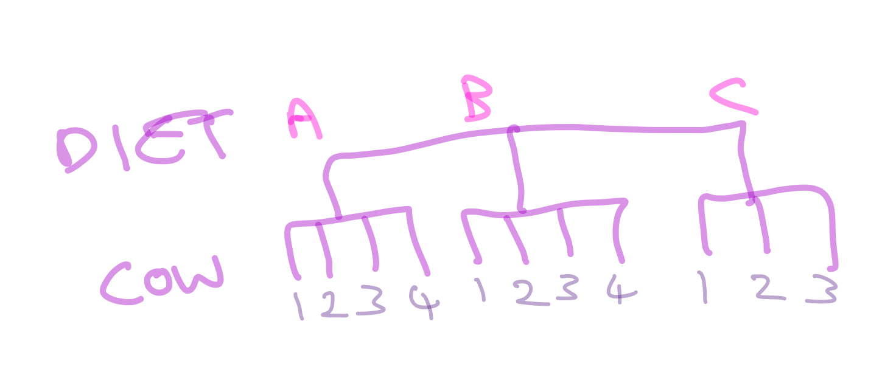

```{r setup, include=FALSE}
knitr::opts_chunk$set(echo = TRUE, cache=TRUE)
```

# Introduction

This is a summary of a second approach to the analysis of the cow data. There is a recording of me doing the analysis, which has been lightly edited. The text below follows what I did, and cleans it up. Note that this goes into ideas and models that we will not cover in the course (and will not be on the exam): I did this partly to show that there are often several approaches to the models, and also that there is a lot of statistics out there, but a lot of it you should be able to understand, with a bit of effort.

The code used in the analysis [can be found here](CowCode.R). The markdown document used to create this html document [is here](Week10aCowAnswersVersion2.Rmd), if you want to see the inner workings. 

## The Problem 

<a title="Keith Weller/USDA, Public domain, via Wikimedia Commons" href="https://commons.wikimedia.org/wiki/File:Cow_female_black_white.jpg"></a>

As a reminder, cows were split into 6 groups, each given a different diet treatment and the question was whether the diets affected the amounts the cows ate (measured as DMI).  You can find the data [here](https://www.math.ntnu.no/emner/ST2304/2020v/Week09/cowdata.csv): it is a .csv with a header.

The columns in the dataframe are:

- DMI = the dry matter intake during the experiment (grams)
- Baseline = the baseline dry matter intake before the experiment (grams)
- Treatment = the diet treatment group (1 to 6)

The main analysis considered the `Baseline` food eaten as a covariate. But there is another way to look at this, as a before/after study. We can think that `Baseline` is a response, i.e. before the treatment, and `DMI` is a measurement after the treatment.

# The Video 

[Video here](https://ntnu.cloud.panopto.eu/Panopto/Pages/Viewer.aspx?id=aa3bb237-a558-4e82-876f-acf4011dc7c2).

<iframe src="https://ntnu.cloud.panopto.eu/Panopto/Pages/Embed.aspx?id=aa3bb237-a558-4e82-876f-acf4011dc7c2&autoplay=false&offerviewer=true&showtitle=true&showbrand=false&start=0&interactivity=all" height="405" width="720" style="border: 1px solid #464646;" allowfullscreen allow="autoplay"></iframe>

# Formatting the data

First we read in the data, and reformat it. 

```{r ReadCowData}
cowdata <- read.csv("https://www.math.ntnu.no/emner/ST2304/2020v/Week09/cowdata.csv", header=T)
cowdata$Treatment <- as.factor(cowdata$Treatment)
cowdata$Baseline <- as.numeric(cowdata$Baseline)
# Remove NAs
cowdata <- cowdata[!is.na(cowdata$Baseline),]

```

To re-format we have to make the amount of food eaten the response, i.e. put `Baseline` and `DMI` into one column. We then need to have a variable saying whether the measurement was before or afterwards (`BeforeAfter`), and also a variable saying which cow the measurement belonged to (called, imaginatively, `Cow`).

```{r RedrawData}
cowdata2 <- data.frame(
  Treatment = rep(cowdata$Treatment, 2),
  BeforeAfter = rep(c("Before", "After"), each=nrow(cowdata)),
  FoodEaten = c(cowdata$Baseline, cowdata$DMI),
  Cow = rep(1:nrow(cowdata), 2)
)
cowdata2$BeforeAfter <- factor(cowdata2$BeforeAfter,
                               levels=c("Before", "After"))
cowdata2$Cow <- factor(cowdata2$Cow)
```

# Modelling

So, to the modelling. 

First, an explanation. Any observation of the amopunt a cow ate depends on the following:

- whether it was before or after the dieting started
- which diet the cow got, and
- which cow it was.

Now, each cow only got one diet, so if we fit a model with `BeforeAfter` and `Cow` we cannot also use `Diet`, as the variation between cows is already fully explained. So we need a slightly different model.

## Nested Effects

The data structure we have is what is called a nested design. Each cow is *nested* within Diet. The structure looks like this:



So cow 1 in diet A is not the same as cow 1 in diet B. We can have more levels of nesting (e.g. [each leg of a cow](https://www.csmonitor.com/2005/0921/p25s01-stct.html)), if we want.

We would want a parameter for each cow, and also one for each diet. But that would give us too many parameters (6 diets and `r nrow(cowdata)` cows), so we have to treat one cow in each diet as an intercept.

We also have to write the nestedness in the model. We do this using A/B, i.e. B is nested within A. Obviously we can extened this, e.g. A/B/C. It turns out that this is the same as A + A:B, i.e. A and the interaction of A and B, but not the B main effect.

Finally, let's fit the models. First the model without diet.

```{r FitNewModels}
model1a <- lm(FoodEaten ~ Cow + BeforeAfter, data=cowdata2)
coef(model1a)
```

Note that there are now a lot of parameters, because there are a lot of cows. We will do something soon to simplify this.

Now we can add Diet:

```{r FitNestedModels}
model2a <- lm(FoodEaten ~ BeforeAfter + Treatment/Cow, data=cowdata2)
# summary(model2a)$coefficients

```

This, of course, also has a lot of parameters, actually the same number as the model with just cows:

```{r Parameters}
length(coef(model2a)[!is.na(coef(model2a))])
length(coef(model1a))
```

The difference is that now some of the parameters are the effects of diet:

```{r DietEffects}

round(summary(model2a)$coefficients[!grepl("Cow", rownames(summary(model2a)$coefficients)),], 4)


```

There is a clear effect of whether the observation was done before or after the treatment (which is probably not interesting). There may be some variation between diets, but could it be explained by chance? We can use ANOVA to test this:

```{r anova}
anova(model2a)
```

That suggests that we could get this be chance. But, you might say, some of the differences are signficant, e.g. the Treatment3 effect. However, with enough comparisons we would expect some to be significant. Just by chance.

## More complex modelling: random effects

If we have another week or two of the course, we would talk a bit about random effects and mixed models. But alas, we have to sneak them into the end of an extra analysis that was purely optional. As you may guess, this will not be on the exam (nested effects won't be either).

The idea here is that we are not actually interested in Cow Number 6, or how it differs from (say) Cow Number 9 ^[Of course, you will immediately notice that they are the same cow, but Cow Number 9 is upside down]. What we are interested in is how the variation between cows affects the differences in diet estimates, i.e. the variance in cows. We can do this by assuming their effects are normally distributed with a mean of zero, and we are not so interested in estimating each cow effect, instead estimating their variance is more interesting. 

The statistical theory for the actual estimation gets more technical (we don't maximise the likelihood for every parameter, we actually average over the possible values of the cow effects).

In practice we can use the `lmer()` function in the `lme4` package:

```{r FitRandomModel}
library(lme4)

modelRa <- lmer(FoodEaten ~ Treatment + BeforeAfter + (1|Cow), data=cowdata2)

summary(modelRa)

# Coefs <- summary(modelRa)$coefficients
# TreatEffs <- data.frame(Coefs[grep("Treat", rownames(Coefs)), ])
# TreatEffs$Lint <- TreatEffs$Estimate - TreatEffs$Std..Error
# TreatEffs$Uint <- TreatEffs$Estimate + TreatEffs$Std..Error

  
# plot(TreatEffs$Estimate, 1:nrow(TreatEffs), xlab="Diet Effect (g)", ylab="Treatment",
#      xlim=c(min(TreatEffs$Lint), max(TreatEffs$Uint)))
# segments(TreatEffs$Uint, 1:nrow(TreatEffs), TreatEffs$Lint, 1:nrow(TreatEffs))


```

The output is more involved, but the main parts are the fixed effects and the random effects. The fixed effects suggest that there is little difference between the treatments, perhaps a maximum difference of about 1.5g (between treatments 3 and 4). The Random effects summarise the amount of random variation, so the cows have random variation that is normally distributed with a mean of 0 (by design) and a standard deviation of `r round(sqrt(lme4::VarCorr(modelRa)[1]$Cow), 2)`g. This is slightly larger than the residual effect, so this suggests that there is a bit more variation between cows than between repeated measurements of the same cow. It is also a bit bigger than the largest difference between treatments, again suggesting that the treatments do not have large effects (this is why I looked at the standard deviation, not the variance: it is on the same scale as the differences).

So, the overall conclusion is the same, but this tells us something about cow-to-cow variation. This sort of random effects modelling is now common in modern statistics. A lot of the ideas were developed from genetics and evolutionary biology, thanks initially to R.A. Fisher.

## Footnote