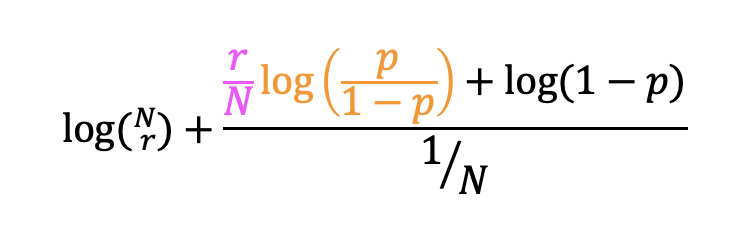
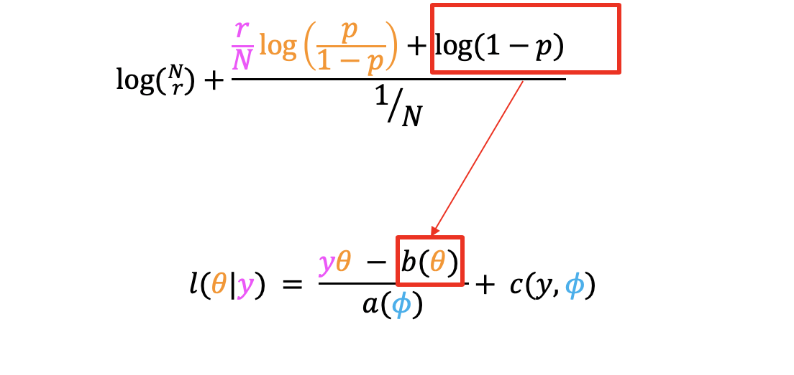
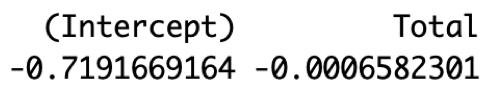
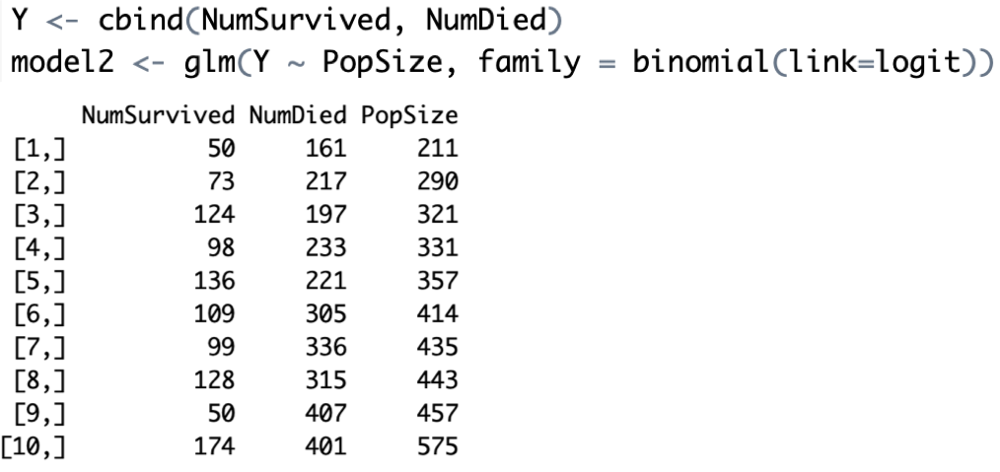
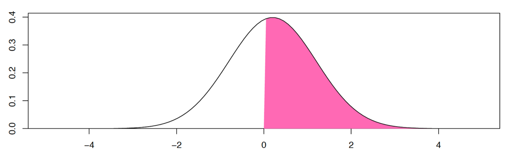
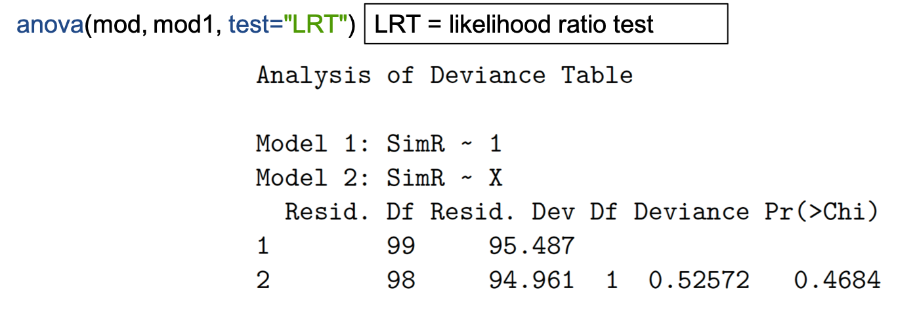

```{r setup, include=FALSE}
knitr::opts_chunk$set(cache=TRUE, dpi = 48)
```


## Instructions:

This module replaces the lectures on Binomial GLMs. 

This document contains:

* Information and background 
* Questions and answers 
* R code 
* Plots and illustrations
* video lectures

**Hints and reminders are in bold**

<span style="color:blue"> Questions appear in blue. </span>
<span style="color:purple"> Answers appear in purple. </span>


### Contents of module

* Part A = Reminder of the Binomial distribution
* Part B = The logit link
* Part C = Interpretation
* Part D = Alternative coding using `glm()`
* Part E = Other link functions `probit` and `cloglog`
* Part F = Model selection for GLMs
* Part G = Practice with a dataset

### New R skills

* Using `glm()` with `link` and `family` arguments.
Particularly, `family = Binomial` and `link=logit`
* Using `predict()` for a `glm()`


-----

Intro video
<!---
<iframe src="https://ntnu.cloud.panopto.eu/Panopto/Pages/Embed.aspx?id=f802ef7f-1daf-4dfe-ae7b-ad05011d9a3c&autoplay=false&offerviewer=true&showtitle=true&showbrand=false&start=0&interactivity=all" height="405" width="720" style="border: 1px solid #464646;" allowfullscreen allow="autoplay"></iframe>
--->
[link](https://ntnu.cloud.panopto.eu/Panopto/Pages/Viewer.aspx?id=f802ef7f-1daf-4dfe-ae7b-ad05011d9a3c)

## Part A: Reminder of the Binomial distribution

You have used the Binomial distribution already in this course.
You used it to look at the proportion of land and sea and to look
at the sex ratio of dragon eggs.


The Binomial distribution is used to represent the number of 
successes ($r$) from a number of independent trials ($N$) when
the probability of success ($p$) is the same for each trial. We
use it for binary data, 0s and 1s.

The Binomial distribution has two parameters $N$ and $p$. Usually,
we know $N$ (it comes from the data), 
so there is only one unknown parameter that we estimate.
That is $p$ (this is why
sometimes we list only one parameter - but we should remember there are two). 


### So, how do we use the Binomial distribution in a GLM?

We use the Binomial distribution for the random
part of a GLM, when we have response data that
match the characteristics of a Binomial distribution, 
i.e. there are successes and failures from independent trials. 
Examples would be survival data, sex
ratios, anything where you have only successes and failures (two options).

### What about the likelihood?

$$
\begin{aligned}
log(Pr(n=r|N, p)) = log(N!/r!(N-r)!) + rlog(p) + (N-r)log(1-p))
\end{aligned}
$$

The above is the likelihood for the Binomial distribution, 
you saw this in week 2.

**But does this work as a GLM?**

Last week, we showed you the general equation for GLM likelihoods.


So, can the Binomial likelihood fit this 
general formula?

If we rearrange the Binomial likelihood, we can get the 
following equation (you don't need to know how to rearrange, but
ask us if you want to know):

{width=60%}


We can then compare this to the general formula. 


First, let's look at $y\theta$:


Then, $b(\theta)$: 

{width=70%}

Then, $a(\phi)$:

{width=70%}


Finally, $c(y, \phi)$ 
{width=80%}


The general conclusion is **Yay! it also fits**.
Following the same idea as last week, you can also
see the link function in the definition of $\theta$.

For the Binomial GLM the default/canonical link is:

$$
log \left( \frac{p}{1-p} \right)
$$

This is called the logit, more on this later. 

### Now to try using a Binomial GLM

**The data:** you have data on some sheep. The data 
are from 1986 to 1996 for a population of Soay sheep.
Today we will look at what influences their survival.
The data contain information on survival, 
body weight, age, year, and population size.

{width=80%}

```{r ReadSheep, echo=F, include=F}
SheepData <- read.csv("SheepData.csv", header=T)
```

<span style="color:blue"> A1. Look at the plot below, 
a straight line has been fitted. 
Why was this a bad idea? (Think of several reasons). </span>

```{r BadSheepBadSheep, echo=FALSE}
plot(SheepData$Weight, jitter(SheepData$Survival, factor=0.3), 
     xlab="Weight (kg)", 
     ylab="Survival probability")
abline(lm(Survival~Weight, data=SheepData), col=2)
```

<span style="color:blue"> A2. What survival 
probability would you predict, for a body weight of 40kg, based on this 
line? Is this sensible? </span>

<span style="color:blue"> A3. What shape of line do you 
think would fit better? </span>

<details><summary><span style="color:purple">I had a go, now show me the answers.</span></summary>

<span style="color:purple"> A1. Straight line does not fit 
data. This will make the residuals bad. Even with scaling
they will just be in two lines, not normal at all! and the line
goes beyond what is possible for the data. </span> 

<span style="color:purple"> A2. If you predict for 40kg, the
survival probability would be approximately 1.3. This is
outside what is possible – you would predict survival above 100%. </span>

<span style="color:purple"> A3. Better to use curved line
 – bounded at 0 and 1 (this is a Binomial GLM). </span>

</details>


-----

## Part B: The logit link


### First, a quick summary of the Binomial GLM

```{r BinomEx, echo=FALSE}
mod1 <- glm(Survival ~ PopSize, family = binomial(), data=SheepData)
predx <- data.frame(PopSize=seq(min(SheepData$PopSize),
                                max(SheepData$PopSize),
                                length=30))
predpsurv <- predict(mod1, newdata = predx, se.fit = TRUE, type = "response")
pred400 <- predict(mod1, newdata = data.frame(PopSize=400),
                   type = "response")
plot(jitter(SheepData$PopSize), jitter(SheepData$Survival, factor=0.3), 
     xlab="Population Size", 
     ylab="Survival probability")
lines(predx$PopSize, predpsurv$fit, col=2)
lines(predx$PopSize, predpsurv$fit-1.96*predpsurv$se.fit, col=2, lty=2)
lines(predx$PopSize, predpsurv$fit+1.96*predpsurv$se.fit, col=2, lty=2)
arrows(x0=400, y0=-0.051, x1=400, y1=pred400, col="lightblue",
       length=0.1, lwd=3)
arrows(x0=400, y0=pred400, x1=200, y1=pred400, col="lightblue",
       length=0.1, lwd=3)
```

*Example of a Binomial GLM fitted line (solid line) and confidence intervals (dashed lines)
for the relationship between survival and population size. Arrows
show how you can predict Y from X. This is plotted on the
original scale.*

* It is still a regression based model
* The aim is still to predict Y values for a given X
* In the sheep example, Y is the probability of being in state 1 (alive)
* It fits curved lines bounded at 0 and 1

### Back to the logit link

If you think back last week weeks ago, hopefully you will remember that
there are three parts of a GLM:

* The <span style="color:orange">systematic part</span>: $\alpha$ + $\beta$$X_i$, this is called a linear predictor (because it makes a straight line), we can represent it using the symbol $\eta$
* The <span style="color:purple">random part</span>: the distribution of error
* The <span style="color:magenta">link function</span>: that links them together

In this section we focus on the link function. 
There are different link functions for different distributions.
Each link function has a name and an equation. 
Last week you used the log link.

{width=70%}

For a Binomial GLM, the <span style="color:purple">random part</span> is
the Binomial distribution. The systematic part is 
still <span style="color:orange">$\alpha$ + $\beta$$X_i$</span>.
The canonical link function is the <span style="color:magenta">logit link
</span>. This is what we will begin with today. This is why a
Binomial GLM can also be called a logistic regression.

The logit link takes the following form:

$$
\begin{aligned}
\mu = log \left(\frac{p}{1-p} \right)
\end{aligned}
$$

Where $\mu$ = the log odds, which is the output of the model.

The inverse of the logit link is:

$$
\begin{aligned}
p = \frac{e^{\mu}}{1+e^{\mu}} 
\end{aligned}
$$

OR

$$
\begin{aligned}
p = \frac{1}{1+e^{-\mu}} 
\end{aligned}
$$

Where $p$ = the probability of success.

Here $\mu$ is on the link scale and $p$ is on the original scale. 

### Log odds

{width=70%}

(cartoon from [xkcd](https://xkcd.com/2599))

You can interpret the results of a Binomial GLM on either the 
original scale or on the logit scale. 

The logit link gives the log odds. Odds are often used in betting.
Odds of 10:1 mean for every 1NOK you bet, you win 10NOK.
The betting companies assume that for every 1 success
there will be 10 failures.

To get to the log odds there are a few steps.

1. We need the probability of success: $\frac{1}{(1+10)}$ = $0.09$

2. Next we use that probability to find the odds:
$\frac{0.09}{(1-0.09)} = 0.0989$
 
3. To get to the log odds, we take the log of 2:
$\log \left( \frac{0.09}{(1-0.09)}\right) = -2.31$

Step 3 should look familiar. It is the same as the link 
function in the Binomial GLM. 

**Great... so how do we interpret it?**


-----

## Part C: Interpretation

This is best addressed with an example. 

First we will look at an example on a different dataset just to show how 
the coefficients match the linear predictor. 
Then we will use that to interpret the sheep example. 

Here are the coefficients output from a GLM:

{width=50%}


They can map onto the systematic part of the GLM:

{width=50%}

So now to interpret. If you remember from last week the
systematic part is on the link scale. Therefore:

$\eta = \alpha + \beta X$

where $\eta$ = the log odds of the probability (in most of our
examples today it is survival). This becomes the $\mu$ in the logistic
equation (the inverse of the logit link).

To see what the
effect of $\beta$ is on the original scale, we need to
predict values of $Y$ for particular
$X$ values and see what the change looks like. 

We can predict using the linear equation and then take the inverse link of this 
prediction. To get a prediction on the original scale. 


**Now, we will look at the example of Soay sheep from Part A.** 

There we will fit a Binomial GLM to explain survival using **population
size.**


In the sheep example (shown below), for every 1 change in population 
size the log 
odds of survival goes down 0.004. **What does this
look like on the original scale?**

 

But often, it is easier to plot the whole relationship. This
is because the line is not linear, the change induced 
by $\beta$ is not the same for every $X$ (on the original scale). 
It is linear on the link scale.

```{r BinomEx2, echo=FALSE}
plot(jitter(SheepData$PopSize), jitter(SheepData$Survival, factor=0.3), 
     xlab="Population Size", 
     ylab="Survival probability")
lines(predx$PopSize, predpsurv$fit, col=2)
lines(predx$PopSize, predpsurv$fit-1.96*predpsurv$se.fit, col=2, lty=2)
lines(predx$PopSize, predpsurv$fit+1.96*predpsurv$se.fit, col=2, lty=2)

```

Hopefully, this last plot is a bit easier than the raw coefficients. But choose
whichever method makes most sense for you!


### Now have a go yourself

**Here you are looking at body weight instead of population size** (you can
have a think about whether separating these into two models is really sensible.)

The sheep data are available at https://www.math.ntnu.no/emner/ST2304/2020v/Week12/SheepData.csv. 

It is a .csv file with a header and columns:

* Year = year of observation
* Age = age of the sheep
* Survival = whether the sheep survived or died
* Weight = body weight in kg
* PopSize = population size

<span style="color:blue"> C1. Fit a Binomial GLM using 
the sheep data to answer the question: 
'Does body weight influence survival probability in sheep?'</span>

<span style="color:blue"> C2. Look at result 
using `coef()` and `confint()`.
What do the coefficients represent? 
Don’t worry about the
link here, just think about where they fit into $Y_i = \alpha + \beta X$.
</span>

The code to do this is explained at the start of this module.

<details><summary>I can't work out the code.</summary>


```r
model <- glm(Y ~ X, YourData, family = binomial(link=logit))
```

</details>

<details><summary><span style="color:purple">I had a go, I'm ready for answers.</summary></span>

<span style="color:purple"> C1 and 2. The code to run the model and 
the output are shown below. 
</span>


</details>

<span style="color:blue"> C3. What do the coefficients tell
us about the relationship between body weight and survival probability?
</span>

Equation for inverse of logit link

Your prediction = $\frac{1}{1+e^{-\mu}}$

Remember: $\mu_i = \alpha + \beta X_i$
 
How to write it in R:


```r
prediction = 1/(1+exp(-(Intercept + (Slope*X))))
```

You need to fill in your own intercept, slope (from your
model output), and X values.

<span style="color:blue"> C4. Use the inverse link equation to
work out the probability of survival when weight = 0kg (the intercept). </span>

<span style="color:blue"> C5. Use the inverse link to 
work out the change in probability of survival 
between the mean body weight (20kg) 
and one standard deviation above 
the mean (25kg). </span>

<details><summary><span style="color:purple">Done, answer time.</summary></span>

<span style="color:purple"> C3. The results show us there
is a positive relationship between body weight and the log 
odds of survival. The confidence intervals do not cross 
zero (0.149 to 0.203), so even when we include uncertainty, we
still estimate a positive relationship. The plausible range of
the effect is an increase in log odds of survival of 0.149 to 0.203
for every 1kg increase in weight.
</span>

<span style="color:purple"> C4 and 5. The code and answers are shown
below. </span>

```{r, echo=F, include=F}
SheepData <- read.csv("SheepData.csv", header=T)
```

```{r, echo=T, include=T}
# Run model
model <- glm(Survival ~ Weight, data = SheepData, family=binomial(link=logit))

# Look at results
coef(model)
confint(model)

# Then predict
prediction_intercept <- 1/(1+exp(-(-2.0298345+(0.1754527*0))))
prediction_intercept # weight = 0kg

prediction_20 <- 1/(1+exp(-(-2.0298345+(0.1754527*20))))
prediction_20 # weight = 20kg

prediction_25 <- 1/(1+exp(-(-2.0298345+(0.1754527*25))))
prediction_25 # weight = 25kg

```

</details>

But it can be easier to interpret the results from a plot
of the model. For a GLM, we cannot use `abline()` as we 
did with `lm()`. This is because the coefficients refer to
change on the link scale but typically we want to plot on
the original scale. 

In this case, we need to predict new $Y$ values for each
$X$ on the original $Y$ scale, we can then plot those.

You have done this in previous weeks, using the function `predict()`.
We can use it again here too. Go back to Exercise 5 if you
can't remember how to use `predict()`.  

To begin you want to create a dataframe called `newdata` which
contains the values of $X$ you want to predict for **Remember:
to name this the same as the column in your data**. I would
recommend doing a sequence of values from 0 to the maximum weight (35kg),
it will make the plot neater.
You can use the `seq()` function to create these $X$ values. 

You can then use `predict()` to predict the new $Y$ values, make
sure to assign them to an object. 

#### How do I make this plot myself?

To make the plot, we will need generate some predictions to make the line. These 
will need to be on what is called the `response` scale, this is the original 
scale. 

You have used `predict()` before for `lm()` objects, but we can also use it for 
`glm()` objects. For `glm()` we want to use predict with three arguments:

 * `object` = your model object
 * `type` = "link", which means predict on the link scale or
 "response", which means predict on the response scale. 
 * `se.fit` = TRUE, which means that standard errors will be given as well as the
 prediction. We can use this to plot the confidence interval
of our fitted line.
 
The argument `interval` does not work for `glm()` objects.

See if you can use predict yourself, otherwise:

<details><summary>get a hint.</summary>

```{r Predict1}
# first make some `new` X values to predict for
newdata <- data.frame(Weight = seq(0,35,1))

# then predict from your model
predictions <- predict(model, newdata, type="response", se.fit=T)
```

</details>

The output of `predict()` will be a list with three elements.
It is the first two that we are interested in `fit`
(our fitted values) and 
`se.fit` (the standard error of the fitted values). You
can refer to each part using `$` as you do for column names 
e.g. `predictions$fit`.

<span style="color:blue"> C6. Use the code below to
plot your model result. What can you interpret now?
Is it easier than using the coefficients?
</span>

**Start by plotting the raw data.** Make sure the response
and explanatory variables are on the correct axes. 

Use `plot(x, y)`. 

```{r Plot1, eval=FALSE}
# Now add a line for the fitted line
lines(newdata$Weight, predictions$fit, col=YOURCOLOUR)

# And the confidence interval, lty changes to a dotted line
lines(newdata$Weight, 
     predictions$fit + (2*predictions$se.fit), 
     col=YOURCOLOUR, lty=2) 
lines(newdata$Weight, 
     predictions$fit - (2*predictions$se.fit), 
     col=YOURCOLOUR, lty=2)
```


<details><summary><span style="color:purple">Check your plot.</summary></span>


</details>

**<span style="color:purple">Videos for answers:</span>**
<!---
<iframe src="https://ntnu.cloud.panopto.eu/Panopto/Pages/Embed.aspx?id=f7320670-0735-4cc6-9821-ad05011d5e7f&autoplay=false&offerviewer=true&showtitle=true&showbrand=false&start=0&interactivity=all" height="405" width="720" style="border: 1px solid #464646;" allowfullscreen allow="autoplay"></iframe>

<iframe src="https://ntnu.cloud.panopto.eu/Panopto/Pages/Embed.aspx?id=9690486c-daae-43eb-9370-ad05011d5eb5&autoplay=false&offerviewer=true&showtitle=true&showbrand=false&start=0&interactivity=all" height="405" width="720" style="border: 1px solid #464646;" allowfullscreen allow="autoplay"></iframe>

<iframe src="https://ntnu.cloud.panopto.eu/Panopto/Pages/Embed.aspx?id=dc1875a8-9080-4161-9250-ad05011d5e48&autoplay=false&offerviewer=true&showtitle=true&showbrand=false&start=0&interactivity=all" height="405" width="720" style="border: 1px solid #464646;" allowfullscreen allow="autoplay"></iframe>
--->
[Part 1](https://ntnu.cloud.panopto.eu/Panopto/Pages/Viewer.aspx?id=f7320670-0735-4cc6-9821-ad05011d5e7f)
[Part 2](https://ntnu.cloud.panopto.eu/Panopto/Pages/Viewer.aspx?id=9690486c-daae-43eb-9370-ad05011d5eb5)
[Part 3](https://ntnu.cloud.panopto.eu/Panopto/Pages/Viewer.aspx?id=dc1875a8-9080-4161-9250-ad05011d5e48)

-----

## Part D: Alternative coding using `glm()`

We have shown you one way, above, that you can fit a Binomial GLM in R.
But there is one other way. You do not need to remember it for this course, but it is useful to know. 

**Option 1**: fitting response as a single factor (What we do here).

**Option 2**: (Alternative) fitting response as two columns.

For option two, you need to change your single column of 0s and 1s to make two columns (one of success (1) and one of failures (0)). Doing this accounts for number of trials (Number of trials is number in population).

The R code to do this and an example of what the data looks like are shown below.


-----

## Part E: Other link functions `probit` and `cloglog`

So far, we have used the logit link for Binomial GLM.
This is the default (canonical) link in R.
But you can use others too. For the Binomial distribution we have two other options: **Probit** and **cloglog**. 

The reason you would choose one link function instead of another depends on the question you are asking and what you want the output from your model to mean. For more complicated models some link functions are easier to work with, so even if you don't use these link functions, you may stumble across them.

### Probit

One way of thinking of binomial problems is as a threshold:

e.g. imagine you have a dam, and if the water is too high, it will flow over the dam. You therefore want a model of when the dam overflows (it either does or does not). What we observe, and model, is whether the water was too high, or not. But, hidden underneath this is a variable of water height, which we don't observe. But it is water height that controls if the dam overflows or not. We call an unobserved variable like this a **latent variable**.

This idea can be used in the modeling. If we observed the water height, we could model it with a regression against rainfall, and assume the residuals are normally distributed (as we've done earlier). But, we only have data on whether this value is above a certain threshold, or not. So, it turns out that this is the same as a binomial GLM with a probit link!

Mathematically the model is $Y_i = 1$ if $\mu_i > 0$, i.e. $\mu_i$ is the latent variable. And 
$\mu_i \sim N(\sum \beta_{j} x_{ij},1)$. The residual error of the latent variable has a variance of 1, so the parameter estiamtes can be compared to that. An estimated change of 4 on the latent scale could move the probability a long way (e.g. from -2 to +2 would move the probability from about 0.025 to 0.975). But a value of 0.1 would only move it a percent or two. You can see this on the Figure below.

The threshold idea can be useful for interpreting models: if you think there is some unobserved variable that causes the binary response when it is above a threshold, it can be easier to understand the process. More complex models (like Genersalised Linear Mixed Models, which we would look at if we had more time) are often written with sums of normal distributions, so the probit link just adds one more on the end.

In practice the estimates from the probit and logit link functions are almost the same, even though they have different interpretations.



Uses an inverse normal link function.

Higher mean = higher probability of success.

**Use when you want a threshold model because you have an unobserved variable that causes a binary response.**

### cloglog

Using a cloglog link allows binary data to be linked to count data.

It is useful when the 0s and 1s actually come from counts, where the count is recorded as "0 or "zero" or "more than zero". For example, the presence of absence of a species. In this case you are really looking at abundance of a species. 

Technically, we assume that the count follows a Poisson distribution (which we will look at in more detail next week). From this we can link the binary data to a log(abundance) using the equations below.


So, in the model we use

$$
\mu = \log(-\log(1-p))
$$
or, if we want to calculate the probability we would get our computer to use

$$
 p = 1 - e^{-e^\mu}
$$


**Use when you want to link the binary data to abundance because they represent counts.**

<span style="color:blue"> E1. Write an example of when you might want to use the Probit link and when to use the cloglog link.
</span>

<details><summary><span style="color:purple">See our examples.</summary></span>

<span style="color:purple">Probit = the dam example above is a good one, another could be whether a temperature alert is triggered on a machine. You only see if the alert is triggered, or not, but underlying this is an actual temperature.</span>

<span style="color:purple">cloglog = presence and absence of plants. Anything that could be related to counts.</span>

</details>


-----


## Part F: Model selection for GLMs

You have already learnt about model selection for linear models. We also need to do this for GLMs. But, it is a bit different for the GLMs.

The main change is in the terminology. One thing that stays the same are the two types of model selection you were introduced to for linear models **Exploratory model selection** and **Confirmatory model selection.**

### Exploratory model selection with AIC/BIC:

For GLMs this is the same as for linear models. For linear models you know the AIC and BIC are the result of the -2*log likelihood + a penalty. For GLMs it is the same idea with a slight change of words:

AIC/BIC = Deviance + 2*parameters

Deviance = $-2l(\theta|Y)$ which is -2 times the difference in loglikelihood between two nested models (models that have some structure the same e.g. Y ~ X and Y ~ X + Z but NOT Y ~ X and Y ~ Z)

### Confirmatory model selection:

This part is a bit more different for GLMs. Now, we compare deviance instead of the sum of squares, but otherwise the idea is the same. We can still use the function `anova()` to compare our null and alternative models. But, we need to add an extra argument called `test` which we want to = `"LRT"`. This stands for likelihood ratio test, because we are looking at the ratio of residual deviances in the two models. 

The residual deviance = twice the difference in loglikelihood of saturated model (parameter for each data point) and the proposed model.

Deviance = difference in residual deviances.

Below is an example of an anova model selection for two GLMs.




Deviance follows $Chi^2$ distribution so probability value is related to that.

Think back to the sheep example

<span style="color:blue"> F1. What question were we asking there? </span>

<details><summary><span style="color:purple">Show me the answer.</summary></span>

<span style="color:purple">F1. Does body weight (or population size) influence 
survival of sheep?</span>

</details>

<span style="color:blue"> F2. Is this a confirmatory or exploratory question? </span>

<details><summary><span style="color:purple">Show me the answer.</summary></span>

<span style="color:purple">F2. Confirmatory, we have a particular variable/hypothesis in mind.</span>

</details>

<span style="color:blue"> F3. Conduct model selection for this question using the code shown above, you will need to edit for your data. </span>

<details><summary><span style="color:purple">Show me the answer.</summary></span>

```{r SheepWeighModel, echo = TRUE}
# run model for H1
H1 <- glm(Survival ~ Weight, data = SheepData, family=binomial(link=logit))

# run model for H0
H0 <- glm(Survival ~ 1, data = SheepData, family=binomial(link=logit))

# run anova
anova(H0, H1, test = "LRT")

```

</details>

<span style="color:blue"> F4. What do you conclude from model selection? </span>

<details><summary><span style="color:purple">Show me the answer.</summary></span>

Remember to check that the number in the DF column is positive! 
Otherwise your models are in the wrong order. 

<span style="color:purple"> The other key part to look at is the 
Deviance and the associated probability value. 
Here we can see the probability value is considerably lower than 0.05, 
so we can reject our null hypothesis and say we have a statistically 
significant effect of body weight on survival of sheep.
We would need to go back to our coefficient estimates to look at the 
direction and strength of the effect and use confidence intervals to 
look at our uncertainty. </span>

</details>

-----


## Part G: Practice with a dataset

The final part of this week's work will let you practice statistical analysis 
on a dataset, a bit like we did just before Easter. 

Below, you can choose whether to try and analyse it completely yourself or 
to have help. 

If you do it yourself, you can have a go at making all of the decisions you 
need to. Otherwise, we can also give you hints and tips! This is similar to what 
you did before with the Iris and Cow data, but now for a GLM. 

### The data

The data you have to analyse is on Sparrows.


You have the following columns:

* Sex = Male and Female
* Age = Adult and Juvenile
* Survival = 0 and 1
* Weight = g

### Aims of this section

In this section, the aim is to practice both using Binomial GLMs and statistical modelling more generally.

You have been presented with some data 
(or in reality you might have collected it).
You now want to decide how to model it.

<span style="color:blue">**The research aim is to look at what influences survival in sparrows.**</span>

If you want to try this on your own, 
then pick a question related to the research aim and try to analyse the data to get a result and conclusion.

The data are here https://www.math.ntnu.no/emner/ST2304/2020v/Week12/Sparrows.csv it is a .csv with a header.

Otherwise... <details><summary>click here for some guidance.</summary>

Things to think about:

**Deciding on a type of model**
What is your biological question?
What kind of data do you have: is it continuous or categorical? which is the response? is it counts?
Will the data be normal?

**Deciding on the formula for the model**
What are you trying to find out?
Why have you chosen this model? What are the parameters you will estimate with this model?
How would you run this model in R? (one line of code)

**Interpreting**
What can you conclude from the output?
How well does the model fit?
Have you done any model selection? If so, what kind?
What do you conclude?

</details>

<details><summary><span style="color:purple">An example answer.</summary></span>

This is just one example answer! 

What is your biological question?
<span style="color:purple">There is no single correct answer, but should be something related to “What influences probability of survival in sparrows?” I chose:
“Do body weight and sex influence survival in sparrows?”, you could also have a question relating to body weight e.g. “Does sex or age influence body weight in sparrows?” </span>

What kind of data do you have: is it continuous or categorical? which is the response? is it counts?
<span style="color:purple"> Here we need to classify ALL variables: sex and age are categorical, survival is binary but could be considered categorical, weight is continuous. The response for me is survival. The only other option is weight. But sex and age cannot be caused by any of the others. None are counts. </span>

Will the data be normal? <span style="color:purple"> No, it will follow a binomial distribution (survival), weight would be normal.</span>

Based on my chosen question, which model would I use for this week’s data?
<span style="color:purple"> I would choose a binomial GLM with a logit link. None of the data are related to counts, so cloglog does not make sense. It is binary data and there is no reason to choose a threshold (probit). </span>

What are you trying to find out? <span style="color:purple"> Whether sex and weight influence survival probability. So, whether there is a difference in survival between two sexes and whether weight has a relationship with survival probability. </span>

Why have you chosen this model? What are the parameters you will estimate with this model? <span style="color:purple"> I have chosen this model because it is the one I feel should represent how the data were generated. As it is binary they should come from a binomial distribution. </span>

<span style="color:purple">The key parameters we will estimate are $\alpha$ and $\beta$ from the following equation : </span>

$Y_i = \frac{1}{1 + e^{-(\alpha + \beta_{sex} X_{sex,i} + \beta_{weight} X_{weight,i})}}$

<span style="color:purple">$\beta_{sex}$ represents the difference in intercept ($\alpha$) caused by sex, $\beta_{weight}$ represents the slope of the relationship between weight and survival (here the log odds of survival because of the link function). </span>

How would you run this model in R? (one line of code) 
<span style="color:purple"> `glm(Survival ~ Sex + Weight, data = SparrowData, family = binomial(link=logit))` </span>

```{r SparrowSurv, eval=T, echo=T, include=T}
SparrowData <- read.csv("Sparrows.csv", header=T)

model0 <- glm(Survival ~ Sex + Weight, data = SparrowData, family = binomial(link=logit))
model1 <- glm(Survival ~ Sex * Weight, data = SparrowData, family = binomial(link=logit))

anova(model0, model1, test="LRT")

```

<span style="color:purple"> Above is an output from R. I decided to conduct confirmatory model selection using an analysis of deviance.
It tests the hypothesis that there is an interaction between weight and sex. I had a specific hypothesis about this rather than wanting to know which variables, of many, influence survival. </span> 

What can you conclude from this output? <span style="color:purple"> The probability Pr(>Chi) value for our test statistic (deviance) suggests if we repeated our analysis on different samples many times 89.8% of the time we would see our deviance or higher, if the null hypothesis was true. Therefore we do not reject the null, as we are very likely to see our result if the null is true. (null = no interaction). </span>

Below are some model fitting plots for this model: `glm(Survival ~ Sex + Weight, data = SparrowData, family = binomial(link=logit))`.

```{r SparrowPlots, eval=T, echo=T, include=T}
# fitted versus residuals plot
# remember these are deviance residuals
fitted <- fitted(model0)
residuals <- resid(model0)
plot(fitted, residuals)

# normal QQ plot
qqnorm(residuals)
qqline(residuals)

# cook's distance
plot(model0, which=4)

# dispersion
summary(model0)
174.55/133

```

What do you think of the fit of this model? 
<span style="color:purple"> The residuals vs fitted tests equal variance and linearity. It is hard to assess these from this plot. They all look bad! But possibly the variance does remain equal. </span>

<span style="color:purple"> The normal QQ tests normality of the residuals. We would not expect it to be perfect but because we use deviance residuals it could be close. I seems to roughly follow a normal but with skew at high and low theoretical quantiles. </span>

<span style="color:purple"> Cook’s distance tests for outliers, it has identified 3 but the distance they produce is very low. </span>

<span style="color:purple"> The dispersion is > 1.2, so this is not good. My model seems to be overdispersed. </span>

<span style="color:purple"> Overall the fit is not great, especially dispersion. We might also want to improve normality but as this is a non-normal model, we have a bit more tolerance for deviation from normality. </span>

Finally, I interpret the output of the final model.

```{r Parameters, eval=T, echo=T, include=T}
coef(model0)
confint(model0)
```

<span style="color:purple">From the output above, we can see the coefficient (parameter estimates) for the linear predictor on the logit scale. As we have one continuous (weight) and one categorical (sex) variable as explanatory variables and NO interaction, we know that we expect to get out a single slope value (for weight) and an intercept for females and a difference in intercept for males.</span>

<span style="color:purple">The intercept for females seems counter intuitive at -10.3 but it is a log odds so we need to use the inverse link to get back to survival probability ($\frac{e^{−10.3}}{1+e^{-10.3}} = 0.00003$).</span>

<span style="color:purple">We can see the difference in intercept for males is -1 log odds or 
($\frac{e^{−10.3 - 1}}{1+e^{-10.3 - 1}} = 0.00001$) ) = 0.00001 = intercept males). **Males have lower survival than females**.</span>

<span style="color:purple">The effect of weight can also be seen to be positive at 0.42 log odds per g. Bigger birds have higher survival probability.</span>

<span style="color:purple"> Both the effect of sex and weight have confidence intervals that do not cross 0, therefore even with uncertainty – we see the same direction of effect. BUT we should remember that the uncertainty is not correctly quantified, due to overdispersion. We will learn how to fix this next week.</span>

<span style="color:purple">The biological reasons for this could be that bigger birds have greater reserves or are older so can better survive a disturbance (in this case a storm). Males having lower survival could also be explained by maybe they are more bold so more exposed. No single answer here, but anything biologically sensible! </span>

</details>

<details><summary><span style="color:blue">Extra interpretation practice.</summary></span>

<span style="color:blue"> H1. Look at the plot below. What can you interpret from it? </span>

This Figure shows the results of a Binomial GLM looking at the effect of Sex and Weight on Survival of Sparrows. e.g. `glm(Survival ~ Sex + Weight, family = binomial(link=logit))`

```{r Preds, eval=TRUE, echo=FALSE, include=TRUE}
# Make predictions for plot
newdata <- expand.grid(Weight = seq(0,35,1), Sex=unique(SparrowData$Sex))
predictions <- predict(model0, newdata, type="response", se.fit=T)
newdata$pred <- predictions$fit
newdata$pred.se <- predictions$se.fit
# Lower and upper intervals
newdata$pred.L <- newdata$pred - newdata$pred.se
newdata$pred.U <- newdata$pred + newdata$pred.se

SparrowData$SexCode <- 1 + (SparrowData$Sex=="Female")

plot(SparrowData$Weight, jitter(SparrowData$Survival, factor = 0.2), type="n",
    col=c("purple", "blue")[SparrowData$SexCode],
    xlab="Weight (g)", ylab="Survival")
# plot intervals for predictions, using transparent colours (4th arg to rgb())
polygon(c(newdata$Weight[newdata$Sex=="Male"], rev(newdata$Weight[newdata$Sex=="Male"])),
       c(newdata$pred.L[newdata$Sex=="Male"], rev(newdata$pred.U[newdata$Sex=="Male"])),
       border=NA, col=rgb(1,0,0,0.2))
polygon(c(newdata$Weight[newdata$Sex=="Female"], rev(newdata$Weight[newdata$Sex=="Female"])),
       c(newdata$pred.L[newdata$Sex=="Female"], rev(newdata$pred.U[newdata$Sex=="Female"])),
       border=NA, col=rgb(0,0,1,0.2))
# Plotting gender symbols trick from here:
# http://sciencetools.evo-eco.org/sciencetools/male-and-female-symbols-in-r/
text(SparrowData$Weight, jitter(SparrowData$Survival, factor = 0.2),
    labels=c('\\VE', '\\MA')[SparrowData$SexCode],vfont=c("sans serif","bold"),
    col=c("blue", "purple")[SparrowData$SexCode])
lines(newdata$Weight[newdata$Sex=="Male"], newdata$pred[newdata$Sex=="Male"], col="purple")
lines(newdata$Weight[newdata$Sex=="Female"], newdata$pred[newdata$Sex=="Female"], col="blue")
legend("bottomright", c("Female", "Male"), col=c("blue", "purple"), lty=1)
```


<details><summary><span style="color:purple">An example answer.</summary></span>

<span style="color:purple">From the plot, we can see that females have higher survival than males (the female predicted line is higher than males) and that survival probability increases with weight (positive slope/curve). </span>

<span style="color:purple">Both lines have the same slope, but because the line is curved they are not quite parallel. The uncertainty around these relationships is quite wide. There is also some overlap between the two sexes, especially as the uncertainty increases at higher and lower values of X (weight). Despite this uncertainty, we can still see clearly that males have lower survival probability and that survival probability increases with weight. The exact difference and exact slope are uncertain but the directions seem robust even with uncertainty.</span>

<span style="color:purple">You could note it is back on the original scale.</span>

</details>

</details>

**<span style="color:purple">Video of answers:</span>**
<!---
<iframe src="https://ntnu.cloud.panopto.eu/Panopto/Pages/Embed.aspx?id=1d96f66f-8a5c-42be-8879-ad05011d5ecf&autoplay=false&offerviewer=true&showtitle=true&showbrand=false&start=0&interactivity=all" height="405" width="720" style="border: 1px solid #464646;" allowfullscreen allow="autoplay"></iframe>

<iframe src="https://ntnu.cloud.panopto.eu/Panopto/Pages/Embed.aspx?id=dadca8db-bd81-4ed4-b62b-ad05011d707a&autoplay=false&offerviewer=true&showtitle=true&showbrand=false&start=0&interactivity=all" height="405" width="720" style="border: 1px solid #464646;" allowfullscreen allow="autoplay"></iframe>

<iframe src="https://ntnu.cloud.panopto.eu/Panopto/Pages/Embed.aspx?id=e02ee3c4-29d0-4434-9876-ad05011d7b8c&autoplay=false&offerviewer=true&showtitle=true&showbrand=false&start=0&interactivity=all" height="405" width="720" style="border: 1px solid #464646;" allowfullscreen allow="autoplay"></iframe>
--->
[Part 1](https://ntnu.cloud.panopto.eu/Panopto/Pages/Viewer.aspx?id=1d96f66f-8a5c-42be-8879-ad05011d5ecf)
[Part 2](https://ntnu.cloud.panopto.eu/Panopto/Pages/Viewer.aspx?id=dadca8db-bd81-4ed4-b62b-ad05011d707a)
[Part 3](https://ntnu.cloud.panopto.eu/Panopto/Pages/Viewer.aspx?id=e02ee3c4-29d0-4434-9876-ad05011d7b8c)

## Summary Video:
<!---
<iframe src="https://ntnu.cloud.panopto.eu/Panopto/Pages/Embed.aspx?id=285b94a8-ba23-420e-a73d-ad05011d9a74&autoplay=false&offerviewer=true&showtitle=true&showbrand=false&start=0&interactivity=all" height="405" width="720" style="border: 1px solid #464646;" allowfullscreen allow="autoplay"></iframe>
--->
[link](https://ntnu.cloud.panopto.eu/Panopto/Pages/Viewer.aspx?id=285b94a8-ba23-420e-a73d-ad05011d9a74)


