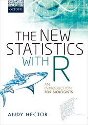
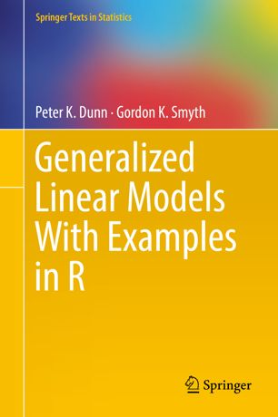

```{r setup, include=FALSE}
knitr::opts_chunk$set(echo = FALSE)
```

## This week we will...

Start the course

- admin 
- try to motivate you
- overview of the course

Start learning R

- introduction
- hands-on work

## Administration Matters

<!---
By the end of the lecture the students should be able to
- explain what a statistical model is 
- say where statistics fits in the process of doing science 
(these are pretty crap!)
By the end of the practical the students should be able to run R and use simple commands
(basically, quick demo of R and then run through Mette’s examples)
--->
(we will deal with these in more detail later)

- Reference Group

- Blackboard
- web page: https://www.math.ntnu.no/emner/ST2304/2023v/

## How the Course Will Run: Modules

<!---
By the end of the lecture the students should be able to
- explain what a statistical model is 
- say where statistics fits in the process of doing science 
(these are pretty crap!)
By the end of the practical the students should be able to run R and use simple commands
(basically, quick demo of R and then run through Mette’s examples)
--->

One module a week 

Modules on web pages

- text
- exercises (with hints)
- short recorded lectures

Active Learning, Group work, Problem solving

## How the Course Will Run: Contact time

Any announcements at the start

In effect everything will be exercise sessions in groups

- "Lectures" mainly for the modules
-  Exercise session will be mainly for the exercises

(but feel free to ignore these)

Work in groups, ask for help when you want it.


## Assessment

Complete 8 exercise sets (of about 10)

- do in groups
- pass/fail
- first couple of weeks won't count 
    - we will tell you when they start to count

## Virtual or in Person?

https://www.menti.com/al6sim51dgx9

{height=70%}

## Teachers

Me

Bert van der Veen

TA: Kenneth Aase


## Resources

Blackboard

- announcements
- links to more material
- exercises

Discussion board on Discourse: https://mattelab2023v.math.ntnu.no/c/st2304/52

Web page: https://wiki.math.ntnu.no/st2304/2023v/start 
(this includes other links from this presentation)

- modules

Text books

## Text Books

New Statistics with R
 - Andy Hector
 


## Text Books
The Analysis of Biological Data
- Whitlock & Schluter


## Text Books

Generalized Linear Models With Examples in R
- Dunn & Smyth



## Other Resources

Blackboard

Discourse

Wiki

Google (yes, use it!)

## Recap: why do we we use statistics in biology

What do you remember from ST0103?

Discuss in groups, 

- Come up with 3 topics you learned about, and for each give an example where they are used in biology (or biotechnology!)
- Add the topics to TaskCard: https://ntnu.taskcards.app/#/board/448a3a68-62df-4a5a-9820-0d03428d06fb


<!---
Begin with a recap of why we use statistics in biology inc. an in-lecture exercise on what they can remember from before christmas, as we assume they don’t think about stats in the holiday.
--->

## .


<!---
## Introduction: Skills and Philosophy

Intro to this course. Cover the general philosophy of modelling and how this might differ to before. Maybe get them to think about it in groups too. Introduce idea of programming here.
--->

## What we are aiming for

We want you to be able to analyse your own data (and understand what you are doing!)
<!--- should re-write these --->

- fit the right models to data
- assess if the model is any good
- compare models and decide which is ‘best’
- interpret the models

## Types of model I: Linear models (regression, ANOVA)

```{r RegressionFig}
Brains <- read.csv("BirdBrains.csv")

Yields <- read.csv("https://www.math.ntnu.no/emner/ST2304/2019v/Week8/Hoosfield_Yields.csv")

Yields$FYM.stopped <- Yields$Treatment=="FYM.stopped" # TRUE = 1
Yields$FYM <- Yields$Treatment=="FYM" # TRUE = 1
Yields$After1970 <- Yields$StartYear>1969 # create dummy variable

Fdata <- Yields[Yields$Treatment%in%c("FYM", "Fertiliser"),]
model1 <- lm(yield ~ Treatment + After1970, data=Fdata) # fit model

PredData <- expand.grid(Treatment=unique(Fdata$Treatment), After1970=unique(Fdata$After1970))
PredData$Pred <- predict(model1, newdata=PredData)
Colours <- c("blue", "darkgreen") # these are the colours used in the plot. Fee free to change them!

par(cex=1.5, mfrow=c(1,2))
plot(Brains$logBodyMass, Brains$logBrainMass, pch=1, col="darkgreen", 
     xlab="log Body Mass", ylab="log Brain Mass")

plot(jitter(0+Fdata$After1970, factor=0.2), Fdata$yield,
       col=Colours[1+Fdata$FYM], ylim=range(Fdata$yield), xaxt="n", xlim=c(-0.2,1.2),
     xlab="", ylab="Yield")
points(PredData$After1970, PredData$Pred, col=Colours[1+(PredData$Treatment=="FYM")], pch=4, cex=2)
segments(PredData$After1970[!PredData$After1970], PredData$Pred[!PredData$After1970],
         PredData$After1970[PredData$After1970], PredData$Pred[PredData$After1970],
         col=Colours[1+(PredData$Treatment=="FYM")])
axis(1, c("Before\n1970", "After\n1970"), at=0:1, padj=1)

```


## Types of model I: Generalised Linear models

<!--- NEED MORE NICE PICTURES --->

When things aren't normal

- binary (e.g. survive/died)
- counts (e.g. how many sparrows are there?)

```{r LogisticRegressionFig}
Bumpus <- read.csv("BumpusData.csv")
Bumpus$StatF <- 0.5+((Bumpus$Status=="Alive")-0.5)*(1-runif(nrow(Bumpus), 0, 0.2))

par(cex=1.5)
plot(jitter(Bumpus$Total.Length), Bumpus$StatF, pch=16, col=c("pink", "lightblue")[1+(Bumpus$Sex=="Male")], 
     xlab="Total Length (mm)", ylab="Survived", yaxt="n")
legend(157, 0.7, c("Female", "Male"), fill=c("pink", "lightblue"))
axis(2, at=c(0,1))

```

<!--- Need to link to biology --->


## How do we get there?

Need some theory (likelihood) and to know how to write the models in the computer (R)


```{r CourseScheme, fig.height=5}

library(png)
Rlogo <- readPNG(system.file("img","Rlogo.png",package="png"))
cex.logo <- 0.8

par(mar=rep(0,4), cex=2, lwd=2)
plot(0,0, type="n", xlim=c(0,1), ylim=c(0,1))
text(0.9, 0.5, "GLM")
text(0.6, 0.5, "Linear\nModel")
text(0.2, 0.2, "Likelihood")
# text(0.2, 0.8, "R")
rasterImage(Rlogo,
            0.2 - cex.logo*dim(Rlogo)[1]/1000,
            0.8 - cex.logo*dim(Rlogo)[2]/1000,
            0.2 + cex.logo*dim(Rlogo)[1]/1000,
            0.8 + cex.logo*dim(Rlogo)[2]/1000)
arrows(x0=0.25, y0=0.75, x1=0.5, y1=0.55)
arrows(x0=0.25, y0=0.25, x1=0.5, y1=0.45)
arrows(x0=0.7, y0=0.5, x1=0.85, y1=0.5)

```

Then can start modelling. linear models is complicated regression 

GLMs are complicated linear models

## Likelihood

The statistical framework to do this

Likelihood = probability of the data

- means we can write everything as probabilities

## R

The stats package we will use

- free, most commonly used
- more shortly


## Course Structure

<!---

Overview of the structure of the course i.e. what we will cover and what order, how the lectures will work and exercises and website and tools and R (so explain exactly how the programming fits in). Maybe even show what an exam looks like and where they can find them. If it is a digital exam, tell them now. 

- Explain how what we do relates to biology and biotechnology and what we expect of them i.e. applied skills etc.
- Discuss some teaching methods a bit more, like focus on group work and problem solving to reach the goals you just mentioned.
- Then go into the intro to R. (They shouldn’t be surprised because this should be detailed in the into at point 3). 
- The R part should cover what R is, what R studio is (like last year), maybe including the orientation slides I did last year. Then have a section on getting help in R and on google and explain none of us as masters, it is a tool, not something you memorise. Then give a demo of some cool things but don’t show all the code on slides. 
--->

Weeks 1-3: Likelihood and R

- statistical theory, and programming
- the background you will need to understand what follows, and to do it

Weeks 4-10: Linear models (regression, ANOVA)

- fitting straight lines

Weeks 11-13: Generalised Linear models

- fitting straight lines to different types of data

