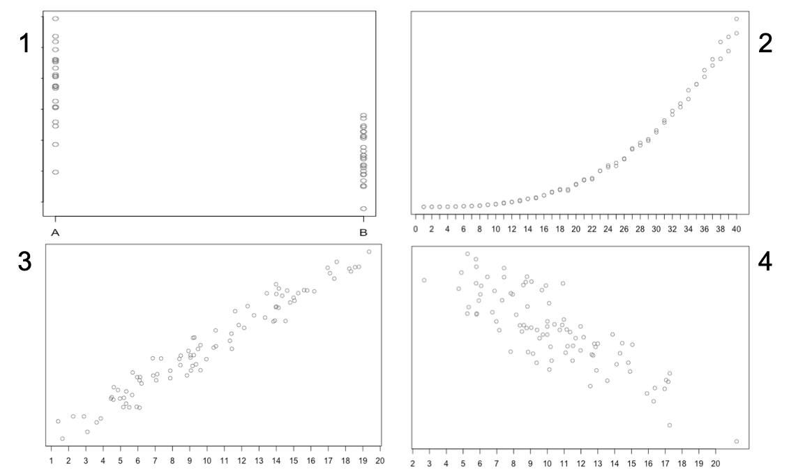

```{r setup, include=FALSE}
knitr::opts_chunk$set(echo = TRUE)
```


# Regression Module

## Instructions:

This document contains information, questions, R code, and plots.

**Hints and reminders are in bold**

<span style="color:blue"> Questions appear in blue. </span>

<style>
div.blue { background-color:#e6f0ff; border-radius: 5px; padding: 20px;}
</style>

<style>
div.green { background-color:#e6fff8; border-radius: 5px; padding: 20px;}
</style>

<style>
div.greentwo { background-color:#b4f28d; border-radius: 5px; padding: 20px;}
</style>

<style>
div.greenthree { background-color:#d6d12f; border-radius: 5px; padding: 20px;}
</style>


```{r Start}
# R code looks like this.
# Comments are in grey and explain the code

2+2 # add two and two
```


```{r Start2}
# outputs from R appear like the above ^^^^
```


* Part A = Why and when to use linear regression
* Part B = Finding a best line (trial and error)
* Part C = Finding a best line (maximum likelihood estimation)
* Part D = Assumptions
* Part E = Olympics data (running a regression)
* Part F = Quantifying uncertainty
* Part G = Interpreting
* Part H = Reflection

-----
<div class = "blue">

# An extra resource this week

As part of the development work we are doing to improve this course, we 
are creating some webpages that will support the information given in this 
course. They are not all complete - but - the one for linear regression is
nearly finished (links within the document are not finished). 

You can find the page [here](https://bioceed.uib.no/dropfolder/sites/bioSTATS-and-R/StatisticsInR/2.1_simple_linear_regression.html).

Not all of the material will be useful and it goes a bit beyond what we will
cover today. But some sections are useful so I will add links below when they
are. 

**Useful sections**:

* Introduction
* Which questions?
* Type of data
* Model details
* Parameters
* Quantify uncertainty
* Draw conclusions

## Different R coding

If you look at the 'Worked example' part of the webpage, you will notice a 
different style of R coding used for plots and data manipulation. To learn
more about this style (if you like the plots) try this tutorial [click here](https://ourcodingclub.github.io/tutorials/datavis/).

</div>
-----

# R skills

* Importing data
* Running functions
* Plotting
* Using `abline()` to plot lines
* Using `lm()` to estimate parameters of a linear regression
* Using `coef()` to show the maximum likelihood estimate of parameters
* Using `confint()` to get confidence intervals
* Using the `predict()` function

-----

<span style="color:blue">Begin with the intro lecture</span>
ADD VIDEO
<!---
https://ntnu.cloud.panopto.eu/Panopto/Pages/Viewer.aspx?id=e0a8364f-0ee6-4fca-80da-acc900f859b0

<iframe src="https://ntnu.cloud.panopto.eu/Panopto/Pages/Embed.aspx?id=e0a8364f-0ee6-4fca-80da-acc900f859b0&autoplay=false&offerviewer=true&showtitle=true&showbrand=false&start=0&interactivity=all" height="405" width="720" style="border: 1px solid #464646;" allowfullscreen allow="autoplay"></iframe>
--->
<span style="color:blue">and video 2</span>
ADD VIDEO
<!---
https://ntnu.cloud.panopto.eu/Panopto/Pages/Viewer.aspx?id=de5c4738-3455-4577-a325-acc900f8662a

<iframe src="https://ntnu.cloud.panopto.eu/Panopto/Pages/Embed.aspx?id=de5c4738-3455-4577-a325-acc900f8662a&autoplay=false&offerviewer=true&showtitle=true&showbrand=false&start=0&interactivity=all" height="405" width="720" style="border: 1px solid #464646;" allowfullscreen allow="autoplay"></iframe>
--->

# Part A: Why and when to use linear regression

<span style="color:blue"> What do you already know about regression? 
Discuss in your groups. </span>

(No model answer for this, just what you can remember.)

### **Why** do we use linear regression?

At this point we will introduce a new motivation for statistical modelling. 
In previous weeks we have
focused on something called **inference**. 
This is when you want to say something about a population
from a sample. But there can also be another motivation, this is 
**prediction**. We can use models
to predict the further state of our variables.

<div class = "blue">
**Check out the introduction, which questions? and type of data sections** 
[here](https://bioceed.uib.no/dropfolder/sites/bioSTATS-and-R/StatisticsInR/2.1_simple_linear_regression.html).
</div>

### Great, I read the page, so **when** do we use linear regression?

Linear regression is used when you have a continuous numeric response 
variable ($Y$) AND continuous numeric
explanatory variables ($X$). This means that for any value of $X$, 
we can predict a value of $Y$. Because
a linear regression model has a component that is a continuous straight line, the variables going in
also need to be continuous. 

If our data are in categories (instead of continuous) e.g. blue and green, 
then we cannot predict a 
$Y$ value for any value
of $X$ because we do not know what values lie between our categories 
(is it teal, turquoise, or yellow?).
We also do not know if the same relationship would be present. 

The straight line is also important for deciding when to use a linear 
regression. As with any model,
we want our linear regression model to represent how our data were generated. 
Therefore, we would 
like it to take a similar shape to our data, 
i.e. we want our data to follow a straight line (roughly).

There are some other criteria we need to consider, 
these are introduced in Part D.

<span style="color:blue"> How is the description above different to the 
t-test last week? (think about
what question you asked with the t-test) </span>

<details><summary>Answer</summary> 
The description above describes something continuous, where as
in the t-test one of our variables had groups (zombie or human). 
In the t-test, because we had
groups, we were testing the difference in mean between those groups. 
But for regression we 
look at a relationship between two variables and the change in Y for a 
change of 1 unit in X. 
</details>

</br>

<span style="color:blue"> Based on the description above, 
which of these datasets do you think
is suitable for a linear regression? </span>



<details><summary>Answer</summary> 

Answer explanation in the video. But panels 3 and 4 should be ok. Could 
maybe make panel 2 work but panel 1 is not suitable. 

</details>

</br>

<span style="color:blue">Once you have had a go, what a summary in video 3</span>
ADD VIDEO
<!---
https://ntnu.cloud.panopto.eu/Panopto/Pages/Viewer.aspx?id=1f07494d-ede2-4ed2-b246-acc900f86cb8

<iframe src="https://ntnu.cloud.panopto.eu/Panopto/Pages/Embed.aspx?id=1f07494d-ede2-4ed2-b246-acc900f86cb8&autoplay=false&offerviewer=true&showtitle=true&showbrand=false&start=0&interactivity=all" height="405" width="720" style="border: 1px solid #464646;" allowfullscreen allow="autoplay"></iframe>
--->

-----


# Part B: Finding a best line 1 (trial and error)

Today we have given you some data. 
This data is made up. `x` is the explanatory variable
and `y` is the response variable. 
Both have a mean of 0, **this is important**. The data are
created using the code below.

<span style="color:blue"> Create the data `x` and `y` as objects in R. </span>


```{r Data}
# First save your data as objects x and y
x <- -10:10
y <- c(-41.64, -11.04, -20.71, -3.89, -23.71, -18.42, -16.21, 
       -23.22, -16.47, 15.72, -7.43, 14.1, -6, -12.04, 7.53, 23.26, 
       28.44, 36.9, 5.45, 46.78, 22.58)
```

We now want to create a model that represents how these data were generated. 
We will use a regression model because we have numeric data and we think 
there is a relationship between our
two variables. When we model using a regression, 
we want to mathematically define a straight
line that best represents the data we have. 
So, ideally we want one that follows the same 
pattern as our data and explains as much variation in the data as possible. 

The line is defined by two parameters: **$\alpha$** = the intercept, 
where the line crosses the Y axis and
**$\beta$** the slope of the line (steepness/gradient). 
We can alter the position of the line using
these two parameters. 
For our model we also need to estimate the variance in the residuals, but we 
will get to this later. 

<div class = "blue">
**For more detail on the model details and parameters look at those sections 
on the webpage** 
[here](https://bioceed.uib.no/dropfolder/sites/bioSTATS-and-R/StatisticsInR/2.1_simple_linear_regression.html). 
</div>

<span style="color:blue">You can also watch video 4 (note the correct to the residuals part)</span>
ADD VIDEO
<!---
https://ntnu.cloud.panopto.eu/Panopto/Pages/Viewer.aspx?id=81460c19-df44-4c8b-94c0-acc900f8c96f

<iframe src="https://ntnu.cloud.panopto.eu/Panopto/Pages/Embed.aspx?id=81460c19-df44-4c8b-94c0-acc900f8c96f&autoplay=false&offerviewer=true&showtitle=true&showbrand=false&start=0&interactivity=all" height="405" width="720" style="border: 1px solid #464646;" allowfullscreen allow="autoplay"></iframe>
--->

We have tried out one candidate model line below. 
We plot it using the `abline()` function. `abline()` plots 
straight lines and takes the arguments `a` = intercept and `b` = slope, 
so it is very convenient
to use here.


```{r PlotData}
# Then plot the data points
plot(x,y)

# Add a line with intercept = 0, slope = 1, colour = red
abline(a=0, b=1, col="red")
```


Our line is too shallow, it does not follow the pattern of the data. 
But we want to check this mathematically too. 
In regression, we want to **minimise the distances between the data points and the 
model line (residuals)**. 
This might be familiar from your last statistics course. 
We can summarise the
residuals by adding all of the distances up to give a single measure of 
distance between the model
and the data. When we do this we must square the distances first otherwise 
the sum will = 0 (some points
are above the line and some below so they cancel). 
This is called the **sum of squares**. 

To calculate the sum of squares you need to:

1) predict a value of $Y$ for each $X$ using the linear equation and 
fill in your chosen values of $\alpha$ and
$\beta$: 

predicted_Y = $\alpha$ + $\beta$*X

2) calculate the differences between the predicted $Y$ values and the real ones

3) square the differences

4) add them all up

You can do this in R by using it like a calculator. Just remember to save each step
as an object. You should be able to do it for all $X$ values at once. 

If you want the code <details><summary>CLICK HERE</summary> 


```{r LineCode}
## To find the sum of squares when alpha = 0 and beta = 1

E.y <- 0 + 1 * x # Calculate your expected y value for each x

# Calculate the difference between the expected y and the actual y (residuals)
residual <- y - E.y 

# Square all the residuals
SS <- residual^2

# Sum the squared residuals
sum(SS)
```

</details> 

</br>

Otherwise have a go yourself! Or use this app: [click here](https://shiny.math.ntnu.no/qmbio/Shiny_apps/Regression/).

* <span style="color:blue"> Have a go at altering the slope of the line 
($\beta$) to try and find a better line. 
You do
not need to alter a ($\alpha$) because the line must go through the mean of 
x and the mean of y (more on this in Part D)
which is an intercept of 0, so this is fixed. 
Try a few times until you are satisfied.
(doesn't have to be the best, just one you are happy with.) </span>

* <span style="color:blue"> Calculate the sum of squares each time
and keep note of it. </span>

* <span style="color:blue"> What is the best sum of squares you got? 
Write it on the board nearest to you. </span>

* <span style="color:blue"> What would it look like if you plotted the sum of 
squares against each slope value?
i.e. sum of squares on the y-axis and the slope/$\beta$ values on the x-axis </span>

<details><summary>Answer</summary> 

Answer explanation in the video. 

The best answer for the sum of squares is given by a slope ($\beta$) value of
3 which gives a sum of squares of 3423.242. 

If you plot sum of squares again each slope value, you should get a U shaped
plot. The lowest point will be at a slope of 3. 
 
</details>

</br>

<span style="color:blue">Once you have finished part B watch the summary in video 5</span>
ADD VIDEO
<!---
https://ntnu.cloud.panopto.eu/Panopto/Pages/Viewer.aspx?id=3045c9ec-89bf-4f3f-b908-acc900f8854c

<iframe src="https://ntnu.cloud.panopto.eu/Panopto/Pages/Embed.aspx?id=3045c9ec-89bf-4f3f-b908-acc900f8854c&autoplay=false&offerviewer=true&showtitle=true&showbrand=false&start=0&interactivity=all" height="405" width="720" style="border: 1px solid #464646;" allowfullscreen allow="autoplay"></iframe>
--->
-----

# Part C: Finding a best line 2 (maximum likelihood estimation)

In the same way as we did in previous weeks, we have chosen a model 
(linear regression) and this
can be represented as an equation:

$$
y_i = \alpha + \beta x_i + \varepsilon_i
$$

To fit the model to our data, we need to find estimates of the parameters. 
In Part B, you tried to do
this by trying different things, but this takes a lot of time and will be 
different for each
group. So, instead, we use maximum likelihood estimation to find the 
values of the parameters that
make our data most likely. This should be the same for every group. 

The parameters are:

$\alpha$ = the intercept of the line

$\beta$ = the slope of the line

$\sigma^2$ = the variance of the residuals

The first step for this would be to write out the likelihood equation for this model. 
<details><summary>I want to see the maths</summary>

The log-likelihood is 

$$
l(\mathbf{y}|\mathbf{x}, \alpha, \beta, \sigma^2) = - \frac{n}{2} \log{\sigma^2} - \sum_{i=1}^n 
{\frac{{(y_i - \alpha - \beta x_i)^2}}{2\sigma^2} }
$$

This is quadratic in $y_i$, so this is the same minimising the sums of squares, i.e. the least squares estimate (that you did in Part B)

</details>

Once you have this you can write out equations to get the maximum likelihood estimator for each
parameter. In reality, while $\sigma^2$ needs to be estimated as part of the model, 
we do not really
use it in interpretation. 

<details><summary>I want to see the equations</summary>

$$
\begin{aligned}
\hat{\alpha} &= \bar{y} - \hat{\beta} \bar{x} \\
\end{aligned}
$$

$$
\begin{aligned}
\hat{\beta} &= \frac{\sum_{i=1}^{N} (x_i - \bar{x})(y_i - \bar{y}) }{\sum_{i=1}^{N} \left( x_i - \bar{x} \right)^2} \\
\end{aligned}
$$

$$
\begin{aligned}
\hat{\sigma^2} &= \frac{1}{N} \sum_{i=1}^{N} \left(y_i - (\hat{\alpha} + \hat{\beta}x_i \right))^2 \\
\end{aligned}
$$

In words:

$\hat{\alpha}$ = the mean of $y$ minus the mean of $x$ multiplied by $\hat{\beta}$

$\hat{\beta}$ = the covariance of $x$ multiplied by the covariance of $y$ divided by the variance of $x$

$\hat{\sigma^2}$ = the variance of the residuals from your model

You can test these out by calculating using these formulas then compare to the output from
R below. 

</details>  Otherwise keep reading to see how to do this in R.

<span style="color:blue">There is also a colour coded summary in video 6</span>
ADD VIDEO
<!---
https://ntnu.cloud.panopto.eu/Panopto/Pages/Viewer.aspx?id=d7aa92a9-7f57-4659-aaa2-acc900f88bc2

<iframe src="https://ntnu.cloud.panopto.eu/Panopto/Pages/Embed.aspx?id=d7aa92a9-7f57-4659-aaa2-acc900f88bc2&autoplay=false&offerviewer=true&showtitle=true&showbrand=false&start=0&interactivity=all" height="405" width="720" style="border: 1px solid #464646;" allowfullscreen allow="autoplay"></iframe>
--->
Luckily for us, R can calculate the equivalent of maximum likelihood estimates for us. 
To do this we use the function `lm()`, it
stands for linear model (should seem familiar). 
We began to use this last week. It takes the argument of a formula in form:
`y~x`. The function will fit the regression model and give us
the maximum likelihood estimates of $\alpha$ and $\beta$ as an output.

<span style="color:blue"> Use lm() to fit the actual regression line to the data from Part B. </span>

**Remember to save the output as an object.**

<details><summary>Code hint</summary>

```{r CodeHint, eval=FALSE}
ModelObject <- lm(y~x)
```


</details>

<details><summary>Answer</summary>
```{r CodeAnswer}
ModelObject <- lm(y~x)
```


</details>

</br>

Now you have a model object you can use a new function called `coef()` to look 
at the estimates of $\alpha$ and $\beta$. The argument you need to put in is the
object you saved above.

<details><summary>Code hint</summary>.


```{r CoeftHint, eval=FALSE}
coef(YourModelObject)
```


</details>

<details><summary>Answer</summary>.


```{r CoefAnswer}
coef(ModelObject)
```


</details>

</br>

<span style="color:blue"> How do these compare to your estimates for the slope in Part B? </span>

<details><summary>Answer</summary>

Will depend on what you got as your best answer in Part B, but should be close. 

</details>

</br>

<span style="color:blue"> Think about what these estimates mean in relation 
to the aim of regression i.e. to 
estimate a relationship between two variables. 
Which bit tells you about a relationship? </span>

<details><summary>Answer</summary>

The beta value tells you about the relationship. 

</details>

</br>

-----

# Part D: Assumptions

The linear regression model has several criteria that need to be met in order to use it 
appropriately and for the statistics to behave as we expect. We call these **assumptions**. 
Assumptions are part of most statistical models and they are called this because the
maths behind these models **assumes** these things are true. If they are not, the model
can behave strangely and the results are invalid.

Assumptions for linear regression:

* The relationship between X and Y is linear
* Residuals (this is another word for error) are normally distributed
* The residuals have a mean of 0
* The variance of the residuals is equal for all fitted values (homoscedasticity)
* There are no outliers
* Each value of Y is independent

**The regression line must also go through the point that = 
the mean of $X$ and the mean of $Y$.**

We will cover these more next week, 
including how to see if they are met, and what to do if they are not.

-----

# Part E: Olympics data

In this part of the module we will give you some real data to model using a 
linear regression. These data
are the official fastest times for men and women for the 100m sprint 
(running) from 1948 to 2004. 

The data can be found at: https://www.math.ntnu.no/emner/ST2304/2019v/Week5/Times.csv

It is a `.csv` file with headers. 

<span style="color:blue"> Import the data and save as an object. </span>

<details><summary>Code hint</summary>


```{r ReadTimes}
Times <- read.csv('https://www.math.ntnu.no/emner/ST2304/2019v/Week5/Times.csv', header=T)
```

</details>
</br>

The question we want to ask here is:

**How do the times of men/women change with year?** 
Times are the response and Year the explanatory variable.

In Part C, you used the `lm()` function and the formula argument. 
But `lm()` can actually take
more arguments. We will need to use one more argument in this part.

Arguments of `lm()`: `lm(formula, data)`

* formula = Y ~ X
* data = your data

Y is the response variable and
X is the explanatory variable.

Example: `lm(columnNAME1 ~ columnNAME2, data = YourDataFile)`

When using the data argument, 
you need to use the column names for the variables you want to include.

<span style="color:blue"> Fit the regression for looking at the relationship
between year and time using `lm()`, make sure to assign the output as an object. 
Choose either Men's or Women's times. </span>

**We recommend some of your group choose Men's times and some Women's so you
can share the results later.**

<details><summary>Code hint</summary>


```{r DataHint, eval=FALSE}
# You will need to look at the column names to find the X and Y variables ??? 
# you can use:
head(YourData)
str(YourData)
colnames(YourData)

#Remember to use ?FunctionName for help on arguments
```

</details>

<details><summary>Answer</summary>


```{r OlympicAns}
OlympicModelW <- lm(WomenTimes ~ Year, data  = Times)

OlympicModelM <- lm(MenTimes ~ Year, data  = Times)

#Remember to use ?FunctionName for help on arguments
```

</details>

</br>

<span style="color:blue"> Look at the results using `coef()` like above. </span>

<details><summary>Answer</summary>


```{r OlympicCoefs}
coef(OlympicModelW)

coef(OlympicModelM)
```

</details>
</br>

<span style="color:blue"> Have a go at plotting your data and add the 
regression line using `abline()` </span>

Make sure to label your axes (arguments = xlab and ylab) and choose the colour of your line.

**Remember the data argument does not work in plot. You need to use YourDataFile$columnNAME1**

<details><summary>Code hint</summary>

```{r PlotHints, eval=FALSE}
plot(x=Times$Year, y=Times$WomenTimes, 
     ylab="Times (s)", xlab="Year")

abline(a = YourIntercept, b = YourSlope, 
       col = "hotpink") 
```

</details>

<details><summary>Answer</summary>


```{r PlotAnswers}
par(mfrow=c(1,2)) # make two plots in the plot window

plot(x=Times$Year, y=Times$WomenTimes, 
     ylab="Times (s)", xlab="Year")

abline(a = coef(OlympicModelW)[1], 
       b = coef(OlympicModelW)[2], 
       col = "purple") 

plot(x=Times$Year, y=Times$MenTimes, 
     ylab="Times (s)", xlab="Year")

abline(a = coef(OlympicModelM)[1], 
       b = coef(OlympicModelM)[2], 
       col = "green") 
```


</details>
</br>

-----

# Part F: Quantifying uncertainty

As you know from previous weeks, 
any estimates we make for parameters are not certain. 
There are several possible values for any parameter that could be true but 
we cannot know which
is true. We can try and quantify how uncertain we are in our estimate and which
values might be more plausible.

For regression, it is the same process as we have come across before. 
Using the likelihood,
we can get a distribution for the estimator of each parameter. 
This distribution has our maximum likelihood
estimate in the centre but some variation around it. However, 
now that we have several parameters to 
estimate, it gets a bit more complex.

The graph below shows the likelihood curves for $\alpha$ and $\beta$ 
plotted against each other.
As we have two curves, this makes a surface. 
You can see higher numbers in blue. You should notice
there is a correlation between the two parameters. 
This is because they are not independent. 

As a regression line must go through the mean of X and the mean of Y 
($(\bar{x}, \bar{y})$), this fixes the line at that
point. If you increase the intercept ($\alpha$) you would therefore need 
to also decrease the slope ($\beta$).


All of this makes it difficult to estimate the uncertainty by hand. But,
it is very easy to calculate the confidence intervals from an `lm()`.

**For more theory on uncertainty in linear regression look at the Quantify 
Uncertainty section of the webpage [here](https://bioceed.uib.no/dropfolder/sites/bioSTATS-and-R/StatisticsInR/2.1_simple_linear_regression.html#06__Quantify_uncertainty).**

We use the function `confint()` e.g. `confint(YourModelObject)`

<span style="color:blue"> Calculate the confidence intervals for your model in Part E. </span>

<details><summary>Answer</summary>


```{r ConfIntsW}
confint(OlympicModelW)
```


```{r ConfIntsM}
confint(OlympicModelM)
```


</details>
</br>

<span style="color:blue"> Based on what you know already about the different parameters,
work out what the confidence intervals are telling you. </span>

<details><summary>Answer</summary>

From previous sections, you should know that the slope parameter is the one
we are most interested in to tell us about the relationship between $X$ and $Y$. 

In this case, for both examples we can see the confidence interval for the
slope (second row of output and labeled 'Year') does not span 0. There is a
clear direction of the effect of Year on Times, which is negative. So, times
are decreasing over time. The strength of this relationship is not certain
and varies quite a lot. It could plausibly be as high as -0.1 or -0.2 seconds
per year or as small as -0.009 or -0.005 seconds per year. 

For the intercept, the uncertainty is wider. The intercept tells us how fast
Olympic runners would have been in Year 0, which is a strange thing to want
to know. 

</details>
</br>
 
Now that you have the confidence intervals and have thought about them, 
it can be 
helpful to visualise them. To plot them takes a few steps. 
First is plotting the data
and the regression line as you have done before.

For the next step, we need to introduce another
function here (sorry!) `predict()`.

`predict()` predicts new values of $Y$ based on values of $X$. 
It takes several arguments:

* object = your model object from `lm()`
* newdata = a dataframe of new $X$ values to predict from
* interval = can take values "confidence" or "prediction"

There are others but we will not use them here. 
Today, we will only use arguments object and interval.
We want to get predictions based on our model and we want confidence 
intervals (we will look at prediction later).

You know you can plot your regression line using `abline()`

**Read the comments to see what the code does, DO NOT just copy and paste**

To plot your confidence intervals you need these two bits of code:

```{r GenConfInts, eval=FALSE}
# generate some predictions based on the confidence interval
predictions <- predict(YourModelObject, interval = 'confidence')

# look at the predictions
predictions
# There are three columns of results
# the first is the mean prediction (the actual regression line)
# the second is the lower end of the confidence interval
# the third is the upper end of the confidence interval

# This bit add the lines to the plot
# [,2] = second column, [2,] would be second row

# REMEMBER to re-run your plot of the regression line

# plot the lower bound, column 2 in predictions
lines(YourXValues, predictions[,2], lty=2)

# plot the upper bound, column 3 in predictions
lines(YourXValues, predictions[,3], lty=2)

# lty=2 gives a dashed line
```

<details><summary>Answer</summary>


```{r GenPredsAns}
# generate some predictions based on the confidence interval
predictionsW <- predict(OlympicModelW, interval = 'confidence')

predictionsM <- predict(OlympicModelM, interval = 'confidence')

# look at the predictions
predictionsW

predictionsM

# There are three columns of results
# the first is the mean prediction (the actual regression line)
# the second is the lower end of the confidence interval
# the third is the upper end of the confidence interval

# This bit add the lines to the plot
# [,2] = second column, [2,] would be second row

plot(x=Times$Year, y=Times$WomenTimes, 
     ylab="Times (s)", xlab="Year")

abline(a = coef(OlympicModelW)[1], 
       b = coef(OlympicModelW)[2], 
       col = "purple") 

# plot the lower bound, column 2 in predictions
lines(Times$Year, predictionsW[,2], lty=2)

# plot the upper bound, column 3 in predictions
lines(Times$Year, predictionsW[,3], lty=2)
# lty=2 gives a dashed line
```

</details>

</br>

-----

# Part G: Interpreting

You now have estimates of $\alpha$ and $\beta$
and the associated confidence intervals for your regression model.

**Although we did plot a line, remember the drawing is not your model, 
the equations and numbers are!**

But what do these mean in terms of the relationship between 100m times and year?

<span style="color:blue"> Have a go at picking out the key results from your model. </span>

<details><summary>Answer</summary>

The key result is the slope value and the associated confidence intervals.

It tells you the strength
of the relationship between x and y, h
ow much y changes for each change in x. Also the confidence
intervals around this relationship tells you how confident you are in 
direction and strength.

Remember to interpret it in the original units e.g. seconds per year. 

</details>

</br>

<span style="color:blue"> Prepare a summary of one key result to tell another 
member of your group. </span>

<span style="color:blue"> Then have a go at presenting your results. </span>

<span style="color:blue">Once you had a go look at a summary in video 7</span>
ADD VIDEO
<!---
https://ntnu.cloud.panopto.eu/Panopto/Pages/Viewer.aspx?id=effad08c-ee1d-4e59-87f5-acc900f8c9b1

<iframe src="https://ntnu.cloud.panopto.eu/Panopto/Pages/Embed.aspx?id=effad08c-ee1d-4e59-87f5-acc900f8c9b1&autoplay=false&offerviewer=true&showtitle=true&showbrand=false&start=0&interactivity=all" height="405" width="720" style="border: 1px solid #464646;" allowfullscreen allow="autoplay"></iframe>
--->

## Prediction

Wait a minute.... this has all been about understanding, 
I thought we could also predict with regression?

Regression can also be used for prediction. 
We can predict within our dataset and outside.

<span style="color:blue"> Why might we want to predict values of Y? (discuss together) </span>

<details><summary>Answer</summary>

To predict future the, or new values within the dataset.

This might be needed if you cannot do experiments e.g. under climate change. 

Or if you didn't measure a particular value e.g. if you want to know the 
time of a runner in a non-Olympic year. See if you can think of other examples. 

</details>

</br>

<span style="color:blue"> In what ways could prediction be good or bad? (discuss together) </span>

<details><summary>Answer</summary>

BAD: the same relationship may not continue into the future and 
new x values you have never measured. It is a big assumption to make. A linear
regression can also predict from - infinity to infinity of the both variables, 
which might not be realistic e.g. runners cannot run in less than 0 seconds. 

GOOD: can give insight into likely outcomes in scenarios we have not experienced. 

</details>

</br>

When we use a regression for prediction it has uncertainty. 
Uncertainty in relationship is captured by confidence intervals.
Prediction uncertainty captured by prediction intervals. 
A prediction interval gives a range of values that can be considered likely to contain
a future observation.

For prediction we need to convey uncertainty in estimated relationship and 
scatter around the line (error).
So, prediction error includes the variance of the residuals too 
($\sigma^2$ is finally useful!)

**Definition:** While confidence intervals are used to represent uncertainty in parameters
estimates
and to relate them to an underlying population, prediction intervals are used to represent
uncertainty in predictions. It gives a plausible range for the next observation of the response
(i.e. for the
new value of Y). It is a type of confidence interval, but in regression it will be wider than the
confidence interval of the line (which includes uncertainty in our parameters $\alpha$ and 
$\beta$). **A 95% prediction interval tells you, if you were to collect a sample and run the
analysis, then
go out an collect a new observation of the response variable ($Y$)
with particular value of the explanatory variable ($X$) many many times AND each time
draw a prediction interval, 95% of the time, the new observation
would fall in within the prediction interval.** 

<span style="color:blue">Prediction uncertainty explained a bit more in video 8</span>
ADD VIDEO
<!---
https://ntnu.cloud.panopto.eu/Panopto/Pages/Viewer.aspx?id=8ce31c0a-b243-4f49-bab3-acc900f896a7

<iframe src="https://ntnu.cloud.panopto.eu/Panopto/Pages/Embed.aspx?id=8ce31c0a-b243-4f49-bab3-acc900f896a7&autoplay=false&offerviewer=true&showtitle=true&showbrand=false&start=0&interactivity=all" height="405" width="720" style="border: 1px solid #464646;" allowfullscreen allow="autoplay"></iframe>
--->
You will practice prediction during the Exercise this week. 

-----

# Part H: Reflection

This is getting ready for next week, when we look at how good our models are.

Some points to think about:

* How well do you think your line captures the data?

* How could you work out how good the fit is? What would you want to look at?

* What did you find out about the times? 

* Is there anything more might you want to know? (E.g. does temperature impact running speed?)

Answers will come for this part next week.
