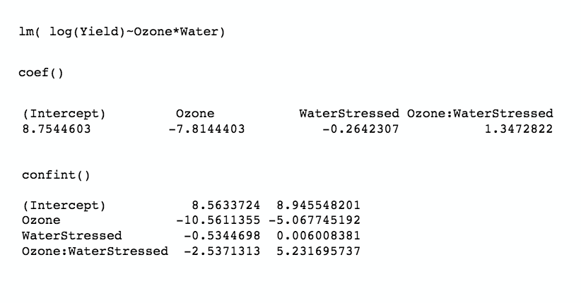
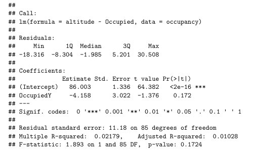
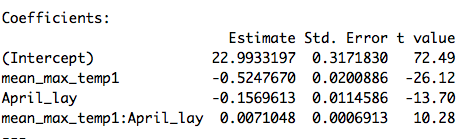

# Instructions

This document contains information, questions, R code, and plots.

**Hints and reminders are in bold**

<span style="color:blue"> Questions appear in blue. </span>

```{r Example, warning = FALSE, error = FALSE, evaluate = FALSE, echo = TRUE}
# R code looks like this.
# Comments are in grey and explain the code

2+2 # add two and two
```

outputs from R appear like the above ^^^^

# Contents of module

* Part A = Choosing a model
* Part B = Two categorical explanatory variables
* Part C = Interactions
* Part D = Mixed continuous and categorical variables
* Part E = Two continuous variables
* Part F = Detective skills

## R skills

* Using `lm()` and interpretting output
* Plotting `lm()` results

Begin with the intro video.
 <!---
<iframe src="https://ntnu.cloud.panopto.eu/Panopto/Pages/Embed.aspx?id=52349887-e562-4cfc-aa7e-ace2011e1418&autoplay=false&offerviewer=true&showtitle=true&showbrand=false&start=0&interactivity=all" height="405" width="720" style="border: 1px solid #464646;" allowfullscreen allow="autoplay"></iframe>
--->
[click here](https://ntnu.cloud.panopto.eu/Panopto/Pages/Viewer.aspx?id=52349887-e562-4cfc-aa7e-ace2011e1418) if it does not work. 

# Part A: Choosing a model

Video that recaps last week and gets ready for this week.
<!---
<iframe src="https://ntnu.cloud.panopto.eu/Panopto/Pages/Embed.aspx?id=b724a370-7bd7-4775-b1be-ace2011e13bb&autoplay=false&offerviewer=true&showtitle=true&showbrand=false&start=0&interactivity=all" height="405" width="720" style="border: 1px solid #464646;" allowfullscreen allow="autoplay"></iframe>
--->
[click here](https://ntnu.cloud.panopto.eu/Panopto/Pages/Viewer.aspx?id=b724a370-7bd7-4775-b1be-ace2011e13bb) if it does not work. 

In this first part, you will be presented with some example data. 
You will then have to think about what sort of question you can ask with the
model and therefore what you expect the `lm()` output to represent. 

<span style="color:blue"> A. If you fit a linear model to following datasets 
what would the model be asking each time? i.e. what is the biological
question that you would be using the model to answer? </span>

<span style="color:blue"> B. What would you expect the `lm()` estimates
for the intercept ($\alpha$) and $\beta$ to represent in each 
example? </span>

Dataset 1: Data collected on wing length of butterflies from 
three different populations; one at sea level, one half-way up
a mountain, and one at the top. Wing length is in mm, the populations
are "low", "mid", and "high" altitude. There are 100 measurements
per population.

Dataset 2: Data collected on body weight and length of frogs.
Body weight is in grams and length in mm. There are 200 measurements.

Dataset 3: Data collected on bacteria growth rate under two different
treatments. The first treatment controls food and is "low" and "high". 
The second concerns the presence of a fungus and is "present" or "not".
There are 70 observations per treatment. 

<details><summary>Answer video</summary> 

Answer videos:
<!---
<iframe src="https://ntnu.cloud.panopto.eu/Panopto/Pages/Embed.aspx?id=dbaa2999-1ad6-4db7-bc61-ace2011e13f6&autoplay=false&offerviewer=true&showtitle=true&showbrand=false&start=0&interactivity=all" height="405" width="720" style="border: 1px solid #464646;" allowfullscreen allow="autoplay"></iframe>
<iframe src="https://ntnu.cloud.panopto.eu/Panopto/Pages/Embed.aspx?id=9016b116-9138-420b-a2e3-ace2011e1397&autoplay=false&offerviewer=true&showtitle=true&showbrand=false&start=0&interactivity=all" height="405" width="720" style="border: 1px solid #464646;" allowfullscreen allow="autoplay"></iframe>
<iframe src="https://ntnu.cloud.panopto.eu/Panopto/Pages/Embed.aspx?id=3c7365ab-e904-4ce3-970f-ace600e37193&autoplay=false&offerviewer=true&showtitle=true&showbrand=false&start=0&interactivity=all" height="405" width="720" style="border: 1px solid #464646;" allowfullscreen allow="autoplay"></iframe> 
--->
[Video1](https://ntnu.cloud.panopto.eu/Panopto/Pages/Viewer.aspx?id=dbaa2999-1ad6-4db7-bc61-ace2011e13f6)
[Video2](https://ntnu.cloud.panopto.eu/Panopto/Pages/Viewer.aspx?id=9016b116-9138-420b-a2e3-ace2011e1397)
[Video3](https://ntnu.cloud.panopto.eu/Panopto/Pages/Viewer.aspx?id=3c7365ab-e904-4ce3-970f-ace600e37193)

</br>

**Extra explanation of dataset 3**. In this dataset you have two categorical
variables, just like the example last week with Treatment and Time. The model
I discuss in the video is an additive model (Food and Fungus are included
in the `lm()` using a +). This is why you would only get 3 coefficients, an
intercept, which = estimate of mean of the group Food = 0 and Fungus = 0, 
then a single 
effect of Food = 1 and a single effect of Fungus = 1. To get to the combined
effect of Food and Fungus both = 1 and an estimate of the mean of that group,
you would need to calculate yourself by 
adding the individual effects
for each treatment to the estimated intercept group mean 
(Food = 0 and Fungus = 0). (Adding all 3 coefficients together.)

e.g.

* Group mean for Food = 0 and Fungus = 0 (intercept)
* Group mean for Food = 0 and Fungus = 1 (intercept + coef for fungus)
* Group mean for Food = 1 and Fungus = 0 (intercept + coef for food)
* Group mean for Food = 1 and Fungus = 1 (intercept + coef for food + coef for fungus)

OR you could use an interaction model. 
Then you could get estimates for the effects of all treatments and calculate
the group means:

* Group mean for Food = 0 and Fungus = 0 (intercept)
* Group mean for Food = 0 and Fungus = 1 (intercept + coef of fungus)
* Group mean for Food = 1 and Fungus = 0 (intercept + coef of food)
* Group mean for Food = 1 and Fungus = 1 (intercept + coef of food + coef of fungus + coef of interaction)

This model
would give 4 coefficients in R (the extra is the interaction estimate). 
But, as mentioned below in the written answers, 
you can't know if the data was collected in a way to allow this analysis or
not. 

There is a lot more on this in the rest of the module, if it doesn't make sense yet.   

<details><summary>Show me the answer as words</summary> 

Dataset 1: You would be asking if there is a difference
in mean wing length between different populations. 
This is because we
would assume that altitude might explain wing length (you could maybe
argue the other way, but I think that would better be addressed looking
at wing length and ability to fly up or something similar) and altitude
here is represented by the variable population, which is categorical. This
means you should expect the output of the `lm()` to give the estimate of 
a group mean and some 
differences between that group mean and other group means. 

Dataset 2: You would be asking if there is a relationship between
body weight and length. This is because we
would assume that length would influence weight and these are both continuous 
variables. Therefore
you should expect the output of the `lm()` to give an intercept and a slope, 
which
represent a continuous straight line. 
 
Dataset 3: You would be asking if there is a difference
in mean bacteria growth rate between different food or fungus treatments. 
Growth rate
is the response variable and the treatments are the explanatory variables, 
which are both categorical. This
means you should expect the output of the `lm()` to give an estimate of a 
group mean and some 
differences from that estimate to the other group means. It is
not completely clear from the description if this experiment had a full 
factorial design i.e. if
all combinations of both treatments were tried. 
So you could test an interaction or not, 
both are correct. 

</details>

</details>

<span style="color:blue"> Write tips to your future self on how to decide 
which model to use when. </span>

<details><summary>Show me Emily's example</summary>  

If I were to do this, I would emphasise checking what kind of data your 
variables are made from e.g. categorical or continuous 
and thinking about which is a response and which
is explanatory. You could also try and draw it out like in the examples. 

</details>

</br>

## Part B: Two categorical explanatory variables

Last week you had data from an experiment carried out at Rothamsted 
research lab in the UK. **Notice I have renamed one of the variables. 
After1970 is now called Time. I thought this was a bit less to type.**

```{r YieldData, warning = FALSE, error = FALSE, eval = TRUE, echo = TRUE}
# Import the data
Yields <- read.csv("https://www.math.ntnu.no/emner/ST2304/2021v/Week09/Hoosfield_Yields_Renamed.csv")

# first check how the data are stored
str(Yields)

# IF Time is chr not fct run this line
Yields$Time <- as.factor(Yields$Time)

# Make sure to relevel the time variable
# to make 'before' the intercept
Yields$Time <- relevel(Yields$Time, ref="Before") 
```

{width=70%}

The data had four fertiliser treatments: 

* Control 
* Manure 
* Fertilised, 
* Stopped

You analysed
the effect of these different treatments last week using t-tests, 
linear models, and one-way ANOVA ideas.

Towards the end of last week Bob told you that in 1970 something changed in the experiment. 
We don't know exactly what changed, but we want to account for it. 
So, we introduced an extra variable:

Time: with levels "Before" and "After", i.e. before and after 1970. And you 
fit a model with Time and Treatment included and looked at how this changed
your results. 

<span style="color:blue">Load your model (the `mod.2way` model, i.e. `yield ~ Treatment + After1970`) from last week or run it again. Remember that After 1970 is now called Time.</span>

<span style="color:blue"> Calculate the estimated mean of each group using 
the model coefficients e.g. calculate the mean for the manure treatment before 
and after 1970 etc </span>

<span style="color:blue"> Now you have an estimated mean for each
group, check this against the actual mean of each group. </span>

<details><summary>Code hint</summary>

The code below shows you how you can easily (easy in terms of less typing) 
take the mean of each group in the data. Remember that `[]` are index 
brackets, they
tell R, "I want something inside the object I just mentioned" e.g. 
`object[1]` takes the
first entry in `object`. 

The `==` means matching and selects only entries that match what follows the `==`.
So, in words 
`mean(Yields$yield[Yields$Treatment == "Control" & Yields$Time == "Before"])` 
tells R to take the mean of the column `yields` inside data frame `Yields` 
but only for
rows where column `Treatment` = Control and column `Time` = Before.

```{r Means, warning = FALSE, error = FALSE, eval = FALSE, echo = FALSE}
# Get means
mean(Yields$yield[Yields$Treatment == "Control" & Yields$Time == "Before"])
mean(Yields$yield[Yields$Treatment == "Stopped" & Yields$Time == "Before"])
mean(Yields$yield[Yields$Treatment == "Fertilised" & Yields$Time == "Before"])
mean(Yields$yield[Yields$Treatment == "Manure" & Yields$Time == "Before"])
mean(Yields$yield[Yields$Treatment == "Control" & Yields$Time == "After"])
```

You can then check if these match your estimates from the `lm()` (some of
these you will need to calculate). 

</details>

<span style="color:blue"> Why does it not add up? </span>

<details><summary>Show me the answer</summary> 

Make sure to have at least a guess first! Think about what the
model could be missing?

Answer video:
<!---
<iframe src="https://ntnu.cloud.panopto.eu/Panopto/Pages/Embed.aspx?id=c143cef8-4adc-444c-8a47-ace2011e273c&autoplay=false&offerviewer=true&showtitle=true&showbrand=false&start=0&interactivity=all" height="405" width="720" style="border: 1px solid #464646;" allowfullscreen allow="autoplay"></iframe>
--->
[Link](https://ntnu.cloud.panopto.eu/Panopto/Pages/Viewer.aspx?id=c143cef8-4adc-444c-8a47-ace2011e273c)

</details>


# Part C: Interactions

Make sure to watch the video in the answers for Part B. 

Often in nature, effects are not separate but interact. This means that
the effect of one variable is different for different values of another, 
e.g. plants might not be able to grow more in response to fertiliser, 
unless they
also have enough light. 
So, the effect of fertiliser would be different in low
and high light.

Often, we want to include interactions in our models. 
We do this by changing the `+` in `lm()` to
`*` or `:`. If you use `:` need to use `+` too, `*` does everything. 
So we recommend
using `*`! It's much easier. e.g. `lm(Yield ~ Treatment * Time, data = Yields)`

By adding in an interaction, we now change what R calculates from the model.
In the previous example, without an interaction, the output of the `lm()` had
no row for the Fertilised, Manure, or Stopped treatments for the time period
after 1970. To work out what the estimated means of these groups 
you would have had to add the effect of the fertiliser treatment to the control
and then add the effect of time after 1970. This assumes that the effect of 
time is the same for each fertiliser treatment AND that the effect of 
each fertiliser treatment is the same regardless of time. 

But in reality, the effect of 
time might not be the same for each fertiliser treatment and
vice versa, **this is an 
interaction**. So, when you fit a model with an interaction in R it
fits a separate effect for each combination of groups within the 
interacting variables e.g. one for fertiliser after 1970 and
a separate effect for fertiliser before 1970 and a separate one
for control after 1970 etc.

When you run a model with an interaction, you should now
get a row for each combination of time and fertiliser treatment.

<span style="color:blue"> Run the interactive model. </span>

<span style="color:blue"> What do these coefficients mean? 
Which parameters do they relate to? </span>

<details><summary>Check your answer!</summary>

Answer video

<!---
<iframe src="https://ntnu.cloud.panopto.eu/Panopto/Pages/Embed.aspx?id=a090d983-0e27-4505-9f86-ace2011e3f63&autoplay=false&offerviewer=true&showtitle=true&showbrand=false&start=0&interactivity=all" height="405" width="720" style="border: 1px solid #464646;" allowfullscreen allow="autoplay"></iframe>
--->
[Link](https://ntnu.cloud.panopto.eu/Panopto/Pages/Viewer.aspx?id=a090d983-0e27-4505-9f86-ace2011e3f63)

<details><summary>Answer in writing</summary>

The (Intercept) row is still the estimate of the mean of the control group 
before 1970.
Each row that is labelled with 'Treatment' followed by a group name e.g. 
'TreatmentFertilised' (but without a :) represent the estimated difference 
in mean
between the (Intercept) group and the named group (all before 1970). 
E.g. Fertilised before 1970 group has a mean 1.6225 more than the 
Control group before 1970.

The row that is labelled with TimeAfter gives the estimated difference in
mean between the (Intercept) group and the Control group after 1970.

The last few numbers are the interactions. They all include a `:` which 
tells you they are an interaction. They represent the estimated difference 
between the
mean of the Treatment group before 1970 and the mean of the Treatment 
group after 1970. For example, the row labelled TreatmentManure:TimeAfter
represents the difference between the mean for the Manure treatment 
before 1970 (0.89750000 + 2.14083333) and the mean for the Manure
treatment after 1970. After 1970, the Manure Treatment had a mean yield
approximately 2.6 higher than before 1970.


```{r InteractionModels, warning = FALSE, error = FALSE, eval = TRUE, echo = TRUE}
# Run the model
modelBothI <- lm(yield ~ Treatment*Time, data = Yields)

# Look at coefficient estimates
coef(modelBothI)

# Look at uncertainty
confint(modelBothI)
```

</details>

</details>

<span style="color:blue"> Do things add up now? 
(we are not aiming for perfection) </span>

<details><summary>Show me the answer</summary> 

Mostly. Not perfect, but close. 

</details>


<span style="color:blue"> What can you conclude from these results? </span>

<details><summary>Hint</summary> 

Try and think about what you want to know and what information tells you
about this. 

I.e. do you want to know how yields changed by treatment? by time? both?
will it be the same for all treatments? how much change is happening?

</details>

<details><summary>Show me the answer</summary> 

Need to use confidence 
intervals to get the conclusions.
You can conclude that in the period before 1970 all fertiliser treatments
seem to have a positive effect on yield compared to the control. All have
estimates of positive mean difference, manure is highest. The effect of time
is different for each treatment. For control, no clear direction of pattern 
(CI span 0.
For Fertilised there was an interaction and you see an extra increase in
mean after 1970 (0.34 to 1.7 increase) same for manure, but even
bigger extra increase (1.94 to 3.29) but for the stopped treatment, you do
not see an interaction (effect spans 0). So control and stopped show no
difference with time. Makes me wonder if they changed the type of manure/fertiliser
in 1970? But we don't know! 
**Remember, to find the mean of the Treatment groups e.g. 
fertilised, stopped, and manure, for after 1970 you must add the intercept
the effect of time, the effect of the treatment AND the interaction effect.**

</details>

# Part D: Mixed continuous and categorical variables

What about continuous data? So far, we have treated both categorical and
continuous explanatory variables separately but there are 
many scenarios where
we would want to have both types of explanatory variable in a 
single analysis.

Example 1: **Body length and temperature and water treatment**. 
Scientists measured the body length
of insects in micrometers at different temperatures either with or 
without rainfall.

Example 2: **Lay date and insect biomass and habitat**. Scientists (including Emily) 
measured the date in the year
when birds lay their eggs (it can take any value even 1.5 or -2). These birds 
live in 
different habitats in a 
woodland: good, bad, ok, which impacts when they lay eggs. 
You can also measure the biomass of insects close 
to each nest box. Biomass
is measured in grams and there are several nest boxes in each habitat. 

Example 3: **Tail length and dinosaur family and age of fossil**. 
Paleontologists measured the tail length of 
fossils in cm and recorded the family the dinosaur belonged to 
and the age of the fossil in million years.

<span style="color:blue"> In the examples, which variable is 
categorical and which is continuous? </span>

<details><summary>Hint</summary> 

If you are not sure, have a go at drawing out a graph for the data or 
designing a data collection table. 
For each variable, would you expect its values
to be numbers e.g. a graph with an axis 0-100 (continuous) or 
would you expect categories
e.g. A, B, C or species1, species2, species3 (categorical)? 

(like the graphs from the videos in Part A)

</details>

<details><summary>Show me the answer</summary> 

Example 1 = categorical (water) and continuous (temperature).

Example 2 = categorical (habitat) and continuous (biomass). 

Example 3
= categorical (family) and continuous (fossil age). 

</details>

</br>

The data for example 1 (made up) can be found here: 
https://www.math.ntnu.no/emner/ST2304/2020v/Week09/BodyLengthExperiment.csv

It is a csv file and has column headers. 

<span style="color:blue"> Run an interactive model for example 1. </span>

<details><summary>Code help</summary> 

```{r BodyLengthData, warning = FALSE, error = FALSE, eval = TRUE, echo = TRUE}
# Import data

BodyLength <- read.csv("https://www.math.ntnu.no/emner/ST2304/2020v/Week09/BodyLengthExperiment.csv", 
                       header=T)

# create the lm object
BodyLengthModel <- lm(length ~ temperature*water, data = BodyLength)

# extract the coefficient estimates
coef(BodyLengthModel)

# extract confidence intervals
confint(BodyLengthModel)
```
</details>

</br>

<!---
 <iframe src="https://ntnu.cloud.panopto.eu/Panopto/Pages/Embed.aspx?id=5353df62-e41f-484c-9954-ace2011e49cd&autoplay=false&offerviewer=true&showtitle=true&showbrand=false&start=0&interactivity=all" height="405" width="720" style="border: 1px solid #464646;" allowfullscreen allow="autoplay"></iframe>
--->

[Link](https://ntnu.cloud.panopto.eu/Panopto/Pages/Viewer.aspx?id=5353df62-e41f-484c-9954-ace2011e49cd)

<span style="color:blue"> What do these coefficients mean? 
Which parameters do they relate to? </span>

<span style="color:blue"> Try and draw out the results on a piece of paper,
or an app. i.e. draw what they would look like on a graph </span>

When drawing think about what data you have and how you can best represent 
it in a
graph. Think about what the response variable is, what the explanatory 
variables are
and how you would like to model them e.g. a straight line or several? 
Or differences in
means etc. Don't worry, we will go through this afterwards so it doesn't 
matter if you 
are wrong, **just have a go!**

ANSWERS at the end of this section

<span style="color:blue"> Interpret the output in biological terms. </span>

<details><summary>Hint</summary> 

This is where you translate the raw coefficients into something meaningful.

EXAMPLE (not on this data just to show the sort of things to consider):

IF the slope estimate was 7, is not very meaningful on its own. 
This number should have units for
a start. 

TO INTERPRET: variable Y is estimated to increase by between 5 and 8 cms 
for every 
1 mm change in X. This suggests that Y gets bigger as X does but much faster. 
So, if Y
is a wing length and X is a body length, 
you would have a bigger wing to body size ratio as the body gets longer. 

</details>

<span style="color:blue"> Was an interaction term needed in this model? </span>

<details><summary>Hint</summary> 

This is basically asking, was the interaction term clearly different to 0. 

</details>

<details><summary>Show me the answers</summary>  
<!---
<iframe src="https://ntnu.cloud.panopto.eu/Panopto/Pages/Embed.aspx?id=eedd4cac-9544-4018-a8bd-ace2011e553b&autoplay=false&offerviewer=true&showtitle=true&showbrand=false&start=0&interactivity=all" height="405" width="720" style="border: 1px solid #464646;" allowfullscreen allow="autoplay"></iframe>
--->
[Link](https://ntnu.cloud.panopto.eu/Panopto/Pages/Viewer.aspx?id=eedd4cac-9544-4018-a8bd-ace2011e553b)

The (Intercept) is the intercept of
the line for temperature when water = No. The next row is 
the slope of the effect of temperature when water = No.
Then the next is the effect of water = Yes, in this case
a change in intercept of the line. The final number is the 
interaction so the change in the effect of temperature
when water = Yes, it is a difference in slope. 

Plot in R (so a bit neater below too).

```{r PlotBL, warning = FALSE, error = FALSE, eval = TRUE, echo = FALSE}
# Plot the results
plot(BodyLength$temperature,
     BodyLength$length, pch=16,
     ylab = "Length",
     xlab = "Temperature", 
     xlim=c(0,20),
     ylim=c(10,150), col = "blue")

# colour code points for the different water treatments
points(BodyLength$temperature[BodyLength$water == "No"],
       BodyLength$length[BodyLength$water == "No"], pch=16, col="grey")

# add a line of the two effects
# coef()[1] = intercept, coef()[2] = effect of temperature
abline(a=coef(BodyLengthModel)[1], b=coef(BodyLengthModel)[2], col = "grey")
# coef()[3] = effect of water (change in intercept), coef()[4] = interaction (change in slope)
abline(a=coef(BodyLengthModel)[1]+coef(BodyLengthModel)[3], 
       b=coef(BodyLengthModel)[2]+coef(BodyLengthModel)[4], col = "blue")
```
</details>


# Part E: Continuous and continuous

It is not only categorical variables that can have interactions. 

Two continuous variables can also have interactions. So that we give you a 
complete set of information, we also have a small amount on this here. 

There can be many cases in the real world, where two continuous variables 
influence each others effect such as the amount of rainfall (in mm) might 
change the relationship between light (in PAR) and plant growth. 
It turns out - a lot of Emily's work has this
in! In the example below, we will use the data from one of the papers from
Emily's PhD. 

You have already included two continuous variables in a linear model in R 
during week 7. To add an interaction you do exactly what you did for two
categorical variables and use `*` e.g.:

`lm(y ~ x1 * x2)`

## Example

The example we will look at for continuous interactions is from this paper:

https://onlinelibrary.wiley.com/doi/full/10.1002/ece3.3446

It looks at the timing of incubation onset in great tits (kjøttmeis på norsk).
What I wanted to look at is whether birds start incubating their eggs earlier
when it is warmer in spring. 

{height=20%}

To look at this, I put thermometers into nests to see when incubation was
started. In one of the analyses, I looked at the relative start of incubation
(whether the female great tit started incubating the eggs before she had
finished laying or after) and whether this was influenced by when she started
laying the eggs (clutch initiation date) or mean temperature. 

You can find the data for this analysis [here](https://onlinelibrary.wiley.com/action/downloadSupplement?doi=10.1002%2Fece3.3446&file=ece33446-sup-0002-Incubationdata.xlsx)

#### How to import the data

The link above will download the excel file. This is different to all other
data you have used so far, but is good practice for your own analyses. This 
file is a `.xls` NOT a `.csv` and therefore you can open in Excel or Numbers
or another spreadsheet program. You will notice there are A LOT of columns. 

What you will need to do is create a `.csv` file that we can use in R. To do
this, save as this file and change the file type to **comma separated values**
(`.csv`). You might get a warning about losing information or sheets, that is
ok, it is what we want. You may also want to change the file name to something
more simple.

**Remember to save into the same folder R is working from. To check this use
`getwd()`.**

### Back to the analysis

Once you have the data in R, we can work on building an interaction model.

The variables you will want are:

* relative_incu_onset - this is the timing that incubation started relative to 
when the female finished laying. 0 = same day as last egg, negative = before
last egg and positive = after. **This is the response**. It is what I wanted 
to explain.

* Clutch_initiation_date - this is the date since 1st April when the first egg
in the nest was laid.

* mean_temp8 - this is mean temperature at the time of laying in Celsius

<span style="color:blue"> Run a linear model to look at whether
clutch initiation date and mean temperature impact incubation onset AND whether
they have an interaction. </span>

<details><summary>Hint</summary> 

Remember the `*`

</details>

<span style="color:blue"> Have a look at the coefficients, how easy are 
these to interpret? Have a go if you can! </span>

Hopefully you can interpret some of the results. But the interaction might
be a bit challenging. Can we look at this in another way? Yes, we can plot
the results instead. There are a couple of ways to do this.

**Option 1: As a surface (complicated but fun)**

The code for this is quite complex (I only learnt it today). If you are
interested, this is the page I used https://rpubs.com/aagarwal29/179912

You will need to run the code yourself and the plot pops up in another window.
Install the package `rgl` to do this.

This plots the interaction between clutch initiation date and mean temperature
as a 3D surface. You can move this plot if you click on it and rotate to see the 
whole surface. You can see how the relationship between incubation onset and
either of the explanatory variables changes with the other. 

```{r ContInt, warning = FALSE, error = FALSE, eval = TRUE, echo = TRUE}
library('rgl') # you will need to install this package

# import data (you will have saved it under a different name)
BirdData <- read.csv('BirdData.csv', header = TRUE)

# run a 3d plot of the data
plot3d(BirdData$Clutch_initiation_date, 
       BirdData$mean_temp8, 
       BirdData$relative_incu_start,
       type="s", size=1, lit=FALSE)

# run the interaction model
ContinuousInteractionModel <- lm(relative_incu_start ~ Clutch_initiation_date *
                                         mean_temp8, data = BirdData)

# predict values of the response variable
# this is done for ALL values in the sequence of both explanatory variables in ALL
# combinations. This is what expand.grid does - it makes a big object.

newdata <-  expand.grid(Clutch_initiation_date = seq(min(BirdData$Clutch_initiation_date), 
                                max(BirdData$Clutch_initiation_date), 
                                length.out = 100),
                        mean_temp8 = seq(min(BirdData$mean_temp8), 
                                max(BirdData$mean_temp8), 
                                length.out = 100))

# then predict the response
predictions <- predict(ContinuousInteractionModel, newdata, type = NULL)

# Add the mesh of predicted values to the plot

# first save out the unique values of both explanatory variables
x1 <- unique(newdata$Clutch_initiation_date)
x2 <- unique(newdata$mean_temp8)

# save the predictions in a matrix
y <- matrix(predictions, nrow = length(x1), ncol = length(x2))

# then add a 3d surface to the plot
surface3d(x1, 
          x2, 
          y, alpha=0.4, front="lines", back="lines")
```

**Option 2: hold one variable at fixed values**

This way is a bit more straightforward and I find it a bit easier to read (that's
why I used it in the paper). Here you predict new values of $Y$ (incubation
onset) for a sequence of X1 values (mean temperature) but for only a few
fixed values of X2 (clutch initiation date).

The steps needed are written in the code and are in the summary video. 

```{r CIopt2, warning = FALSE, error = FALSE, eval = TRUE, echo = TRUE}

# first, run the model
ContinuousInteractionModel <- lm(relative_incu_start ~ Clutch_initiation_date *
                                         mean_temp8, data = BirdData)

# make 3 sets of 'new data' to use for prediction
# the values of mean temperature will all be the same but the value of 
# clutch initiation will change

# vector of mean temperature values

mean_temp <- seq(min(BirdData$mean_temp8),
                 max(BirdData$mean_temp8), 
                 length.out = 50)

# the first quartile of the clutch initiation date is 8
newdata1 <- data.frame(Clutch_initiation_date = 8,
                       mean_temp8 = mean_temp)

# now clutch initiation is at the median 
newdata2 <- data.frame(Clutch_initiation_date = 14,
                       mean_temp8 = mean_temp)

# the third quartile of the clutch initiation date is 16
newdata3 <- data.frame(Clutch_initiation_date = 16,
                       mean_temp8 = mean_temp)

# now we want to make the predictions
predictions1 <- predict(ContinuousInteractionModel, newdata1)
predictions2 <- predict(ContinuousInteractionModel, newdata2)
predictions3 <- predict(ContinuousInteractionModel, newdata3)


### NOW PLOT

# first the basic plot of the data (incubation onset and temperature)

plot(y = BirdData$relative_incu_start, 
     x = BirdData$mean_temp8, pch = 16, col = "grey",
     ylab = "Incubation onset", xlab = "Temperature")

# now add the lines

lines(y = predictions1, x = mean_temp, col = "blue")
lines(y = predictions2, x = mean_temp, col = "orange")
lines(y = predictions3, x = mean_temp, col = "purple")

# and a legend

legend("topright", c("clutch initiation = 8", 
         "clutch initiation = 14", 
         "clutch initiation = 16"), 
       col = c("blue", "orange", "purple"), lty = 1,
       cex = 0.5)
```

<span style="color:blue"> Using these plots, can you now interpret 
the interaction? </span>

Summary video on continuous interactions:
<!---
<iframe src="https://ntnu.cloud.panopto.eu/Panopto/Pages/Embed.aspx?id=4f7e9a5c-54e2-4701-8f72-ace2011fbf34&autoplay=false&offerviewer=true&showtitle=true&showbrand=false&start=0&interactivity=all" height="405" width="720" style="border: 1px solid #464646;" allowfullscreen allow="autoplay"></iframe>
--->
[Link](https://ntnu.cloud.panopto.eu/Panopto/Pages/Viewer.aspx?id=4f7e9a5c-54e2-4701-8f72-ace2011fbf34)


# Part F: Detective skills
<!---
<iframe src="https://ntnu.cloud.panopto.eu/Panopto/Pages/Embed.aspx?id=f82a674d-afee-46c5-aff5-ace2011e5745&autoplay=false&offerviewer=true&showtitle=true&showbrand=false&start=0&interactivity=all" height="405" width="720" style="border: 1px solid #464646;" allowfullscreen allow="autoplay"></iframe>
--->
[Link](https://ntnu.cloud.panopto.eu/Panopto/Pages/Viewer.aspx?id=f82a674d-afee-46c5-aff5-ace2011e5745)

<span style="color:blue"> Look at the model outputs above, match the 
following model types to the output: </span>

They are all in different styles and I have deliberately given no
information on the type of data. You have to work it out from the output.

Example 1

{width=90%}

Example 2


Example 3



Example 4: lm(time ~ mean_max_temp1*April_lay)



* <span style="color:blue"> One categorical explanatory variable </span>
* <span style="color:blue"> One categorical and one continuous explanatory variable </span>
* <span style="color:blue"> One continuous explanatory variables </span>
* <span style="color:blue"> Two continuous explanatory variables </span>
* <span style="color:blue"> Model with an interaction </span>

<details><summary>Show me the answer</summary>
 
* <span style="color:blue"> One categorical explanatory variable </span>
<span style="color:purple"> Example3 </span>

* <span style="color:blue"> One categorical and one continuous explanatory variable </span>
<span style="color:purple"> Example1</span>

* <span style="color:blue"> One continuous explanatory variables </span>
<span style="color:purple"> Example2</span>

* <span style="color:blue"> Two continuous explanatory variables </span>
<span style="color:purple"> Example4</span>

* <span style="color:blue"> Model with an interaction </span>
<span style="color:purple"> Examples1 and 4</span>

</details>


<span style="color:blue"> How would interpretation be different for 
a) a model with an interaction
and the one with one categorical and one continuous explanatory variable
b) the same data but no interaction? </span>

<details><summary>Show me the answer</summary> 

With no interaction there will be
the same slope for each group but with interaction
there is a difference slope for the continuous variable within
each group of the categorical.

</details>

# Final Comment

Interactions are an important part of modelling, because the world is not simple, so effects can act together. Calculating the effects of interactions can be complicated, especially if we get more complex models (e.g. interactions between 3 or 4 covariates). The calculations follow what we do here, so to work out what is happening you just need to take a very deep breath and work out what levels you are using and what is going into the calculation. Then you can let R do the calculations: your job is to understand them.

