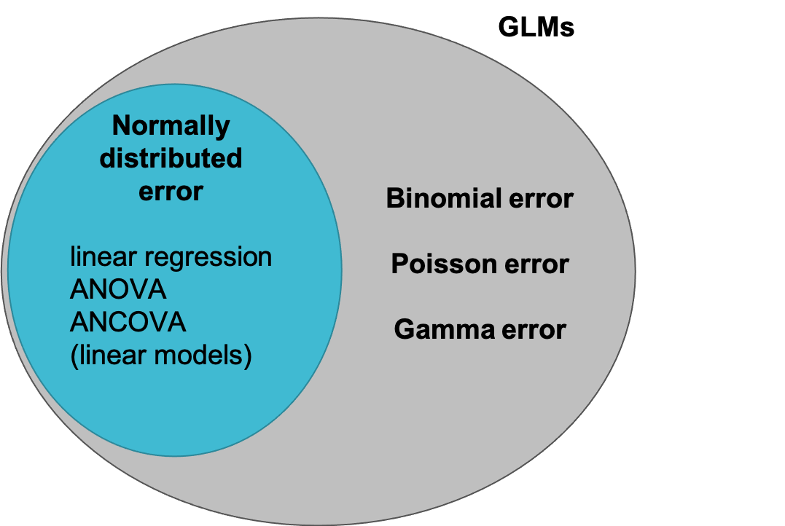

This document contains:

* Information and background 
* Videos
* Questions and answers 
* R code 
* Plots and illustrations

**Hints and reminders are in bold**

<span style="color:blue"> Questions appear in blue. </span>
<span style="color:purple"> Answers appear in a click down. </span>

### Contents of module

* Part A = What are GLMs?
* Part B = Parts of a GLM
* Part C = An example of a linear model as a GLM
* Part D = The likelihood
* Part E = Choosing a distribution
* Part F = Interpretation (phoenix example)
* Part G = Model checking 

-----

### New R skills

* Using `glm()` with `link` and `family` arguments

```{r setup, echo = FALSE, include = FALSE, message=FALSE}
library('imager')
library(tidyverse)
```

-----

## Part A: What are GLMs?

This module gives an overview of the new type of models we will be using for the
final weeks of this course. 

**The aims of this week are:** 

* to give an introduction to Generalised Linear Models
* to show how they are different to the linear models we used before 
* to let you try fitting some example models 
* to discuss how using a Generalised Linear Model changes model checking

It is quite a long module, so do not worry if you don't get through everything
this can be a document you come back to as you go through the final few weeks of
the course. 

<!---
<iframe src="https://ntnu.cloud.panopto.eu/Panopto/Pages/Embed.aspx?id=10ae8bb3-2cf2-4d93-b4a7-acfd00e7d256&autoplay=false&offerviewer=true&showtitle=true&showbrand=false&start=0&interactivity=all" height="405" width="720" style="border: 1px solid #464646;" allowfullscreen allow="autoplay"></iframe>
--->
[link](https://ntnu.cloud.panopto.eu/Panopto/Pages/Viewer.aspx?id=10ae8bb3-2cf2-4d93-b4a7-acfd00e7d256)


#### Reminder of the course so far

So far in the course you have covered:

* intro to R
* maximum likelihood estimation (estimating parameters and quantifying uncertainty)
* using various forms of linear model (continuous explanatory, categorical 
explanatory, continuous + categorical explanatory, interactions)
* model checking
* model selection 
* practice of a full analysis

A lot of these topics are very general techniques that can be used for any model. 
For example, estimating parameters, quantifying uncertainty, checking a model, 
and model selection are all general tools that we will keep using for the rest of
this course. 

Linear models have been the primary statistical model we have been using to
illustrate these general tools. For the final part of this course, we will move
on to another type of statistical model the **Generalised Linear Model.** You
will learn how to apply what you learned for linear models to this new model type.

#### Intro to GLMs

Generalised Linear Models (GLMs) are similar to the linear models you have been 
using so far in the course. This is true both in terms of concepts and 
(very importantly) in how they are run in R. But, GLMs are very much more flexible.

Linear models are used to model a continuous response as a function of 
explanatory variables. 
GLMs also model a response as a function of explanatory 
variables. However, as they are more flexible 
GLMs can
be used for discrete as well as continuous response variables. They can model
non-linear relationships, and handle cases where model residuals would not be
normally distributed. 

Actually, all of the models we have used so far could be written as a GLM, but
GLMs can also do much more (see diagram below).



In particular, GLMs are useful when the assumptions of the linear model are 
violated. 

A quick reminder of the assumptions of a linear model:

* linear relationship between X and Y (linearity)
* each value of Y is independent
* the variance of the residuals is equal for all fitted values (homoscedasticity)
* residuals are normally distributed and have mean of zero
* no outliers

The most common violations that can be addressed with a GLM are:

 * Residuals that are not normally distributed
 * Non-linearity
 * Unequal variance 
 
While some of these violations could be addressed by transformation of the 
response to try and improve linearity or equalise the variance - 
this is not always possible or preferable. 
The GLM makes it possible to account for violations of
linearity and variance of residuals in a single model without changing the 
response. This is especially useful when you know that the response data will
not follow a normal distribution e.g. if they are binary results or derive from
counting. In these cases, different distributions will better represent the data
generation process than the normal distribution used in the linear model.

#### Is a linear model appropriate?

To help you start thinking about violations of linear model assumptions, below
there are three example datasets where a linear model has been fitted. 

Each is shown by three plots.

* Plot 1 = the raw data with a straight line fitted.
* Plot 2 = the residuals vs fitted plot for the linear model.
* Plot 3 = the normal QQ plot for the linear model.

<span style="color:blue"> For each, answer:</span>

<span style="color:blue"> 1. If you think the linear model was appropriate.</span>

<span style="color:blue"> 2. Explain why/why not.</span>

**Example 1: Sparrow survival**

Question: How does body weight influence survival probability in sparrows?

Data: Response = whether the bird survived (1), or not (0). 
Explanatory = body weight in grams

```{r sparrow_example, echo = FALSE, fig.caption = "Plots of a linear model for sparrow survival, points have been jittered so they don't sit on top of each other."}

sparrows <- read.csv("https://www.math.ntnu.no/emner/ST2304/2019v/Week11/BumpusSparrows.csv", 
                     header=TRUE, stringsAsFactors = TRUE)

par(mfrow=c(2,2))

plot(as.numeric(sparrows$Status)-1 ~ jitter(sparrows$Weight), ylab="Survival probability",
     xlab="Weight (g)", pch=16, main="1: Data")
abline(lm((as.numeric(sparrows$Status)-1) ~ sparrows$Weight), col=2)
mod1 <- lm((as.numeric(sparrows$Status)-1) ~ sparrows$Weight)


fitted <- fitted(mod1)
residuals <- resid(mod1)

plot(fitted, residuals, main="2: residuals/fitted")
abline(h=0)

qqnorm(residuals, main="3: normalQQ")
qqline(residuals)

sparrow <- load.image("Sparrow.jpg")
plot(sparrow, axes = FALSE)

```

**Example 2: Length and weight in sparrows**

Question: How does body weight influence total length of the sparrows?

Data: Response = total length in mm. Explanatory = body weight in grams

```{r, echo = FALSE, fig.caption = "Plots of a linear model for sparrow length as a function of weight"}

par(mfrow=c(2,2))
plot(sparrows$Total.Length ~ sparrows$Weight, ylab="Sparrow length (mm)",
     xlab="Weight (g)", pch=16, main="1: Data")
abline(lm(sparrows$Total.Length ~ sparrows$Weight), col=2)
mod2 <- lm(sparrows$Total.Length ~ sparrows$Weight)

fitted <- fitted(mod2)
residuals <- resid(mod2)

plot(fitted, residuals, main="2: residuals/fitted")
abline(h=0)

qqnorm(residuals, main="3: normalQQ")
qqline(residuals)

plot(sparrow, axes = FALSE)

```

**Example 3: Fledge success in blue tits**

Question: How does lay date influence the number of chicks that leave the nest?

Data: Response = number of chicks that fledge (leave nest alive). Explanatory = lay date (day since 1st April)

```{r, echo = FALSE, fig.caption = "Plots of a linear model for blue tit fledging"}

eggs <- read.csv("blue_tit_data.csv", header=TRUE)

par(mfrow=c(2,2))

eggs <- subset(eggs, year < 1960)

plot(eggs$number_fledged ~ eggs$April_lay, ylab="number of chicks",
     xlab="lay date", pch=16, main="1:Data")
abline(lm(eggs$number_fledged ~ eggs$April_lay), col=2)
mod3 <- lm(eggs$number_fledged ~ eggs$April_lay)

fitted <- fitted(mod3)
residuals <- resid(mod3)

plot(fitted, residuals, main="2:residuals/fitted")
abline(h=0)

qqnorm(residuals, main="3:normalQQ")
qqline(residuals)

bluetit <- load.image("Cartoon_BT.png")
plot(bluetit, axes = FALSE)


```

<details><summary>Answers</summary>

<!---
<iframe src="https://ntnu.cloud.panopto.eu/Panopto/Pages/Embed.aspx?id=b8db0807-0c86-4556-8195-acfd00e7d218&autoplay=false&offerviewer=true&showtitle=true&showbrand=false&start=0&interactivity=all" height="405" width="720" style="border: 1px solid #464646;" allowfullscreen allow="autoplay"></iframe>
--->
[link](https://ntnu.cloud.panopto.eu/Panopto/Pages/Viewer.aspx?id=b8db0807-0c86-4556-8195-acfd00e7d218)

<details><summary>Answer in words</summary>

**Example 1:** Is a linear model a suitable model for this data? No. Why not? 
From the data plot (1) we can see that the response is not continuous, it is
binary (only 0s and 1s). The residuals are also not normally distributed and 
the relationship between $X$ and $Y$ it is not linear. The variance is also not 
equal for all fitted values. Pretty bad on every measure really. 
Also the data are bounded at 0 and 1, a bird cannot survival > 100% or < 0%. 
We could try a
transformation but won't fix both the non-normality AND the lack of linearity. 
Using a GLM for this data is more appropriate. 

**Example 2:** Is a linear model a suitable model for this data? Yes, it seems 
like it. Why? From the data we can see that both the response and explanatory
variable are continuous. In addition, the variance seems equal for all fitted 
values and linearity seems good. The residuals are also pretty normally 
distributed.

**Example 3:** Is a linear model a suitable model for this data? No. Why not?
From the data you might be able to see that the response is discrete. You cannot
have half a bird. We have used some counts before but these have usually been
averages, which can have non-whole values. Here is different and the mean of the
response will be close to 0. This is important, as the mean of count data 
increases, it can approximate a normal distribution. But not here. If you look at
the diagnostic plots you can see that the variance increases with increase 
in fitted values. The data are bounded at zero so shape not quite linear and the
residuals do not follow a normal distribution for low quantiles. 

To improve the fit of an LM here you could try a log transformation 
but probably wont fix the variance and the non-linearity. A GLM is better!

</details>

</details>

As you can hopefully see from some of the examples above, A LOT of biological 
data violates the assumptions for a linear model. Therefore, a large number of 
the models that are used in biological research are GLMs. 

Some examples of biological data that requires a GLM are: 

* survival data (did it die or not)
* occupancy data (was an organism there or not)
* presence of a particular gene
* counts of species
* reproductive success. 

**As a result of their wide usage, 
GLMs are a key part of modern quantitative biology!**

<span style="color:blue"> See if you can think of any other examples from data
you have collected or a topic you have learned about.</span>

-----

## Part B: Parts of a GLM

**Nothing active to do here - just a lot of new (and important) information.**

Hopefully you remember from previous weeks that a linear model can be written
as the following equation:

$$
Y_i = \alpha + \beta X_i + \varepsilon_i
$$
where:

* $Y_i$ is the ith element of variable $Y$ 
* $\alpha$ is the intercept of the
model line 
* $\beta$ is the slope of the model line 
* $X_i$ is the ith element of
variable $X$
* $\varepsilon_i$ is the residual. 

This equation can be split into two components: a linear predictor 
($\alpha + \beta X_i$) and an error term ($\varepsilon_i$). These two components
can be considered <span style="color:orange">a
systematic part</span> and <span style="color:purple">a random</span> part. Like
this:

$$
Y_i = \color{orange}{\alpha + \beta X_i} + \color{purple}{\varepsilon_i}
$$

Thinking of a linear model in this way is a good foundation for looking at GLMs. 
The same components are part of a GLM, with one extra. 

**There are three main components of a GLM**:

* <span style="color:orange">The systematic part</span>:
the model for each data point (linear predictor) e.g. $\alpha + \beta X_i$

* <span style="color:purple">The random part</span>: 
the data (with an assumed distribution e.g. Binomial)

* <span style="color:magenta">The link function</span>:
transforms the model (linear) onto scale of data e.g. 
$\color{magenta}{log}(\alpha + \beta X_i)$ **This one is new.**

We will explain a bit more about each one of these components below. 

### <span style="color:orange">The systematic part</span>

This part is probably the most familiar, as it is a linear equation and very
similar to a linear model. However, in GLMs the linear predictor 
does not directly estimate $Y$. 
Instead, it is linked to the expected value for $Y$ through a link function.

E.g. 

$$
E(Y_i) = \color{orange}{\alpha + \beta X_i})
$$


where $E(Y_i)$ is the expected value of $Y_i$ and $link$ is the link function. 

or as a matrix where $X_{ij}$ = value i (e.g. 1 or 2 or 3) of $X$ variable j 
(e.g. 1 or 2 or 6) and $\beta_j$ = the slope value for $X$ variable j.

$$
link(E(Y_i)) = \color{orange}{\sum X_{ij}\beta_j}
$$

### <span style="color:purple">The random part</span>

This is the part that describes how the errors around the fitted line are 
distributed. It maps between the data and the fitted model line. 

In linear models, this part has been assumed to be Normally distributed
(or Gaussian - both mean the same just two different words for the 
distribution). This is where the assumption **residuals are normally distributed
with a mean of 0** comes from! 

In GLMs the error can still be Normally distributed but it can also have other
distributions such as: Binomial, Poisson, and Gamma. We will look at Binomial 
and Poisson distributions in this course. 

**Key things to think about with the random part:** you should choose carefully
which distribution to use for the data. It will be determined by characteristics
of the data. Different distributions use different link functions (see below).

This gives the distribution for $E(Y_i)$ in the equation above. 

### <span style="color:magenta">The link</span>

The link function is what connects the 
<span style="color:orange">systematic part</span> of the model to the 
<span style="color:purple">random part</span>. That is why it is called a link.

It describes how the mean depends on the linear predictor. This will make more
sense when we look at specific examples. 

e.g.

$$
\color{magenta}{link}(\color{purple}{E(Y_i)}) = \color{orange}{\alpha + \beta X_i}
$$


Different distributions for the random part use different link functions, which 
change the interpretation of the coefficients of the model ($\alpha$ and $\beta$).

For instance, a Poisson distribution for the random part uses a log link. We 
will look at an example of this later in the module and in two weeks time. But
in the equation below $Y$ would be Poisson distributed and
it is linked to the linear predictor via the **natural** log, which is `log()`
in R.  

$$
\color{magenta}{ln}(\color{purple}{E(Y_i)}) = \color{orange}{\alpha + \beta X_i}
$$

-----

## Part C: An example of a linear model as a GLM

### Some theory

As you can see in the diagram in Part A, not all GLMs can be linear models, but
all linear models can be GLMs. This means that we can re-write any of the linear
models we used in previous weeks as a GLM. 

To do this, we need to be able to work out what the 
<span style="color:orange">systematic part</span> of the model is, what the 
<span style="color:purple">random part</span> should be, and what 
<span style="color:magenta">link</span> is used. 

For a linear model the answer to this is:

* <span style="color:orange">systematic part</span> = $\alpha + \beta X_i$
* <span style="color:purple">random part</span> = a Normal (also called Gaussian)
distribution
* <span style="color:magenta">link</span> = identity, this means there basically
is no link. The systematic part (the linear predictor) maps directly onto the
expected value of $Y$ in this case. 

### Fitting in R

Now you can have a go at fitting a GLM in R. We will use the 100m Olympic 
running times data you used in the regression week, 
found here: https://www.math.ntnu.no/emner/ST2304/2019v/Week5/Times.csv

Luckily the code is **very** similar to `lm()` function, but now you use the 
`glm()` function. 

Video explaining how to fit in R:
<!---
<iframe src="https://ntnu.cloud.panopto.eu/Panopto/Pages/Embed.aspx?id=d80ec95c-44f2-439c-8347-acfd00e7d23d&autoplay=false&offerviewer=true&showtitle=true&showbrand=false&start=0&interactivity=all" height="405" width="720" style="border: 1px solid #464646;" allowfullscreen allow="autoplay"></iframe>
--->
[link](https://ntnu.cloud.panopto.eu/Panopto/Pages/Viewer.aspx?id=d80ec95c-44f2-439c-8347-acfd00e7d23d)


<span style="color:blue"> Use the code below to fit a `glm()` and an `lm()` 
for WomenTimes.
Stick with gaussian family and identity link. </span>

```{r, eval = FALSE}
# code for the glm - update to match your data
glm(Y ~ X, data = YourData,  family = gaussian(link=identity))  

# lm() is the same as always
```

<details><summary>Answers - make sure to try first!</summary>

```{r, eval = TRUE}
# import the data
Times <- read.csv("https://www.math.ntnu.no/emner/ST2304/2019v/Week5/Times.csv",
                  header = TRUE)

# check the structure and column names
str(Times)

# code for the glm - save as object
glmTimes <- glm(WomenTimes ~ Year, 
                data = Times,  
                family = gaussian(link=identity))  

# lm() is the same as always
lmTimes <- lm(WomenTimes ~ Year, 
                data = Times)
```


</details>

<span style="color:blue"> Look at the results of each model. </span> 

Use `coef()` and `confint.lm()` or `summary()`. 
**Note, we have added something to the `confint()` function!** This is important
to get results that are easy to compare. The `.lm` part just tells R to treat 
the model as a linear model. For GLMs with distributions other than Normal, 
we will just use `confint()` as these are treated a bit differently (R can tell
whether the model was run with the `glm()` or the `lm()` function).

<details><summary>Check your answers</summary>

```{r, eval = TRUE}

# coefficients
coef(glmTimes)
coef(lmTimes)

# confidence intervals
confint.lm(glmTimes)
confint.lm(lmTimes)

# summary
summary(glmTimes)
summary(lmTimes)

```

</details>

<span style="color:blue"> Compare the results from the two different models. Are
they similar? </span> 

<details><summary>Check your answer</summary>

They look identical. 

</details>

<span style="color:blue"> Have a look at the output of the `summary()` function
for each model, can you find the differences in the two tables? </span> 

<details><summary>Check your answer</summary>

<!---
<iframe src="https://ntnu.cloud.panopto.eu/Panopto/Pages/Embed.aspx?id=7e1471ec-82ed-4309-ad83-acfd00e7d1e1&autoplay=false&offerviewer=true&showtitle=true&showbrand=false&start=0&interactivity=all" height="405" width="720" style="border: 1px solid #464646;" allowfullscreen allow="autoplay"></iframe>
--->
[link](https://ntnu.cloud.panopto.eu/Panopto/Pages/Viewer.aspx?id=7e1471ec-82ed-4309-ad83-acfd00e7d1e1)

<details><summary>Answer as words</summary>

While there were no differences in the coefficient estimates or the confidence
intervals or the Coefficients: part of the summary table, there were some 
differences in the summary output. 

* The Call for each model is different.
* The residuals become deviance residuals for the GLM.
* The summary parts at the end change, there is no longer and R-squared, residual
error, or F-statistics. Instead there is Null deviance: Residual deviance 
and the AIC. 

</details>

</details>

In this example, the interpetation of the results is the same as it was in 
week 5 (Regression). This is because the link is an identity link. For other
links, the interpretation is a bit different. **See section F for more on this.** 

-----

## Part D: The likelihood

Video on the likelihood - not in the exam and more detail in the next two weeks.

<!---
<iframe src="https://ntnu.cloud.panopto.eu/Panopto/Pages/Embed.aspx?id=cce3f17d-092e-40c9-98e7-acfd00e7dcc8&autoplay=false&offerviewer=true&showtitle=true&showbrand=false&start=0&interactivity=all" height="405" width="720" style="border: 1px solid #464646;" allowfullscreen allow="autoplay"></iframe>
--->
[link](https://ntnu.cloud.panopto.eu/Panopto/Pages/Viewer.aspx?id=cce3f17d-092e-40c9-98e7-acfd00e7dcc8)


-----

## Part E: Which distribution?

As mentioned earlier in this module, GLMs can be used for response data that 
is not Normally distributed. There are many different distributions that can be
used for a GLM:

* **Normal/Gaussian**
* **Binomial**
* **Poisson**
* Gamma
* Quasi-distributions (quasi means almost)

Those in bold are the ones we cover in this course. 

**But how do you know which distribution you should use?** This is determined by
characteristics of the response variable, see the table below.

| Distribution | Characteristics of data | Parameters | Examples |
| ------------ | ----------------------- | ---------- | -------- |
| Normal | Continuous, numeric, follows a bell-shaped curve (roughly) | mean ($\mu$) and variance ($\sigma^2$) | Height, biomass, running times |
| Binomial | Binary data i.e. yes or no, 0 or 1, success or failure | number of trials ($n$) and probability of success ($p$) | Survival, sex ratio, land vs sea |
| Poisson | Integer, positive only, comes from counting, successes in time or space | mean ($\lambda$) | Number of plants, number of eggs, number of dragons |

Look back at the examples in Part A:

**Example 1: Sparrow survival**

Question: How does body weight influence survival probability in sparrows?

Data: Response = whether the bird survived (1), or not (0). 
Explanatory = body weight in grams

```{r sparrow_example2, echo = FALSE, fig.caption = "Plots of a linear model for sparrow survival, points have been jittered so they don't sit on top of each other."}

par(mfrow=c(1,2))

plot(as.numeric(sparrows$Status)-1 ~ jitter(sparrows$Weight), ylab="Survival probability",
     xlab="Weight (g)", pch=16, main="1: Data")
abline(lm((as.numeric(sparrows$Status)-1) ~ sparrows$Weight), col=2)
mod1 <- lm((as.numeric(sparrows$Status)-1) ~ sparrows$Weight)

plot(sparrow, axes = FALSE)

```

**Example 2: Length and weight in sparrows**

Question: How does body weight influence total length of the sparrows?

Data: Response = total length in mm. Explanatory = body weight in grams

```{r, echo = FALSE, fig.caption = "Plots of a linear model for sparrow length as a function of weight"}

par(mfrow=c(1,2))

plot(sparrows$Total.Length ~ sparrows$Weight, ylab="Sparrow length (mm)",
     xlab="Weight (g)", pch=16, main="1: Data")
abline(lm(sparrows$Total.Length ~ sparrows$Weight), col=2)
mod2 <- lm(sparrows$Total.Length ~ sparrows$Weight)

plot(sparrow, axes = FALSE)

```

**Example 3: Fledge success in blue tits**

Question: How does lay date influence the number of chicks that leave the nest?

Data: Response = number of chicks that fledge (leave nest alive). Explanatory = lay date (day since 1st April)

```{r, echo = FALSE, fig.caption = "Plots of a linear model for blue tit fleding"}

par(mfrow=c(1,2))

plot(eggs$number_fledged ~ eggs$April_lay, ylab="number of chicks",
     xlab="lay date", pch=16, main="1:Data")
abline(lm(eggs$number_fledged ~ eggs$April_lay), col=2)
mod3 <- lm(eggs$number_fledged ~ eggs$April_lay)

plot(bluetit, axes = FALSE)


```

<span style="color:blue"> Using the table above to help, which distribution 
should you use to model each example? </span>

<details><summary>Check your answer</summary>
<!---
<iframe src="https://ntnu.cloud.panopto.eu/Panopto/Pages/Embed.aspx?id=c01fa956-14ca-457b-a314-acfd00e85451&autoplay=false&offerviewer=true&showtitle=true&showbrand=false&start=0&interactivity=all" height="405" width="720" style="border: 1px solid #464646;" allowfullscreen allow="autoplay"></iframe>
--->
[link](https://ntnu.cloud.panopto.eu/Panopto/Pages/Viewer.aspx?id=c01fa956-14ca-457b-a314-acfd00e85451)


<details><summary>Answer as words</summary>

Example 1: Binomial as the response is binary (survived or not - survived = 
success)

Example 2: Normal/Gaussian as the response should be normally distributed

Example 3: Poisson as the response is count data

</details>

</details>

### Link functions and distributions

In Part C of the module, you fitted a GLM to data on Olympic running times. For
this you used a Gaussian (Normal) distribution for the random part and an 
identity link. 

The different distributions that we can use with a GLM have different recommended
link functions. Each has something called a **canonical link**. This is the link
that can be found mathematically in the likelihood and from the exponential of 
the density function of the distribution and is the default in R. But other links
are also possible. 

To get you started, see the table below for which links can be used with which
distributions:

| Distribution | Canonical link |  Other links | 
| ------------ | -------------- |  ----------- |
| Gaussian | Identity | - |
| Binomial | logit ($ln(\frac{\mu}{1-\mu})$) | Probit, cloglog |
| Poisson | log (natural) ($ln(\mu)$) | Identity |

### Examples of what results look like for different links and distributions

**Hopefully you can see how this is non-linear.**

```{r link_examples, echo = FALSE, fig.height = 7}

# create some example data
set.seed(2020)
your_data <- example_data <- tibble(explanatory1 = c(rnorm(50, 5, 3), 
                                                    rnorm(50, 10, 3)),
                                binomial = (c(sample(0:1, 50, replace = TRUE, 
                                      prob = c(0.8, 0.2)), 
                                sample(0:1, 50, replace = TRUE,
                                       prob = c(0.2, 0.8)))),
                                poisson = NA,
                                explanatory2 = rnorm(100, seq(1,50,100),
                                                     10),
                                normal = NA)

your_data <- mutate(your_data, poisson = rpois(100, exp(2+(0.2*explanatory2))),
                    normal = rnorm(100, explanatory2, 5))

par(mfrow = c(3,1))

plot(y = your_data$normal, 
     x = your_data$explanatory2,
     pch = 16, col = "grey",
     xlab = "Explanatory",
     ylab = "Response", 
     main = "Normal")

model_normal <- glm(normal ~ explanatory2, data = your_data,
           family = gaussian)

abline(glm(normal ~ explanatory2, data = your_data,
           family = gaussian), col = "blue")

plot(y = your_data$poisson, 
     x = your_data$explanatory2,
     pch = 16, col = "grey",
     xlab = "Explanatory",
     ylab = "Response", 
     main = "Poisson")

model_poisson <- glm(poisson ~ explanatory2, data = your_data,
           family = poisson)
predictions_poisson <- predict(model_poisson, 
                               newdata = data.frame(explanatory2 = -30:30),
                               type = "response")
lines(x = -30:30,
      y = predictions_poisson, col = "blue")

plot(y = your_data$binomial, 
     x = your_data$explanatory2,
     pch = 16, col = "grey",
     xlab = "Explanatory",
     ylab = "Response", 
     main = "Binomial")

model_binomial <- glm(binomial ~ explanatory1, data = your_data,
           family = binomial)
predictions_binomial <- predict(model_binomial, 
                               newdata = data.frame(explanatory1 = -30:30),
                               type = "response")
lines(x = -30:30,
      y = predictions_binomial, col = "blue")

```

In the next section, you will have a go at fitting and interpretting a Poisson
GLM. 

-----

## Part F: Interpretation

To look at interpretation, we will work through an example together. For this
example, we will use a Poisson GLM. These will be covered in more detail in a
couple of weeks time, but this gives some early practice of how to deal with 
link functions that aren't identity. 

Here is a video on how the likelihood works for the Poisson GLM. This is an
introduction video, more details in a couple of weeks:

<!---
<iframe src="https://ntnu.cloud.panopto.eu/Panopto/Pages/Embed.aspx?id=ca3265ce-1bc6-4249-9d58-ad02007f8a66&autoplay=false&offerviewer=true&showtitle=true&showbrand=false&start=0&interactivity=all" height="405" width="720" style="border: 1px solid #464646;" allowfullscreen allow="autoplay"></iframe>
--->
[link](https://ntnu.cloud.panopto.eu/Panopto/Pages/Viewer.aspx?id=ca3265ce-1bc6-4249-9d58-ad02007f8a66)


### Phoenix data

The data we will use for this is on phoenixes in Norway and Scotland. 


The phoenix is a mythical bird. To get the data here, eggs were counted in 
phoenix nests in two places, Scotland and Norway.

The aim of the research was:

**to see if the location of the nest influences the number of eggs laid**

The data on phoenix clutch size can be found at
https://www.math.ntnu.no/emner/ST2304/2019v/Week11/Phoenix.csv. 
It is a csv with a header.

<span style="color:blue"> Import the phoenix data and make a plot of the
raw data. </span>

**Remember either to use `stringsAsFactors = TRUE` or check and change the 
format of the `location` column after import. It should be a factor.**

<details><summary>Suggestions/hints</summary>

Suggestion: plot clutch size on the y-axis and location on the x-axis

Hints:

* remember to change the axis labels
* decide on how to make it pretty e.g. change the colour `col` of the points, 
change the `pch`, use `las = 1` to make the y-axis labels horizontal

If you just plot the raw data, you will get a box plot. That is ok. If you want
to see the data as points, you will need to change the `Location` column into
numeric data, just for the plot e.g. 

`plot(x = as.numeric(PhoenixData$Location))`

(remember to include the rest of the code that you need for a plot, the above
is just an example)

To make it look pretty, see the answer below. 

</details>

<details><summary>Answer</summary>

```{r, message = FALSE}
# import data
PhoenixData <- read.csv("https://www.math.ntnu.no/emner/ST2304/2019v/Week11/Phoenix.csv", stringsAsFactors = TRUE, header = TRUE)
  
# check the structure                      
str(PhoenixData)
# looks ok! 

# make the plot
plot(y = PhoenixData$ClutchSize,
     x = PhoenixData$Location,
     pch = 12, col = "red",
     las = 1,
     xlab = "Location",
     ylab = "Clutch size")
# This is a box plot

# then try the actual points
plot(y = PhoenixData$ClutchSize,
     x = as.numeric(PhoenixData$Location),
     pch = 12, col = "red",
     las = 1,
     xlab = "Location",
     ylab = "Clutch size",
     xaxt = 'n') # this last bit removes the x axis

# draw your own x axis
axis(side = 1, # tells you where to draw axis, 1 = x, 2 = y
     at = c(1, 2), # tells R where on the axis to put the labels
     labels = c("Norway", "Scotland")) # these are the labels we want

```

</details>

For this model, we will use a Poisson GLM as we have count data (counts of
number of eggs). We cannot have negative eggs or half eggs. 

<span style="color:blue"> Fit a GLM with a Poisson family and 
log link to look at whether location of nest influences number of eggs. </span>

<details><summary>Suggestions/hints</summary>

Basic code is below, you will need to edit it to match your data AND 
the distribution you need.

```{r, eval = FALSE}

glm(Y ~ X, data = YourData,  
    family = DISTRIBUTION(link=YOURLINK))  

```

</details>

<details><summary>Check answer</summary>


```{r, eval = TRUE}

PhoenixModel <- glm(ClutchSize ~ Location, data = PhoenixData,  
    family = poisson(link=log))  

```

</details>

<span style="color:blue"> Look at results using `coef()`. 
How easy is it to interpret them? </span>

<details><summary>Hint</summary>

Remember the link. What are the coefficients actually telling you now? 

Usually, for a categorical explanatory variable (as you have here) they would
tell you the $Y$ value for the mean of group 1 and then the difference in
mean from group 1 to group 2, again in terms of $Y$. Is that what happens here?

</details>

<details><summary>Check answer</summary>


```{r, eval = TRUE}

coef(PhoenixModel) 

```

This tells you the mean of the Norway group (Intercept) and then the difference
in mean to between the Norway and Scotland group, but these are in units of 
$log(Y)$. They are on the log scale (**natural log as this is default in R**).

So, this makes it a bit harder to interpret directly. 

</details>

The output of the `glm()` looks very similar to an `lm()`. But slightly more
has been going on here. In particular, we have used a link function to link the 
systematic part of our model to the random part. This needs to be considered when
interpreting. We need to think about what scale our parameters are working on!

**Remember the link function!** The parameters (coefficients) are for the linear predictor, 
which sits inside the link. Our link here was `log()`, the inverse is `exp()`.
This is the **natural log** and `exp()` = $e$ which is approximately equal to 
2.71828. It calculates $x$ to the power of $e$ e.g. `exp(x)` = $e^x$. 

We want to interpret on the original scale of our data. This works differently 
for the different parameters we estimate. 

* $\alpha$, the intercept, this represents the value of $Y$ when $X$ = 0. 
Therefore, to
be meaningful to us, we want this on the scale of y. 
To interpret it, and
for plotting, we want to take the inverse of the coefficient estimate given by the `glm()`. 
The unit of the intercept = $Y$.

* $\beta$, slopes, these represent the slope of a continuous relationship or the
move from x=0 to x=1. 
Generally, it represents the change in $Y$ for a change of 1 unit in $X$. It
represents this change on the link scale, so the link($Y$) not just $Y$ here. 
Right now, we do NOT want to take the inverse of the
$\beta$ coefficient estimate to interpret it. 
What we might want to do, for prediction or
plotting, is to take the inverse of the actual prediction. (But more on how
you can interpret it directly in the next two weeks).
We can do this by predicting first
using a linear equation, then take the inverse of the link. 
Or, we can take the inverse of 
the linear equation itself e.g. `exp(alpha + betaX)` or `y = alpha + betaX, exp(y)`. 
You can interpret
the direct and type of effect without transforming the coefficient at all. This
works the same as for an `lm()`.

<span style="color:blue"> Convert the $\alpha$ estimate back onto the 
original scale of $Y$ </span>

<details><summary>Hints</summary>

You will need to use the function `exp()` to take the inverse of the log.

You can either type out the coefficient estimate or extract straight from the 
model e.g. `coef(MODEL)[1]`.

</details>

<details><summary>Answer</summary>

```{r}

exp(coef(PhoenixModel)[1])

```

</details>

<span style="color:blue"> Look at the raw estimate of $\beta$ and see if you
can interpret. Remember that Location
is categorical. </span>

<details><summary>Hints</summary>

The direction of the effect will not change between the link and original 
scales. 

Strength might be harder to work out now, more on that in two weeks. 

</details>

<details><summary>Answer</summary>

As the direction won't change you can see there is a negative effect of
location i.e. Scottish phoenix have small clutches on average than Norwegian 
ones. To be sure, I would want to see the confidence intervals. 

```{r}
confint(PhoenixModel)
```

Now I can see that the confidence interval does not cross 0, so no difference is
not a plausible value for the effect of location. 

</details>

<span style="color:blue"> Try plotting the result instead using the code
below.</span>

To do this, you can use the function `lines()` it takes the arguments:

* y, this should be a vector of two values the prediction for the mean of Norway
and then the prediction for the mean of Scotland
* x, this is a vector of two values, here this would be c(1,2)
* col, choose a colour

**You need to repeat the plot of the draw data to draw the line onto.** 
See code above for that, in answers at the beginning of this section. 
You'll want the plot of raw data. 

To get the predictions for each group:

* Norway = intercept value (but on original scale)
* Scotland = intercept + the effect of Scotland (on original scale)

If no line appears, something went wrong with converting to the original scale.

<details><summary>Answer</summary>

```{r}
# repeat plot from above
plot(y = PhoenixData$ClutchSize,
     x = as.numeric(PhoenixData$Location),
     pch = 12, col = "red",
     las = 1,
     xlab = "Location",
     ylab = "Clutch size",
     xaxt = 'n') # this last bit removes the x axis

# draw your own x axis
axis(side = 1, # tells you where to draw axis, 1 = x, 2 = y
     at = c(1, 2), # tells R where on the axis to put the labels
     labels = c("Norway", "Scotland")) # these are the labels we want

# calculate mean of scotland on log scale
MeanScotland <- coef(PhoenixModel)[1] + coef(PhoenixModel)[2]

# THEN convert
MeanScotlandOriginal <- exp(MeanScotland)

lines(x = c(1,2),
      y = c(exp(coef(PhoenixModel)[1]), # intercept
            MeanScotlandOriginal), # Scotland prediction
      col = "blue")

```

</details>

<span style="color:blue"> Have a go at answering "Does location impact
clutch size of the phoenix?" </span>

<details><summary>Answer</summary>
<!---
<iframe src="https://ntnu.cloud.panopto.eu/Panopto/Pages/Embed.aspx?id=3d304312-bcd5-4a74-9b4d-acfd00e85a1c&autoplay=false&offerviewer=true&showtitle=true&showbrand=false&start=0&interactivity=all" height="405" width="720" style="border: 1px solid #464646;" allowfullscreen allow="autoplay"></iframe>
--->
[link](https://ntnu.cloud.panopto.eu/Panopto/Pages/Viewer.aspx?id=3d304312-bcd5-4a74-9b4d-acfd00e85a1c)


<details><summary>Answer in words</summary>

You can see from the estimates and the plot that yes location does seem to have
an impact on clutch size. Scotland has a lower clutch size than Norway. The
confidence intervals for this effect do not cross 0, so we are quite sure of this
direction. 

Could be many reasons this happens. Phoenix are warm birds, maybe they breed 
best when it is a bit cooler outside (Norway is colder than Scotland). Or any
other ideas! 

</details>

</details>

-----

## Part G: Model checking

Now you have a model, it is important to check it too. This can be similar to 
the checking for an `lm()` but we need to use different residuals.
This is because our residuals are be definition, not normal for most GLMs. 

The assumptions for a GLM are also a bit different than for a linear model.

Assumptions of a GLM (new ones are in bold):

* Lack of outliers

* **Correct distribution used**

* **Correct link function is used**

* **Correct variance function is used**

* **Dispersion parameter is constant**

* Independence of Y

How we check these also changes. For linear models we used: 

* Residuals vs fitted plots for linearity and equal variance 
* Normal Q-Q plots for the normality of residuals
* Cook’s distance to check for outliers

These were reasonably straight
forward to interpret (most of the time) – 
we know what we are looking for with each. 

This is not the case for GLMs – non-normal variance!

For GLMs things are a little different since GLMs have non-normal and 
non-constant variance (for Binomial and Poisson distributions the variance is
controlled by the mean). We want to 
produce diagnostic plots that are roughly normal. Therefore, we correct the model
residuals to make them more normal.

There are two ways of doing this: **Pearson** and **Deviance** residuals. 
These are not perfect in any way. 
These measures scale the residuals by the variance. 
Once we have scaled the residuals in this way to account for non-equal variance, 
they should be approximately normal.

**Pearson residuals**

These are calculated by dividing the residual (difference between observed data
point $y_i$ and the fitted value $\hat{\mu}$) but the standard deviation of the estimates $\sigma_x$: 

$$
Res_p = \frac{y_i - \hat{\mu}}{\sigma_x}.
$$

In R, the Pearson residuals are obtained by:

```{r pearson_residual, eval = FALSE}

residuals_pearson <- resid(glm_model_object, type = "pearson")

```

Pearson residuals follow a chi-squared ($\chi^2$) distribution. 

**Deviance Residuals**

These are calculated by calculating the individual deviance $d_i$ 
(the contribution of
each data point to the deviance of the model) and then assigning this a direction
based on the sign of the difference between the observed data point  $y_i$ and 
the fitted value $\hat{\mu}$: 

$$
Res_D = sign(y_i - \hat{\mu})\sqrt{d_i}
$$

where $sign(y_i - \hat{\mu}) = 1$ when $y_i - \hat{\mu} > 0$ and 
$sign(y_i - \hat{\mu}) = -1$ when $y_i - \hat{\mu} < 0$. 

**The deviance residuals are the default in the `glm()`**. 

In R, the Deviance residuals are obtained by:

```{r deviance_residuals, eval = FALSE}

residuals_deviance <- resid(glm_model_object, type = "deviance")

```

**Example of Pearson and Deviance residuals**

```{r example_residuals, eval = TRUE, echo = FALSE}

residuals_deviance <- resid(model_normal, type = "deviance")

residuals_pearson <- resid(model_normal, type = "pearson")

par(mfrow = c(1,2))

plot(x = fitted(model_normal),
     y = residuals_deviance,
     main = "Deviance residuals")

plot(x = fitted(model_normal),
     y = residuals_pearson,
     main = "Pearson residuals")

```

<span style="color:blue"> Check the fit of your phoenix model using
both Pearson and Deviance residuals. Use residuals vs fitted, normal QQ and 
cook's distance plots. 
Check linearity, normality, and outliers. </span>

Code to help is here:

```{r, eval = FALSE}

resid(model, type="pearson")
resid(model, type="deviance")

fitted(model)

plot(fitted, residuals)

qqnorm(residuals)
qqline(residuals)

plot(model, which=4) # cook’s distance

```

You might want to use the argument `main` in plot to set a title. 

**cook's D will just be for deviance residuals.**

<span style="color:blue"> What do you think? How easy was it to interpret
the plots? </span>

<details><summary>Answer</summary>

Here are the plots you should have made.

```{r, eval = TRUE}

# first create an object of residuals and one of fitted values

pearson <- resid(PhoenixModel, type="pearson")
deviance <- resid(PhoenixModel, type="deviance")

FittedValues <- fitted(PhoenixModel)

# set up plotting window to be 3 rows and 2 columns

par(mfrow = c(3,2))

# residuals vs fitted (deviance then pearson)
plot(FittedValues, deviance,
     main = "Deviance") # add title so you know which is which

plot(FittedValues, pearson,
     main = "Pearson")

# normal qq
qqnorm(deviance)
qqline(deviance)

qqnorm(pearson)
qqline(pearson)

# cook's d
plot(PhoenixModel, which=4) # cook’s distance

```

I expect these to be much harder to interpret than for a linear model. Even with
the correction to the residuals, they are still not very well behaved. 

This is especially true for the normal QQ plot that shows strange horizontal lines.
This is because the response is discrete. 

The Cook's D is maybe a bit easier to interpret. Generally, it seems like the 
assumptions of all plots are met pretty well. In the residuals vs fitted, there
is even-ish spread above and below 0, the normal QQ generally follows the line 
and there are no clear outliers. 

</details>

<span style="color:blue"> Are the two types of residuals different? </span>

<details><summary>Answer</summary>

Yes, the residuals are different but not in a clear way. 

</details>

### Overdispersion

Looking back to the start of this section, 
we gave a list of assumptions of a GLM:

* Lack of outliers

* Correct distribution used

* Correct link function is used

* **Correct variance function is used**

* **Dispersion parameter is constant**

* Independence of y

Some of these are the same as for linear models. But some are different. 
This section focuses on the two assumptions in bold above.  

In Binomial and Poisson GLMs we assume that the variance is controlled by the 
mean. But this is not always true. 
It is something we need to check as part of the model checking process.

Two things can happen:

1. We could get overdispersion (more variation than we expect). 

2. We could get less variation than we expect. 

The first option is a bigger problem and something we need to correct for, if we find it. 

#### How do we check for overdispersion?

To check for overdispersion in GLMs we need to calculate the deviance. 
To do this we **take the ratio of residual deviance and residual degrees of freedom.**

Our assumption is that the deviance = 1. So, we want a value close to that. >1.2 indicates a potential problem.


We can find these deviance values in `summary()` 
they are in the final paragraph of the output as discussed back in Part C. 
([link](https://ntnu.cloud.panopto.eu/Panopto/Pages/Viewer.aspx?id=7e1471ec-82ed-4309-ad83-acfd00e7d1e1))
e.g.


```{r, echo=TRUE, include=TRUE}

summary(PhoenixModel)

```


For the example above (the phoenix model) 
the **Deviance ratio = 116.17/98 = `r 116.17/98`.**

We assume a value of 1, 1.185 is *just* ok. 
Any higher and we might want to investigate
further. 

The main problem with overdispersion is: uncertainty. If there is more variation, 
the uncertainty in the estimate should be wider. 
However, if our model does not know there is extra variation and it is assuming something else, it will give uncertainty that is too narrow! 
We want the correct amount of uncertainty for our model and data. 

There are a few ways to correct for overdispersion, more on that in two weeks!

For now, just know that it is something we should check for. 

-----

## Next week

Next week and the final week, we will use specific examples of GLMs (Binomial and
Poisson).


 
